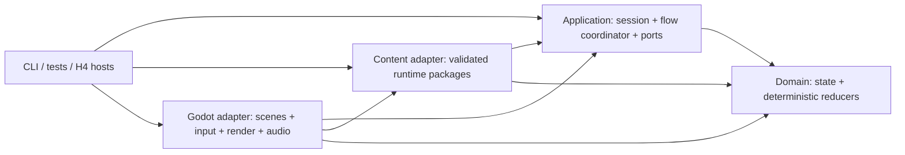

# ADR 0011: Phase 4 Remake Runtime Architecture

- Status: **Proposed**
- Proposal date: 2026-08-20
- Scope: prospective Phase 4 runtime, module, adapter, and verification architecture
- Recommended option: **A — deterministic modular monolith with ports and Godot adapters**
- Required acceptance: explicit user selection; this proposal does not start Phase 4

## Context

[ADR 0008](./0008-godot-csharp-cli-first-remake-tooling.md) fixes Godot 4.7.2 .NET/C#, a CLI-first
toolchain, a plain-C# domain layer, and a thin Godot adapter. This proposal consumes that decision; it
does not reopen the engine, language, version, or MCP boundary.

[ADR 0009](./0009-first-phase4-playable-slice.md) fixes the first implementation milestone as one
continuous playable scenario from Map 3 through completion of Battle 01. [ADR 0010](./0010-map3-battle01-product-acceptance.md)
fixes the product profile: a controlled admitted start, the smallest Research-proven natural route,
natural battle admission, manual player control, the first stable controllable post-after-program
endpoint, no milestone save/load, private-local original assets, exact reached frame/audio/hardware
parity, modern accessible logical controls, and an explicit deviation ledger.

The [readiness ledger](../design/synthesis/map3-battle01-readiness.md) remains **NOT READY** and the
accepted [Research gap audit](../research/map3-battle01-audit.md) remains **OPEN**. In particular, the
exact admitted state, natural route, reached programs and dialogue, natural Battle 01 state and
winning trace, after-battle effects, endpoint state, presentation timing, private capture inventory,
and H4 tolerances are Research-owned inputs. A runtime architecture must provide places for those
inputs without inventing them or allowing engine code to become their source of truth.

The project therefore needs one architectural choice before implementation starts: where game state
and deterministic behavior live, how the continuous scenario crosses exploration and battle, how
Godot participates without owning rules, and where the private 7C and exact 8C boundaries attach.

## Decision Boundary

This ADR proposes the shape of a future `remake/` project. It does not create that directory, write
engine code, install or change Godot, select or use MCP, define a distributable asset strategy, close
any Research or H4 gap, report the scenario ready, or authorize Phase 4.

The architecture may name stable ports and observation layers, but exact values and admitted command
sets must come from accepted contracts and fixtures on `main`. When evidence does not admit a route,
command, content record, timing rule, or presentation behavior, the runtime must report that boundary
instead of guessing.

## Options Considered

| Option | Shape | Advantages | Rejection cost or risk |
| --- | --- | --- | --- |
| **A. Deterministic modular monolith with ports and Godot adapters** | Plain-C# domain and application assemblies own state and transitions; validated content and Godot are outer adapters. | Directly satisfies ADR 0008, supports CLI replay and H4 observation, keeps one process and explicit dependencies, and isolates exact presentation work. | Requires deliberate mapping between domain state, presentation cues, and scenes; it is more structured than a scene-only prototype. |
| B. Godot scene-centric runtime | Nodes, resources, signals, autoloads, and scene transitions own gameplay state and rules. | Fast initial visual iteration and familiar Godot composition. | Determinism and CLI tests depend on the scene tree; state becomes distributed; signals and animation callbacks can silently define behavior; removing Godot or MCP cannot leave a useful domain gate. |
| C. General ECS/data-oriented simulation | Every world and battle object is a component and every rule is a system. | Uniform iteration and potential large-scale simulation performance. | The first slice has small, heterogeneous, strongly ordered state machines; a general ECS obscures action construction/replay and creates a framework before a performance need exists. |
| D. Original-hardware/emulator core as the game runtime | Reproduce CPU, VDP, audio, and original program execution, with Godot as a shell. | Makes some 8C observations intrinsic to the runtime. | Conflicts with the independently maintained remake goal, couples product behavior to private original program/assets, and turns the project into an emulator rather than a contract-driven remake. |

**Recommendation:** choose Option A. It is a modular monolith, not distributed services and not a
plugin framework. The module seams exist to preserve evidence ownership, deterministic testing, and
replaceable presentation; they should not create indirection without one of those purposes.

## Proposed Architecture

If accepted, the following rules are normative.

### 1. Assembly and Dependency Boundaries

The future runtime uses four production assemblies. Names are stable architectural labels; exact
project files are created only after the Phase 4 start action.

| Assembly | Owns | May depend on | Must not own |
| --- | --- | --- | --- |
| `Sf2.Remake.Domain` | typed IDs and values; authoritative session substate; deterministic formulas, reducers, RNG state transitions, legal-state checks, and domain events | .NET base libraries only | Godot types, files, JSON, clocks, input devices, rendering, audio, private paths, ROM/source addresses |
| `Sf2.Remake.Application` | the session facade; explicit game-flow state machine; command admission; map/battle/program orchestration; presentation-cue scheduling; ports; observation records | `Domain` | Godot nodes/resources, concrete file formats, raw private assets, implicit global services |
| `Sf2.Remake.Content` | concrete readers and validators for versioned runtime packages; import DTO-to-domain mapping; logical content and asset catalogs | `Application`, `Domain` | ROM extraction, disassembly parsing, gameplay mutation, scene-tree state, silent defaults |
| `Sf2.Remake.Godot` | one composition root; Godot scenes; input mapping; map/battle/UI renderers; audio; viewport/capture adapters; platform lifecycle | `Application`, `Domain`, `Content`, Godot 4.7.2 .NET APIs | authoritative gameplay state, formulas, RNG decisions, route truth, fixture expectations |

Dependencies point inward only. `Domain` never references another remake assembly. `Application`
defines ports; outer assemblies implement them. No assembly loads a Godot singleton or service
locator to reach inward, and no Godot signal directly mutates domain state.

Tests may reference the assemblies they exercise. H4 and Godot smoke hosts are outer consumers, not
production dependencies. A later dedicated CLI executable may depend on `Application` and `Content`,
but no production assembly may depend on that CLI.

The prospective layout is:

```text
remake/
  Sf2.Remake.sln
  src/
    Sf2.Remake.Domain/
    Sf2.Remake.Application/
    Sf2.Remake.Content/
  game/
    project.godot
    Sf2.Remake.Godot.csproj
    Scenes/
    Scripts/
  tests/
    Sf2.Remake.Domain.Tests/
    Sf2.Remake.Application.Tests/
    Sf2.Remake.Content.Tests/
    Sf2.Remake.Godot.Tests/
    Sf2.Remake.H4.Tests/
```

This is a future ownership map, not permission to create scaffolding before Phase 4.

### 2. Authoritative State and Mutation

One plain-C# `GameSessionState` is the authoritative runtime state. It owns versioned, serializable
substate for game flow, world/map position, flags, party/roster, inventory/economy, optional active
battle, deterministic RNG, and simulation counters. Subsystems may expose focused views and reducers,
but they do not keep competing authoritative copies.

`GameSession` in `Application` is the sole mutation facade. It admits one typed command at a time,
invokes deterministic domain transitions, applies ordered reducers, and emits an observation record
and presentation cues. A snapshot is the truth; events and cues are ordered outputs for observation
and presentation, not an event-sourced replacement for state.

Godot nodes keep only disposable view state such as node references, interpolation state, active
tweens, loaded resources, and UI focus. Destroying and reconstructing a view from the application
snapshot must not change gameplay. Autoloads, scenes, animation callbacks, audio completion signals,
and UI controls may request an application command or acknowledge a cue; they may not change HP,
flags, inventory, position, RNG, battle order, or route state themselves.

The battle boundary preserves the accepted distinction among committed intent, ordered target/action
construction, temporary resolution, presentation/reaction commands, persistent replay, after-turn
processing, and outcome. A deterministic replay reducer, not an animation callback, applies the
accepted persistent mutations in order. This keeps the owners in
[Battle Action Construction](../design/contracts/battle-action-construction.md),
[Combat Resolution](../design/contracts/combat-resolution.md),
[Spell Resolution](../design/contracts/spell-resolution.md), and
[Battle Control and Combatant Lifecycle](../design/contracts/battle-control-lifecycle.md) distinct.

### 3. Continuous Scenario Orchestration

`Application` owns an explicit `GameFlowCoordinator`. It is one state machine spanning exploration
and battle, not separate Godot games passing ad hoc globals. Its architectural states are:

```text
AdmittedStart
  -> Exploration
  -> MapOrProgramTransition
  -> BattleAdmission
  -> BattleInitialization
  -> BattleTurns
  -> BattleOutcome
  -> AfterBattleProgram
  -> ReturnHandoff
  -> StableControllableEndpoint
```

Dialogue, field menus, cutscenes, and transition waits are typed substates or explicit program gates
inside that flow. Whether the accepted smallest route reaches each optional substate is a Research
input; the architecture does not make it mandatory or silently omit it.

The admitted start is built by a validated scenario-start source. It must contain the accepted
scenario identity, content identities, exact Research-owned start snapshot, and capability profile.
It is not a visible New/load flow and may not be described as one. From that snapshot, logical manual
input drives the Research-proven natural route. Battle 01 admission must pass through the contracted
[exploration](../design/contracts/exploration-control-flow.md),
[map-entry routing](../design/contracts/map-entry-routing-state.md),
[encounter-definition](../design/contracts/battle-encounter-definition.md), and natural
[before/start program](../design/contracts/battle-cutscene-routing.md) handoffs; debug teleport or
direct battle construction is not a milestone path.

Victory must proceed through the ordinary battle controller, victory mutations, after-battle
program, and return handoff. Completion is observed only at ADR 0010's first stable controllable
post-after-program state. A battle outcome code, completed flag, cutscene return, or loaded return map
alone is insufficient.

The exact state values, transition list, program identities/effects, input sequence, RNG seed, winning
trace, and endpoint values remain unresolved inputs from the Research audit. They must be loaded from
accepted scenario definitions and fixtures, not hard-coded from this ADR.

### 4. Deterministic Simulation, Time, RNG, and Input

Gameplay outcomes use integer and explicitly bounded domain types. They must not depend on floating
point delta time, render frame rate, system time, thread scheduling, locale, Godot physics, animation
duration, or unordered collection iteration.

The application scheduler owns integer simulation steps and cue sequence numbers. Interactive Godot
execution may pace those steps against wall time, but wall time cannot choose a branch or change an
outcome. The exact frame/tick cadence for the 8C reference profile remains a Research-owned timing
input. Reference execution advances through an explicit deterministic clock; it does not infer the
original cadence from Godot's `_Process` delta.

RNG state is part of `GameSessionState`. Domain RNG operations are explicit state transitions that
return the value, next state, call family, and sequence number. No gameplay code uses Godot's random
generator, `System.Random`, time-derived seeds, or hidden mutable streams. Copy/retry/directional RNG
behavior is implemented only where accepted by the [Randomness](../design/contracts/randomness.md)
owner. The reference seed and complete reached call order remain Research-owned.

The Godot input adapter maps devices through Godot `InputMap` into semantic actions such as direction,
confirm, cancel, and menu while preserving the abstract boundary in the accepted
[Input System](../design/contracts/input-system.md) contract. It publishes action, phase, sequence,
and admitted simulation step to the application input gate. The application decides whether the
current flow state accepts the action. Key repeat, buffering, controller specifics, and original
input cadence belong to adapter/profile configuration and H4 evidence, not domain rules. A
deterministic H4 input trace uses the same semantic command boundary as manual play; it does not
bypass the coordinator or script battle state.

### 5. Programs, Content, and Data Imports

The remake does not parse a ROM or disassembly at runtime. Existing Python extractors, schemas,
fixtures, and verifiers remain the evidence pipeline. A future Phase 4 content-export slice may
produce versioned runtime packages from accepted, redistribution-safe contracts or ignored private
inputs. Each package declares a contract ID, schema version, content digest, provenance class, and
cross-reference inventory.

`Application` defines narrow sources for scenario definitions, gameplay definitions, program data,
and logical asset metadata. `Content` validates package structure, identity, uniqueness, ranges, and
cross-references, then maps external DTOs into domain definitions. The domain never receives JSON
objects, file paths, source symbols, ROM addresses, or unvalidated numeric IDs.

Map/event/cutscene/dialogue execution uses validated typed programs and explicit command handlers for
the admitted command families, with the accepted
[standalone map-script program](../design/contracts/standalone-map-script-program-data.md) and
[dialogue](../design/contracts/dialogue-system.md) contracts defining bounded input surfaces. It does
not run source assembly, arbitrary C#, GDScript, reflection, or content-provided executable code. An
unsupported command fails at admission or at a named runtime boundary; a similar supported command is
not an authorized fallback.

All content needed by the admitted scenario is validated before the session starts. Reference mode
fails closed on a missing package, digest mismatch, unresolved ID, duplicate record, unsupported
command, or incomplete capability. Interactive development may use a project-authored synthetic
package only under a visibly non-fidelity profile and a declared expected deviation.

### 6. Private 7C Asset and Capture Boundary

Gameplay and presentation refer to stable logical asset IDs. Only an outer asset catalog resolves
those IDs to Godot resources, decoded private-local data, or project-authored substitutes. Domain and
application assemblies never depend on an original filename, extracted byte payload, capture, or
machine-local path.

The private 7C profile loads original graphics, dialogue, music, sound, and captures only from the
ignored local boundary after the Research-owned inventory, hashes, provenance, tools, configuration,
and rights classification are accepted. Missing or mismatched private inputs make the exact reference
profile unavailable; the runtime must not download them, embed them, commit them, upload them, or
silently substitute other assets while reporting 7C/8C success.

Public CLI and CI gates use only tracked redistribution-safe metadata, fixtures, and project-authored
synthetic assets. A public or distributable build remains blocked until a separate rights/replacement
decision accepts its content. Runtime architecture acceptance grants no distribution right.

### 7. Presentation and Godot Adapters

Application transitions emit ordered, typed presentation cues with logical actor/content IDs,
integer simulation/cue sequence numbers, and explicit acknowledgment requirements. Cues request
presentation; they do not contain Godot node paths or mutate gameplay when an animation finishes.

`Sf2.Remake.Godot` contains one composition-root node and replaceable adapters:

- an exploration scene that projects map, entity, camera, dialogue, transition, and menu view models;
- a battlefield scene that projects grid, actor, cursor, movement, target, and battle-menu state;
- a battle-scene presentation adapter for ordered action/reaction cues defined at the accepted
  [Battle Scene Presentation](../design/contracts/battle-scene-presentation.md) boundary;
- UI/window/text adapters that consume logical layout and text records;
- an audio adapter that resolves logical music/SFX cues behind the accepted
  [Audio System](../design/contracts/audio-system.md) boundary and records sample/timing observations;
- an input adapter that maps devices to semantic commands;
- a capture/observation adapter used by bounded headless H4 runs.

The composition root owns the current view instances and dependency wiring, but the application owns
the current game-flow state. No collection of global autoload singletons is allowed to become a
parallel gameplay model.

The exact 8C profile requires a fidelity presentation backend behind these adapters. Godot remains the
desktop host, scene compositor, input platform, and capture surface; the fidelity backend must expose
deterministic pixel/palette/frame, animation/timing, and audio sample/chip/timing observations. It must
also compare the exact reached VInt/DMA/CRAM/VDP observation values, ordering and chronology, and other
hardware-observable fields defined by the future accepted H4 contract, using exact comparison or only
the explicitly field-specific tolerances that contract accepts under ADR 0010. It may use a
software-produced integer-scale framebuffer or other bounded implementation selected later. This
observation boundary does not require an emulator or original executable as the gameplay core, and it
must not move combat, route, or campaign rules into one. If Godot convenience nodes cannot reproduce
an accepted observable, the adapter reports the capability as unsupported until a reviewed backend
closes it; it does not relax the 8C golden.

The backend consumes the bounded state seams in
[Graphics Service State](../design/contracts/graphics-service-state.md) and
[Interrupt, DMA, and Trap State](../design/contracts/interrupt-dma-and-trap-state.md); those contracts
do not themselves supply the still-missing reached pixels, frames, samples, timing, or tolerances.

Interactive views may interpolate or provide accessible presentation only after deterministic state
has been decided. The exact reference profile disables or records every presentation transformation
that would change an 8C observable.

### 8. H4 Observation Seams

H4 reports separate layers so a failure identifies the owner and an engine output cannot mask a
domain mismatch:

| Layer | Required observation boundary |
| ---: | --- |
| 1 | admitted scenario/package identities, provenance class, capabilities, start-state digest, and private-input hash results |
| 2 | semantic input actions, admitted simulation steps, program and game-flow transitions, and cancellation/acknowledgment order |
| 3 | state snapshots or bounded field facts before/after transitions, RNG draws, battle intent/construction, temporary resolution, persistent replay, after-turn, and outcome traces |
| 4 | ordered presentation cues, logical asset references, cue timing, and adapter acknowledgments |
| 5 | Godot scene/view-model projection, renderer/audio/input adapter state, resource identity, and bounded runtime diagnostics |
| 6 | reached 8C framebuffer pixels/palettes/frame cadence, animation timing, audio waveform/sample/chip timing, exact VInt/DMA/CRAM/VDP observation values and ordering/chronology, other contract-defined hardware-observable fields, capture conditions, and exact or explicitly accepted field-specific tolerances |
| 7 | ordinary victory, after-battle program/handoff trace, exact stable endpoint facts, and separately named expected deviations |

Each layer references its accepted fixture owner. The H4 adapter may translate addresses and fixture
fields at the boundary, but production domain code does not expose original RAM/ROM addresses. The
continuous scenario test composes subsystem fixtures; it does not copy selected expectations into a
weaker engine-specific golden.

There are three explicit execution profiles:

1. **Exact reference:** accepted private inputs, deterministic clock/seed/input trace, no unlisted
   fallback, complete 8C capture, and zero undeclared deviations.
2. **Interactive milestone:** manual semantic input and the same domain/application path; optional
   accessibility settings are recorded and evaluated in their own deviation checks rather than
   against unchanged original pixels/audio.
3. **Public synthetic:** tracked fixtures and project-authored assets for build, logic, adapter, and
   export safety; it makes no 7C/8C original-presentation claim.

### 9. No-Save Milestone Boundary

ADR 0010 option 6A is enforced by composition: the first milestone has no player-facing save, load,
checkpoint, battle suspend, or persistence adapter and no related UI. Restart destroys the current
session and rebuilds the exact controlled admitted snapshot. The accepted
[Save System](../design/contracts/save-system.md) remains a future evidence owner, not a service wired
into this milestone.

Test snapshots, H4 case setup, and captured state facts are harness machinery. They are not reachable
from player input, are not written as user saves, and must never be presented as save support. A later
save milestone requires its own decision, schema/versioning contract, migration policy, adapter, UI,
and H4 surface; it may reuse the structured authoritative state but is not pre-authorized here.

### 10. Accessibility and Expected Deviations

ADR 0010 option 9A is implemented at semantic input and presentation boundaries. Device remapping,
keyboard/controller equivalence, focus navigation, reduced-flash presentation, and adjusted text
presentation must not fork gameplay rules or create device-specific domain commands.

The exact 8C reference run and accessibility runs are distinct. Accessibility runs assert the same
admitted logical actions and applicable gameplay state transitions while listing changed timing,
pixels, palettes, text layout, audio, or other presentation output as named expected deviations. A
deviation record includes profile, owner, rationale, affected H4 layer, expected result, and scope.
Silence never authorizes a deviation, and an accessibility setting cannot be used to weaken the exact
reference golden.

### 11. Admitted-Domain and Error Handling

The session starts only after an admission report proves the required package versions/digests,
scenario capabilities, content cross-references, private-input mode, and supported command families.
The report is part of H4 layer 1.

Expected boundary failures return typed diagnostics containing the scenario phase, command/content
identity, expected capability or state, actual state, and evidence owner when applicable. Startup
validation errors prevent the game session from being created. During an exact reference run, an
unsupported command, illegal transition, missing cue acknowledgment, unexpected RNG call, adapter
capability gap, or output mismatch stops the run and fails its layer.

Programmer invariant violations fail tests and terminate the affected reference run; they are not
converted into a plausible gameplay result. Interactive execution outside the admitted fixture
domain must fail safely to a diagnostic boundary without corrupting the last authoritative snapshot.
It may continue only through a separately accepted and visibly declared non-fidelity fallback.
Catch-all logging followed by silent continuation is prohibited.

Godot resource/node/device failures remain outer-adapter failures. They may display a safe diagnostic
screen in interactive mode, but they cannot mutate domain state, select an alternate route, reroll RNG,
or count as H4 success.

### 12. CLI and Test Layering

The maintained acceptance path remains editor- and MCP-independent. Future Phase 4 gates run in this
order, with failures attributed to the narrowest layer:

1. restore/build all C# projects with the accepted SDK and locked dependencies;
2. run pure `Domain` unit/fixture tests for arithmetic, reducers, state invariants, RNG, and admitted
   deterministic transitions;
3. run `Application` replay tests for commands, programs, orchestration, cue/ack order, and exact
   endpoint composition without Godot;
4. run `Content` validation and mutation tests for package identity, shape, joins, capabilities, and
   public/private separation;
5. run the official Godot CLI import plus bounded headless scene-state smoke;
6. run layered H4 reference/interactive/public profiles as their accepted inputs become available;
7. run a profile-declared local-private or public-synthetic export smoke plus tracked/private/generated
   payload scans. A public-synthetic export uses only redistribution-safe inputs; a successful export
   and the private 7C profile never authorize a public release.

Ordinary feature gates use only the affected layers plus the stable shared smoke. A Phase 4 milestone,
shared harness change, release/merge-readiness boundary, or explicit full-parity request runs the full
accepted profile. MCP, editor state, screenshots taken by hand, and a zero-exit Godot launch are never
substitutes for these gates.

Before Phase 4, the readiness gate requires complete accepted H4 definitions, not successful H4
execution against a remake that does not exist. H4 implementation and passing remake results occur
only after the separate start action.

## Dependency and Flow Summary



The arrows mean “depends on.” State and decisions move outward as typed snapshots, transition facts,
and presentation cues; device input and cue acknowledgments move inward through explicit application
ports. No outer adapter becomes an evidence owner.

## Research-Owned Inputs Retained

| Input | Current state | Architectural consumer |
| --- | --- | --- |
| exact admitted Map 3 snapshot and provenance | **Unknown / RA-01** | scenario-start source and layer-1 admission |
| exact natural route, setup/program/dialogue/menu effects | **Unknown / RA-02/03/08/09** | `GameFlowCoordinator` and validated program packages |
| natural Battle 01 admission and initialized state | **Unknown / RA-04/05** | battle-admission and initialization transitions |
| complete viable manual/AI/action/resolution trace and seed | **Unknown / RA-06** | deterministic input/RNG trace and battle reducers |
| ordinary victory, after-battle effects, return, endpoint facts | **Unknown / RA-07/12** | outcome through stable-endpoint orchestration |
| reached private inventory, captures, exact timing/output/tolerances | **Unknown / RA-11** | private asset catalog, fidelity backend, and H4 layer 6 |
| save/load persistence | **Deferred by 6A / RA-10** | no consumer in the first milestone |

This ADR does not rename these gaps, invent fixture IDs, or treat its interfaces as evidence that the
missing values are known.

## Consequences

### Positive

- Original-compatible behavior can be tested without launching Godot, while Godot-specific import,
  scene, renderer, audio, input, and export failures remain testable at their own layer.
- The continuous Map 3-to-Battle 01 flow has one state owner across scene changes.
- Exact 8C presentation can evolve behind a bounded backend without turning the gameplay core into an
  emulator or allowing renderer limitations to weaken game-state contracts.
- Private original inputs remain replaceable outer dependencies and cannot leak into public builds by
  construction.
- Modern input and accessibility can share gameplay rules while reporting presentation deviations
  honestly.

### Costs

- Every accepted content/fixture family needs a reviewed DTO-to-domain mapping and capability check.
- Presentation requires explicit cues, acknowledgments, and reconstruction instead of convenient
  direct node mutation.
- Exact 8C output may require a specialized software presentation/audio backend in addition to normal
  Godot scene composition; the architecture isolates but does not solve that research and engineering
  cost.
- The application state machine and H4 observation model require up-front discipline before visible
  game work begins.

## Non-Goals and Revisit Triggers

This proposal does not decide complete campaign architecture, general battle simulation completeness,
save migration, modding, networking, rollback, ECS adoption, public asset replacement, export targets,
MCP selection, or exact renderer/audio backend implementation.

A follow-up ADR is required before reversing dependency direction, making Godot nodes authoritative,
adding content-provided executable code, introducing a persistent save adapter, adopting an ECS as the
primary state model, using an emulator/original executable as the gameplay core, or weakening the
separate H4 layers. Performance evidence may justify internal data-layout optimization without
changing these ownership rules.

## Acceptance Effect

Explicit selection of Option A would mark this ADR **Accepted** and authorize only this architectural
constraint for a later Phase 4 implementation. It would not make the readiness ledger READY and would
not start Phase 4. Research closures, the continuous-scenario contract, complete H4 definitions,
main-gate readiness, and the separate user start action required by ADR 0009 would all remain open.

Selecting another option requires an amended proposal that explains how it still satisfies ADR 0008,
the ADR 0010 product profile, the private/public boundary, and the layered H4 acceptance surface.
