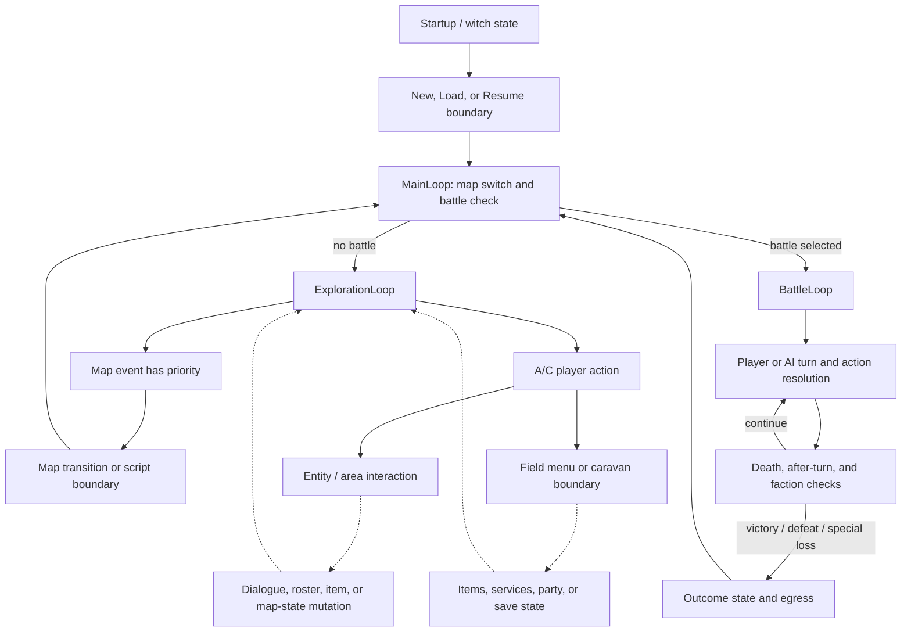

# 玩法总览与系统边界

- 状态：**已接受证据的设计综合**；本文不新增原版事实，也不选择重制引擎、产品形态或平衡方向。
- 记录日期：2026-08-01
- 受众：需要理解玩家动作、顶层状态与 subsystem handoff 的研究者、设计说明作者和 fidelity
  implementer。
- 范围：只连接当前 `main` 已接受的 gameflow、map、input、dialogue、party/roster、service、battle、
  growth 与 save 合同；每条解释保留 **Confirmed**、**Inferred** 或 **Unknown** 标签。

本文是[文档路线图](./documentation-roadmap.md)的第一篇 B 层综合说明。它提供导航，不替代任何
research owner、fixture 或 subsystem contract。文中的 **Confirmed** 表示所述边界已经由链接的 A 层
证据确认；**Inferred** 表示把多个已确认边界连接成了中性的玩家向解释；**Unknown** 表示当前证据
不支持继续解释。

## 本文支持与不支持的判断

本文支持下列判断：

- 玩家在哪些已确认的状态边界上可以移动、交互、管理资源、选择战斗动作或保存；
- exploration、script/service、battle、growth 与 save owner 之间传递哪一类状态；
- fidelity implementation 应从哪些现有合同和 fixture 取得验收事实。

本文不支持下列判断：

- 完整战役路线、情节节拍、角色动机或玩家应当感受到的 narrative experience；
- 地图作者意图、预期策略、最佳 roster、难度/数值曲线或经济平衡；
- 原版界面手感、逐帧输入延迟、可见动画/音频时序或硬件级渲染 parity；
- remake 的引擎、平台、UI、无障碍、存档可靠性改造或 intentional rebalance 决定。

## 玩家动词与即时目标

下表把 source-facing 行为翻译成中性的 player-action phrase。它不把程序符号名当作原版玩家语义，
也不从一次状态 mutation 推导长期设计目的。

| 玩家动作 | 当前证据支持的即时目标 | 标签与边界 |
| --- | --- | --- |
| 开始、载入或恢复 | 进入一个已有或新建的游戏状态；从 suspend 状态恢复战斗 | **Confirmed** 的 witch/save action routing、两槽数据边界和 battle resume 入口；完整可见选择流程、跨进程耐久性与断电行为仍 **Unknown**。 |
| 在地图上移动 | 改变受控实体位置，并让 map movement/event 逻辑继续求值 | entity movement/action 的更新顺序、位置/碰撞单位及 map event polling 是 **Confirmed**；路线目的、移动手感与每个可见 frame 是 **Unknown**。 |
| 触发或检查 | 面向附近实体、区域或可检查 block，请求一个脚本、事件或物品结果 | admission、优先级、对象类别和 inventory handoff 是 **Confirmed**；正常故事 reachability、文本/动画/音效呈现和多数结果的长期持久性仍 **Unknown**。 |
| 打开菜单并管理物品 | 选择 field/battle menu action，使用、给予、装备或丢弃合法物品 | battle player-control 与 service/stat owner 确认了有界分支和 mutation 顺序；本文不声称所有 field-menu 页面、取消手感或完整可见反馈。 |
| 使用服务 | 在 shop、church、caravan/depot 或 blacksmith 的已确认 action surface 上交换资源或改变成员状态 | 动作、取消边界和 gold/item/member mutation 次序是 **Confirmed static**；地图/NPC 准入、服务后返回探索、持久化和呈现仍 **Unknown**。 |
| 在战斗中定位、选目标和行动 | 选择合法 tile/目标以及 attack、magic、item、stay/search 等结果 | player-control state machine 和 action-resolution 边界是 **Confirmed static**，部分 math/status 有 H3；战术意图、AI 公平性、完整战斗 pacing 与通用模拟准确性不在本文范围。 |
| 接受成长与恢复 | 让 EXP、level-up、状态恢复或 service mutation 更新角色状态 | 已有合同确认若干输入、顺序、clamp 与输出；玩家 roster 取舍、build 意图、成长体验和完整数值曲线仍 **Unknown**。 |
| 保存、复制、删除或 suspend | 在已确认的存储 seam 上保留、复制、清除或临时中断状态 | SRAM layout、checksum、slot action 和 in-process H3 是 **Confirmed**；原版断电原子性与长期真实设备耐久性仍 **Unknown**。 |

**Inferred action–goal alignment：**这些动作共同允许玩家推进当前可达状态、解决局部战斗或资源
约束，并保留可恢复的进度。把它们进一步解释为“探索世界”“培养理想队伍”或“掌握特定战术”虽
符合类型直觉，却尚未由本仓库的 campaign reachability、player observation 或作者意图证据确认。

## 顶层状态流

下图是 design synthesis，不是 engine architecture。实线仅表示 owning documents 已确认存在并记录
顺序的 handoff；虚线表示多个已确认边界之间的 **Inferred player-level connection**，其完整 caller、
可见转场或持久性尚未闭合。

### 已确认的 flow anchors

1. `MainLoop` 先处理 flag-driven map switching，再检查 battle；`-1` 是无战斗 sentinel。真实 battle
   返回后会再次经过 map switching，exploration 的 warp-style transition 也返回 outer loop。
2. `ExplorationLoop` 建立或恢复 map/entity state，加载地图资源并执行 setup，然后在 map event 与
   A/C action 之间循环。poll 和 dispatch 都先检查 map event，因此同一轮已可见时 event 优先。
3. player action 路径按 A 再 C 测试。A 进入 field-menu path；C 可到 caravan、entity activation、
   area inspection 或 field-menu fallback，另有不属于普通玩法说明的 debug route。
4. `BattleLoop` 区分 suspended 和 new-battle 入口。新战斗执行初始化、cutscene、roster、region、spawn
   与 turn-order 边界；每次 action 后在 after-turn effect 前后各处理 death 和 faction outcome。
5. victory、defeat 与 battle-4 special-loss 返回不同 outcome state；这些返回继续连接 main/map egress
   边界，但本文不据此补写剧情意义。

### 尚不能闭合的 transition

- service、dialogue、roster command 或 item handoff 在全部 normal-story caller 中何时发生；
- 每条 interaction 的 player-visible completion、cancel、return-to-exploration 与 audio/window 时序；
- save/load 后所有 map、party、service 与 battle state 的跨进程持久性；
- campaign 中所有 branch、battle 和 map 的实际可达顺序。

以上均为 **Unknown**；虚线不能成为 remake 中未经 decision 的隐含 route。

## Loops 与 system dynamics

### 已确认的局部循环

- **Exploration polling loop：**map/entity update 产生或保持状态，`WaitForEvent` 先观察 pending map
  event，再观察 A/C；outer loop 仍先 dispatch event。该优先级为 **Confirmed**，精确 VInt publication
  edge 为 **Unknown**。
- **Battle round/action loop：**new/resumed battle 进入 individual-turn processing；action resolution
  后 death/outcome 检查夹住 after-turn effect；`0xFF` turn-order entry 开启下一 round。顶层顺序为
  **Confirmed**，完整逐行动呈现和所有 runtime caller state 未全部确认。
- **Service/menu loop：**现有 service 合同确认各 action、取消分支与 mutation order；把它们统称为
  玩家反复访问的经济/恢复 loop 是 **Inferred**，因为 admission、return 和 campaign frequency 未闭合。

### 有证据边界的反馈关系

| 状态关系 | 当前标签 | 不得扩张成的结论 |
| --- | --- | --- |
| battle action → HP/status/death → outcome checks | 各 edge 与若干公式/状态案例 **Confirmed**；完整战斗体验是 **Inferred** | 预期战术、目标优先级意义、难度或 pacing |
| battle EXP/reward → level/stat/resource mutation → 后续可消费角色状态 | 单独的 reward、level-up、gold/item 与 service 边界有 **Confirmed** 合同；跨战役 feedback loop 为 **Inferred** | 最优 build、合理 grind、玩家/敌人数值曲线 |
| flag/map setup/event/script → map、dialogue 或 roster state | selector、command shape、handler order 与若干 H3 为 **Confirmed** | plot beat、作者意图、完整 story consequence |
| damage/status/item limits → church/shop/caravan/item actions | service resource order 与若干 stat 状态为 **Confirmed**；访问频率和 player pressure 为 **Unknown** | 经济平衡、补给节奏或策略必要性 |
| save/suspend action → serialized/resumed state | layout、helper order 与 bounded H3 为 **Confirmed** | 所有 subsystem 完整 snapshot、断电安全或现代 save UX |

因此，当前仓库已经能描述多个局部 state machine 和它们的接口，却还不能把这些接口升级为一个已证明
的完整 core loop、campaign loop 或 meta progression loop。

## Evidence matrix

| 综合边界 | 标签与 bounded claim | Evidence owner / executable trace | Remaining question |
| --- | --- | --- | --- |
| main 与 exploration routing | **Confirmed** 的 map switch、battle sentinel、event-before-input 和 interaction admission/order | [gameflow research](../research/gameflow-core.md)；`sf2-gameflow-core-static-v1`（[`gameflow-core-static-v1.json`](../../tests/fixtures/h2/gameflow-core-static-v1.json)） | VInt edge、transition frames、normal-story reachability |
| map state 与 movement/event | **Confirmed** 的 map import、setup/event order、working layout 和 bounded movement/action behavior | [map contract](./map-exploration.md)及其逐项 H2/H3 fixture 清单；`sf2-map-interaction-trigger-runtime-v1`（[`map-interaction-trigger-v1.json`](../../tests/fixtures/h3/map-interaction-trigger-v1.json)） | 最终渲染、完整 player route、部分 persistence |
| input seam | **Confirmed** 的 raw sampling、current/repeat state 与 wait helpers | [input contract](./input-system.md)；`sf2-tech-services-static-v1`（[`tech-services-static-v1.json`](../../tests/fixtures/h2/tech-services-static-v1.json)）拥有 raw sampling 与 wait helpers，`sf2-tech-interrupts-static-v1`（[`tech-interrupts-static-v1.json`](../../tests/fixtures/h2/tech-interrupts-static-v1.json)）拥有 VInt-derived current/repeat stage | controller protocol、frame-exact latency 与 player-visible repeat cadence |
| dialogue handoff | **Confirmed** 的六个 command layout、handler order 与 21-case handler-local runtime seam | [dialogue contract](./dialogue-system.md)；`sf2-map-script-dialogue-runtime-v1`（[`map-script-dialogue-v1.json`](../../tests/fixtures/h3/map-script-dialogue-v1.json)） | text/portrait/audio rendering、story reachability、persistence |
| party/roster handoff | **Confirmed** 的十个 source form、branch/mutation/call order 与 bounded active-party effect | [party/roster contract](./party-roster-state.md)；`sf2-map-script-engine-static-v1`（[`map-script-engine-static-v1.json`](../../tests/fixtures/h2/map-script-engine-static-v1.json)）和 `sf2-force-state-active-party-runtime-v1`（[`force-state-active-party-v1.json`](../../tests/fixtures/h3/force-state-active-party-v1.json)） | roster/list capacity、story lifecycle、save persistence 与玩家选择空间 |
| service actions | **Confirmed static** 的 shop/church/caravan/blacksmith action 与 resource mutation order | [service contract](./service-interactions.md)；`sf2-common-menus-static-v1`（[`common-menus-static-v1.json`](../../tests/fixtures/h2/common-menus-static-v1.json)） | admission、return、presentation 与 persistent outcome |
| battle entry、turn 与 outcome | **Confirmed static** 的 new/resume、round/action/death/outcome ordering | [battle-loop research](../research/battle-loop.md)；top-level executable trace 为 `sf2-battle-control-static-v1`（[`battle-control-static-v1.json`](../../tests/fixtures/h2/battle-control-static-v1.json)）。[battle-functions research](../research/battle-functions.md)与 `sf2-battle-functions-static-v1`（[`battle-functions-static-v1.json`](../../tests/fixtures/h2/battle-functions-static-v1.json)）仅支持 shared individual-turn/player-control surface | 完整 player-visible loop、runtime caller states 与战术解释 |
| action resolution | 物理、法术、状态、EXP 和若干 replay boundary 的 **Confirmed** implementation-neutral contracts | [combat contract](./combat-resolution.md)、[spell contract](./spell-resolution.md)、[randomness contract](./randomness.md)及各自 fixture 清单 | 尚未观察的分支、distribution isolation、通用 battle simulation |
| growth | **Confirmed** 的 level-up order、growth、clamp、spell 与 refresh boundary | [level-up contract](./level-up.md)及其 H2/H3 fixture 清单 | campaign context、roster choice、预期曲线与平衡 intent |
| save 与 suspend | **Confirmed** 的两槽 layout、checksum、action routing 和 bounded in-process replay | [save contract](./save-system.md)；`sf2-witch-save-actions-runtime-v1`（[`witch-save-actions-v1.json`](../../tests/fixtures/h3/witch-save-actions-v1.json)） | 跨进程、断电、完整 subsystem persistence 和 visible UX |

表中 trace 只提供 owner 导航。fixture 的 exact expectations 仍由其 schema、extractor/verifier 与 owning
contract 定义，本文不得复制一套较弱的 expectation。

## Original fidelity 与 modernization

### Fidelity rules

未来 implementation 若声称复现本文覆盖的原版 boundary，至少应：

1. 从 owning contract/fixture 消费 map、input、script、party、service、battle、growth 与 save state，
   不从本图或 player-facing phrase 反推数据结构；
2. 保留已确认的 selector、priority、branch polarity、mutation/call order、clamp 与 sentinel；
3. 对 **Unknown** 的 reachability、presentation、timing、capacity 或 persistence 不作原版事实声称；
4. 将 deliberate deviation 与 original-compatible expectation 分开报告。

### 尚未作出的 modernization decisions

现代输入映射、加速/跳过、UI 信息层级、无障碍、自动保存、原子存档、跨平台存储、内容重排、角色
再平衡、敌人数值重标定与新的 battle simulator 都可能是合理方向，但当前一项也未由本文决定。任何
此类选择都应在 `docs/decisions/` 或 future remake specification 中说明理由，并用独立
expected-deviation/H4 acceptance 与原版 parity 分开。

## H4 接入与停止条件

本文本身不是新的 executable contract，不注册比 subsystem fixtures 更宽松的 aggregate golden。
H4 adapter 应按需消费 evidence matrix 中的 owner，并让同一 fixture 能验证原版 harness 与 remake
adapter 的相同 implementation-neutral fact。跨 subsystem scenario 只有在所有输入、状态单位、顺序和
输出边界均已被 owner 接受后才可增加。

在下列任一条件成立时，本文停止扩张并把问题留在 owner queue：

- 答案需要未接受的 reverse-engineering branch、未观察的 normal-story reachability 或可见 timing；
- 需要把 source name、静态 call 或单个 fixture case 解释成玩家意图、balance 或 campaign rule；
- 需要选择 engine architecture、产品体验或 intentional deviation；
- 需要完整 map-design principles、roster choice space、player/enemy curve 或 battle simulation。

后四个上层方向继续保留在[文档路线图的长期方向](./documentation-roadmap.md#长期方向)，待各自 entry
criteria 满足后再开独立 design-synthesis slice。
