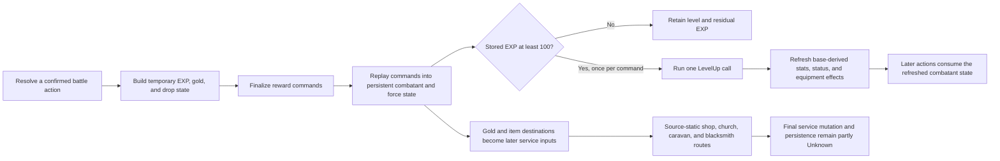

# Progression and Economy

- Status: **Confirmed bounded resource flows**, with **Inferred** feedback relationships and explicit
  **Unknown** campaign, balance, service-runtime, and persistence boundaries.
- Record date: 2026-08-01
- Audience: researchers, fidelity implementers, and designers who need to distinguish original
  resource rules from later product decisions.
- Scope: connect accepted EXP, level-up, gold, enemy-drop, item-transfer, and service evidence without
  claiming a complete campaign economy or intended difficulty curve.

## Judgment Boundary

This document explains how several accepted contracts connect. It does not replace the
[level-up contract](./level-up.md), [physical combat contract](./combat-resolution.md),
[spell contract](./spell-resolution.md), [service contract](./service-interactions.md), or
[save contract](./save-system.md), and it is not independent evidence about the original game.

The supported judgment is narrow: for the listed fixtures and source-static service routes, the
original has distinct action-reward construction, persistent resource mutation, threshold-driven
level-up, stat refresh, item-routing, and service-call stages. Their order and units matter.

The following judgments are not supported yet:

- intended encounter difficulty, level curve, price curve, scarcity, or grinding pressure;
- a complete list of campaign income and expenditure sources;
- optimal equipment, promotion timing, party composition, or roster choice space;
- shop/service availability, normal-story reachability, or lifetime purchase opportunity;
- persistent outcomes for service mutations across map changes, save/load, or power cycles;
- player-visible reward, menu, animation, sound, or timing behavior beyond fixture-owned seams.

## Pre-Synthesis Evidence Audit

This slice reviewed the owning research prose, design contracts, fixture JSON payloads and exact IDs,
schema/verifier registrations, focused tests, and CLI ownership before combining their conclusions.
The following narrow commands passed on 2026-08-01:

```powershell
uv run sf2 h2 common-stats
uv run sf2 h2 common-menus
uv run sf2 h2 enemy-gold
uv run sf2 h2 enemy-drops
uv run sf2 h3 growth
uv run sf2 h3 battle-exp
uv run sf2 h3 kill-exp
uv run sf2 h3 award-exp
uv run sf2 h3 exp-command
uv run sf2 h3 gold
uv run sf2 h3 enemy-drops
```

The executable owners agreed on the values and order synthesized below. The original audit also found
two owner-document discrepancies and deliberately did not copy them. Both findings have since been
resolved in their owning documents:

1. [Issue #11](https://github.com/FrankHZ/md-sf2-reverse-engineering/issues/11) recorded a stale
   reward queue for rare-drop RNG, full-inventory/deals routing, and an already-set drop flag. The
   merged [owner correction PR #18](https://github.com/FrankHZ/md-sf2-reverse-engineering/pull/18)
   removed that queue and explicitly retained the accepted ten-case
   `sf2-enemy-item-drop-behavior-v1` evidence covering those branches.
2. [Issue #12](https://github.com/FrankHZ/md-sf2-reverse-engineering/issues/12) recorded an
   over-broad Church Raise summary. The merged
   [owner correction PR #19](https://github.com/FrankHZ/md-sf2-reverse-engineering/pull/19) now
   preserves only the source-derived filtered mutation-helper order `j_DecreaseGold` →
   `j_IncreaseCurrentHp` (after `move.w #CHAR_STATCAP_HP,d1`) → `UpdateAllyMapsprite`. That order
   does not assert that no other calls intervene; final current HP and caller-visible runtime outcome
   remain **Unknown**.

These are resolved audit findings, not pending follow-up work. This synthesis continues to consume the
accepted drop fixture and the bounded Raise call seam without promoting either into broader reward UX,
service completion, persistence, or player-visible outcome claims.

## Resource and Level Vocabulary

The same everyday word can refer to different stages. A fidelity implementation and its tests must
keep these values separate.

| Term | Confirmed meaning in this synthesis | Boundary that must remain visible |
| --- | --- | --- |
| action EXP accumulator | Temporary battle-scene value built while an action resolves. Confirmed damage/kill paths saturate at 49; confirmed healing accumulation saturates at 25. | These are action-family boundaries, not one universal EXP cap for every spell or command. |
| final EXP command | The post-action amount emitted after the applicable battle-table adjustment, two ordered random checks, and the confirmed enemy-target minimum. | It is neither the accumulator nor stored EXP. Same-side and unsupported action paths must not inherit the enemy-target rule automatically. |
| stored EXP | Persistent actor byte increased by an EXP command and clamped at 200 before threshold handling. | One command subtracts at most one 100-point threshold; stored EXP may remain 100 afterward. |
| stored level | The class-local value retained on the combatant. Confirmed caps are 40 for classes below ID 12 and 99 from class ID 12 onward. | It is not automatically the level used by every comparison. |
| effective reward level | For the confirmed damage/kill bracket, a promoted actor adds 20 to stored level before comparing with target stored level. | The offset is scoped to the confirmed comparison; do not rewrite persistent level. |
| level-up spell threshold | `LevelUp` increments stored level, then applies its class-dependent effective-level rule for spell learning. | TORT's class-11 comparison defect and `$FE` spell-list inheritance remain original-fidelity facts. |
| current versus maximum/base/derived stats | Level-up changes maxima and base stats, then refreshes derived battle stats and equipment/status effects. | Current HP and MP do not increase merely because their maxima grow. |
| gold | Persistent unsigned 32-bit resource; confirmed increase behavior caps it at 9,999,999 on carry or above-cap addition. | Decrease behavior and non-battle mutation results are not covered by the gold H3 fixture. |
| held item, deals count, and caravan storage | Distinct item destinations with separate capacity and ordering rules. Deals counts are packed four-bit quantities and saturate at 15. | Static service helper order does not by itself prove persistence or final runtime state. |

## Connected Resource Flow



The links into later-action use and later service-choice use are **Inferred system relationships**:
stronger combatant state and retained resources can affect later choices because later systems read
those fields. The diagram does not claim the original designers intended a particular power curve,
spending cadence, or optimal loop.

## Battle-Driven Progression

### 1. Build an action-local reward

For the confirmed physical and attack-spell damage paths, the actor's effective reward level is
compared with the target's stored level. Differences below 3 yield a 50-point kill bracket; exact
differences 3, 4, 5, and 6 yield 40, 30, 20, and 10; differences at least 7 yield zero. A promoted
class adds 20 before this comparison. Damage EXP scales that bracket by final damage divided by
target maximum HP with integer truncation. A lethal result then adds the kill bracket after the
damage contribution. Both additions feed the same 49-point action cap in their confirmed paths.

This bracket is not a stored-level rewrite. The fixture's HERO stored level 1 is effective level 21
only for the comparison against target level 18 and therefore takes the difference-3/40 bracket.

Healing uses a different confirmed rule. Eligible PRST, VICR, and MMNK actors compute
`floor(25 * recovered HP / target maximum HP)`, apply a minimum contribution of 10 when the division
path is valid, and accumulate at most 25 for the action. Ineligible classes, enemy actors, and a
zero-maximum-HP target skip the confirmed contribution. Status and special spells have their own
fixture-bounded contributions; this synthesis does not flatten them into either damage or healing.

### 2. Finalize the command amount

For the confirmed enemy-target Battle 01 path, the action accumulator is shifted right once because
Battle 01 matches the halved-EXP table. Two ordered `RNG(16)` calls then add one if the first roll is
zero and subtract one if the second roll is zero. A non-positive final value becomes one before the
EXP command is emitted. The passing fixture keeps these distinct examples:

| Accumulator | First/second roll | Command EXP |
| ---: | --- | ---: |
| 49 | 4 / 4 | 24 |
| 49 | 0 / 3 | 25 |
| 49 | 14 / 0 | 23 |
| 49 | 0 / 0 | 24 |
| 0 | 4 / 4 | 1 |

Battle ID 0 missing that one-entry halving table is confirmed only in the attack-spell fixture. Other
battles, same-side awards, and unsupported actions retain their own evidence boundaries.

### 3. Replay into persistent EXP and process one threshold

The EXP command first increases stored EXP with a cap of 200. It then tests 100, subtracts that
threshold once, and calls `LevelUp` at most once. This ordering produces three important observed
boundaries:

- `75 + 24 -> 99`, with no level-up;
- `76 + 24 -> 100 -> 0`, with one level-up;
- `199 + 24 -> 200 -> 100`, still with only one level-up.

At base level 40 and promoted level 99, the command still subtracts 100 and calls `LevelUp`.
`LevelUp` returns 255, leaves the capped level unchanged, and the command leaves EXP at zero. A
remake cannot replace this sequence with a generic loop or discard-at-cap rule without recording an
intentional deviation.

### 4. Apply level-up and refresh combatant state

For a matching class block below its cap, `LevelUp` processes maximum HP, maximum MP, base ATT, base
DEF, and base AGI in that order; increments stored level; resolves the exact spell threshold; then
refreshes derived combatant state. The [level-up contract](./level-up.md) owns the random-growth
formula, post-level-30 projection rule, class-block scan, learned-spell payload, caps, clamps, and
known original defects.

The connected battle fixture demonstrates why this is part of the persistent replay stage rather
than an isolated stat calculator. Bowie starts level 1 at 99 EXP, receives a 24-point command,
passes through stored EXP 123 to residual 23, reaches level 2, and refreshes base and derived stats.
Current HP/MP remain `12/8` even though maximum HP becomes 14. Action-only ATT/AGI values are replaced
by refreshed values rather than carried forward.

Promotion is not a second level-up proven by this synthesis. Static data confirms the church's level
20 gate, data-driven regular/special class mapping, and `SetClass -> Promote` call order. Complete
promotion stat mutation, inventory edge cases, visible choice flow, and persistence remain **Unknown**
until a dedicated runtime owner closes them.

## Gold and Item Economy Boundaries

### Confirmed battle outcomes

- Enemy gold is a 103-entry big-endian word table aligned with the 103 enemy definitions. A following
  69-word ROM tail is explicitly unused and cannot become additional enemy rows.
- The confirmed runtime addition uses an unsigned 32-bit intermediate. Ordinary `0 + 30` produces
  30; exact-cap, above-cap, and 32-bit-carry cases produce 9,999,999.
- Enemy drops use 30 records keyed by battle, enemy combatant, held item, and one-time flag. Three
  named boss weapons require `RNG(32) == 0`; the other 27 records do not consume drop RNG after their
  preconditions match.
- On a successful drop, the confirmed order is rare roll when applicable, test/set the persistent
  flag, remove the enemy item, then route it. A living actor with room receives it. If direct delivery
  fails, only a rare item enters Deals; a non-rare item is discarded.
- A repeated flag still follows the successful rare roll before aborting. Deals amount `14 -> 15`,
  while 15 remains saturated in its four-bit field.

These are resource mutations, not proof of how or when the player is shown a reward summary.

### Source-static service exchanges

The service rail confirms route dataflow and helper-call order, not completed runtime transactions.
The table deliberately says “calls” rather than converting helper names into player-visible results.

| Surface | Confirmed source-static price or gate | Confirmed mutation-call order | Runtime boundary |
| --- | --- | --- | --- |
| Shop Buy | 16-bit item price; gold and four-slot checks precede recipient path | `DecreaseGold -> AddItem` | Final gold/item state, cancellation side effects, and persistence are **Unknown**. |
| Shop Sell | `(price * 3) >> 2`; unsellable and rare checks are distinct | `IncreaseGold -> DropItemBySlot`, with a conditional Deals helper | Rounding is source dataflow; helper outcomes are not covered by a service H3 fixture. |
| Shop Repair | `price >> 2`; broken-item gate | `DecreaseGold -> RepairItemBySlot` | Final repaired state is **Unknown** at runtime. |
| Deals purchase | 16-bit item price; gold and four-slot checks | `DecreaseGold -> AddItem -> RemoveItemFromDeals` | Failure rollback/atomicity and persistence are **Unknown**. |
| Church Raise | `level * 10`, plus 200 after the promoted-data result | `DecreaseGold -> IncreaseCurrentHp(200) -> UpdateAllyMapsprite` | Final HP and caller-visible resurrection outcome are **Unknown**. |
| Church Cure | poison cost 10, stun cost 20, and curse item-price `>> 2` operands | Separate status-write paths follow payment | Complete totals, final state, and presentation are not runtime-closed. |
| Church Promote | level 20 plus regular/special promotion-data gates | `SetClass -> Promote`; special branches include item/spell/weapon handling | Complete stat effects, item edge cases, and persistence are **Unknown**. |
| Caravan | force 12, storage 64, and member inventory 4 are distinct guards | Deposit adds to caravan before member drop; derive/give have distinct normal and exchange sequences | Helper-internal results and persistence are **Unknown**. |
| Blacksmith placement | mithril item 123, promoted-class gate, a four-order post-placement continuation boundary (not an admission gate), and 5,000-gold cost | `DecreaseGold -> DropItemBySlot -> PickMithrilWeapon -> ClearFlag` after earlier gates | RNG distribution, order persistence, and final fulfillment lifecycle are **Unknown**. |

The confirmed battle-drop route into Deals is runtime evidence. Shop, caravan, and blacksmith use of
Deals remains source-static unless a listed runtime fixture owns the same path. These two evidence
levels must not be merged merely because they touch the same stored field.

## Persistence Boundary

The [save-system contract](./save-system.md) confirms a two-slot representation, checksums,
save/load/copy/delete helper order, and a bounded in-process action matrix. It does not establish
cross-process SRAM survival, interrupted writes, or the persistence of every service, Deals, caravan,
order, drop-flag, gold, EXP, or combatant mutation across all lifecycle paths.

Therefore this synthesis may identify fields as persistent within an observed replay or original
state structure, but it does not claim that every connected mutation has an end-to-end save/load H3
case. A future economy acceptance suite must test that lifecycle explicitly rather than treating the
existence of `SaveGame` as proof for every subsystem.

## Evidence Matrix

| Boundary | Evidence label and bounded claim | Exact owners | Remaining question |
| --- | --- | --- | --- |
| growth storage and level-up | **Confirmed** curves/class blocks plus runtime gain, cap, spell, scan, and refresh cases | [ally-growth research](../research/ally-growth.md), [growth manifest](../../manifests/extractions/growth-data.json), [growth schema](../../schemas/growth-data.schema.json); `sf2-calculate-stat-gain-startup-v1` ([`stat-gain-v1.json`](../../tests/fixtures/h3/stat-gain-v1.json)), `sf2-level-up-tort-boundary-v1` ([`level-up-v1.json`](../../tests/fixtures/h3/level-up-v1.json)), `sf2-level-up-boundaries-v1` ([`level-up-boundaries-v1.json`](../../tests/fixtures/h3/level-up-boundaries-v1.json)), and `sf2-level-up-refresh-v1` ([`level-up-refresh-v1.json`](../../tests/fixtures/h3/level-up-refresh-v1.json)) | Natural campaign distributions, intended curves, remaining clamp edges |
| battle EXP to level-up | **Confirmed runtime** command replay through one threshold and persistent refresh | [runtime battle-math research](../research/runtime-rng-and-battle-math.md); `sf2-battle-exp-level-up-v1` ([`battle-exp-level-up-v1.json`](../../tests/fixtures/h3/battle-exp-level-up-v1.json)) | Other award modifiers and repeated commands |
| reward bracket, finalization, and storage | **Confirmed runtime** effective-level brackets, Battle 01 adjustment/randomization/minimum, stored cap 200, and one threshold | `sf2-kill-exp-level-difference-v1` ([`kill-exp-level-difference-v1.json`](../../tests/fixtures/h3/kill-exp-level-difference-v1.json)), `sf2-award-exp-randomization-v1` ([`award-exp-randomization-v1.json`](../../tests/fixtures/h3/award-exp-randomization-v1.json)), and `sf2-exp-command-boundaries-v1` ([`exp-command-boundaries-v1.json`](../../tests/fixtures/h3/exp-command-boundaries-v1.json)) | Other battles, same-side routing, multiple-action/cap lifecycle |
| physical action construction and replay | **Confirmed runtime subset** damage/kill accumulator cap and persistent command replay | [combat contract](./combat-resolution.md); `sf2-physical-damage-application-v1` ([`physical-damage-application-v1.json`](../../tests/fixtures/h3/physical-damage-application-v1.json)) and `sf2-battle-scene-replay-v1` ([`battle-scene-replay-v1.json`](../../tests/fixtures/h3/battle-scene-replay-v1.json)) | Complete action set and presentation timing |
| spell progression contributions | **Confirmed runtime subsets** attack-spell bracket/cap and healer eligibility/minimum/cap | [spell contract](./spell-resolution.md); `sf2-spell-damage-exp-v1` ([`spell-damage-exp-v1.json`](../../tests/fixtures/h3/spell-damage-exp-v1.json)) and `sf2-healing-exp-boundaries-v1` ([`spell-healing-exp-boundaries-v1.json`](../../tests/fixtures/h3/spell-healing-exp-boundaries-v1.json)) | Unsupported spell families and generalized action policy |
| enemy gold | **Confirmed static/runtime** 103 used rows plus unused tail, and increase/cap/carry cases | [enemy rewards research](../research/enemy-promotions.md); `sf2-enemy-gold-v1` ([`enemy-gold-v1.json`](../../tests/fixtures/h2/enemy-gold-v1.json)) and `sf2-gold-boundaries-v1` ([`gold-boundaries-v1.json`](../../tests/fixtures/h3/gold-boundaries-v1.json)) | DecreaseGold and non-battle callers |
| enemy item drops and Deals routing | **Confirmed static/runtime** 30 records, three random items, one-time flags, recipient routing, and nibble saturation | `sf2-enemy-item-drops-v1` ([`enemy-item-drops-v1.json`](../../tests/fixtures/h2/enemy-item-drops-v1.json)) and `sf2-enemy-item-drop-behavior-v1` ([`enemy-item-drop-behavior-v1.json`](../../tests/fixtures/h3/enemy-item-drop-behavior-v1.json)) | Player-visible reward flow and full save lifecycle |
| service economy | **Confirmed static** price/gate dataflow and ordered direct mutation calls only | [common-menu research](../research/common-menus.md); `sf2-common-menus-static-v1` ([`common-menus-static-v1.json`](../../tests/fixtures/h2/common-menus-static-v1.json)) | Grouped service H3, atomicity, final states, admission, return, persistence |
| shared state helpers | **Confirmed static**, with only itemized runtime clamp coverage | [common-stats research](../research/common-stats.md); `sf2-common-stats-static-v1` ([`common-stats-static-v1.json`](../../tests/fixtures/h2/common-stats-static-v1.json)) | Caller-dependent mutation outcomes outside existing H3 fixtures |
| save handoff | **Confirmed representation and bounded in-process actions** | [save contract](./save-system.md); `sf2-tech-services-static-v1` ([`tech-services-static-v1.json`](../../tests/fixtures/h2/tech-services-static-v1.json)) and `sf2-witch-save-actions-runtime-v1` ([`witch-save-actions-v1.json`](../../tests/fixtures/h3/witch-save-actions-v1.json)) | Cross-process/power-loss behavior and subsystem-complete persistence |

## Original Fidelity and Modernization

Original-fidelity behavior keeps the evidence-owned stage boundaries even when a modern
implementation uses different internal structures. In particular, it preserves ordered RNG use,
integer truncation, action-family caps, command replay, the single-threshold rule, current/max stat
separation, the 32-bit carry-to-gold-cap case, one-time drop flags, item-routing order, and the
fixture-owned level-up defects.

A modernization may choose clearer level display, continuous multi-level processing, corrected TORT
classification, corrected prowess handling, atomic service transactions, different inventory
routing, or platform-native save durability. Each is a future product decision with a named expected
deviation and separate H4 fixture; none can be introduced here as a newly inferred original rule.

## H4 Acceptance and Expansion Gates

A first remake adapter for this slice should consume the existing fixtures without requiring the
original command-buffer representation. It must expose an equivalent ordered trace containing:

1. action-local contributions and caps;
2. final award transformation and RNG consumption;
3. persistent EXP increase, one threshold decision, `LevelUp` call, and residual EXP;
4. level-up gains plus current/base/derived-stat refresh;
5. gold addition/cap and item-drop routing;
6. source-static service intents separately from runtime-confirmed mutations.

Expansion stops until accepted evidence closes the grouped service runtime matrix, complete
promotion effects, non-battle gold callers, campaign service/reward reachability, and end-to-end
save/load persistence. Numerical-curve analysis, roster choice, map-design principles, and battle
simulation remain later synthesis directions under the [documentation roadmap](./documentation-roadmap.md),
not implied deliverables of this resource-flow document.
