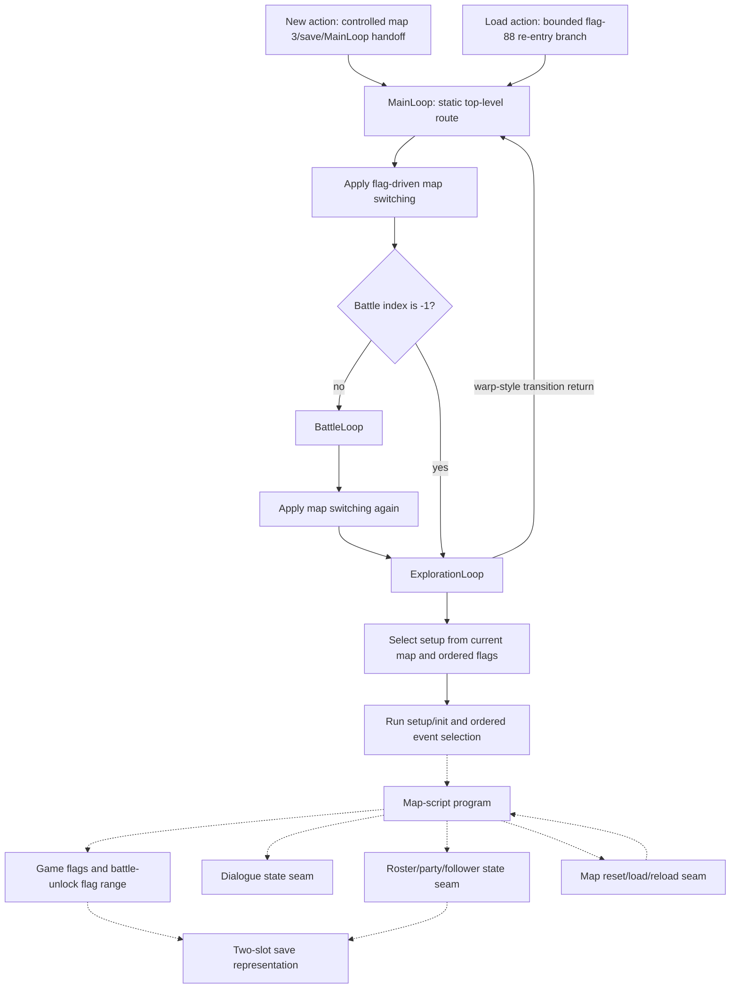

# Story Progression

- **Confirmed original behavior:** bounded New-game/re-entry handoffs, top-level map/battle/exploration
  routing, ordered setup and event selection, the complete map-script program graph, handler-local
  story-flag mutation, dialogue cursor/control seams, roster mutations, map lifecycle calls, and the
  in-process save actions described below.
- **Inferred original behavior:** these independently confirmed seams form a reusable progression
  architecture in which map, flag, party, and battle state select later local behavior.
- **Unknown original behavior:** a complete normal-play chronology, plot-beat meaning, player-choice
  consequences, route exclusivity, full save persistence, and player-visible story presentation.
- Remake status: implementation-neutral Layer B synthesis; no engine, campaign rewrite, or narrative
  data model has been selected.
- Evidence date: 2026-08-02.
- Source baseline: `ShiningForceCentral/SF2DISASM` `master`
  `c834c652b6862bc5679fd7f69a38a7093206efc6`.

## Judgment Boundary

This document explains how accepted original-game state and control boundaries can support story
progression. It is not a plot summary and not a chronological walkthrough. A source label, a static
incoming reference, or a successful handler-local replay does not establish that a normal save reaches
that code, when it reaches it, what the player sees, or what the event means in the fiction.

The safe synthesis is therefore a **progression framework**, not a campaign route:

1. top-level control chooses battle or exploration from current state;
2. current map plus ordered flags selects a six-part map setup;
3. ordered map events and map-script branches select local programs;
4. local programs may inspect or mutate flags, dialogue state, roster state, and map state;
5. map/battle transitions return control to the top-level loop;
6. save services can serialize the bounded combatant-data region, but complete subsystem persistence
   is not yet demonstrated.

The [documentation roadmap](./documentation-roadmap.md) deliberately places this synthesis after the
[gameplay overview](./gameplay-overview.md), [tactical battle loop](./tactical-battle-loop.md), and
[progression/economy synthesis](./progression-and-economy.md). Those documents explain the local
systems that story progression coordinates; none supplies missing narrative chronology.

## Pre-Synthesis Evidence Audit

The synthesis was checked against the exact executable owners instead of relying on prose or source
names alone. The audit kept the following distinctions intact:

- [gameflow research](../research/gameflow-core.md) owns the static `MainLoop` and
  `ExplorationLoop` ordering. It has no runtime fixture for exact transition frames or interrupt-edge
  event/input timing.
- [map-data research](../research/map-data-inventory.md) and the setup fixtures own ordered setup and
  event selection. Setup selection is **last set flag wins**; event dispatch is **first matching record
  wins**. These rules are not interchangeable.
- [common-scripting research](../research/common-scripting.md) owns the complete program corpus and
  handler-local command families. Static references prove graph topology, not normal-story reachability.
- [dialogue](./dialogue-system.md) and [party/roster](./party-roster-state.md) own their state and
  runtime boundaries. Neither fixture proves who speaks, why a member joins, or how either event is
  presented during normal play.
- [save](./save-system.md) owns the two-slot representation and bounded in-process action matrices.
  It does not prove that every story-relevant subsystem survives a process restart or power loss.

The focused audit reproduced the map-script, setup, event, story-state, dialogue, force-state,
control/audio, map-lifecycle, New-game, and save-action fixtures. No mismatch was found among those
owners. Their exact fixture identities remain visible in the [evidence matrix](#evidence-matrix).

## Progression Vocabulary

| Term | Confirmed meaning in this synthesis | Boundary that remains visible |
| --- | --- | --- |
| top-level route | Static `MainLoop` ordering applies flag-driven map switching, tests for battle, and otherwise reaches exploration; a completed battle passes through map switching again. | Exact transition frames and a complete campaign chronology are **Unknown**. |
| game flag | A bit addressable through confirmed check/set/clear handlers. The static map-script corpus has bounded read and write sites. | A numeric flag or source name does not establish its narrative meaning or lifetime. |
| setup route | Current map selects a default six-pointer setup and then scans every ordered flag variant; each set variant replaces the candidate. | Selection is confirmed, but a normal save's reachable map/flag combinations are **Unknown**. |
| event route | Ordered entity, zone, or item records select the first match and hand off to a bounded target identity. | The selected program's side effects and presentation are outside the event-dispatch fixture. |
| map-script program | One of 304 inventoried programs with guarded commands, labels, and explicit transfer targets. | A reference is not evidence that the program executes in normal play. |
| dialogue cursor | The state consumed or changed by bounded dialogue handlers; explicit cursor sites remain inside the source-backed text-ID domain. | Decoded text, speaker identity, portrait/audio output, waits, and input timing are **Unknown** here. |
| roster mutation | A bounded handler-local join, battle-party, AI, reset, death-list, revive, or follower operation. | Recruitment meaning, capacity lifecycle, save persistence, and presentation are **Unknown**. |
| battle-unlock flag | The source-named `setStoryFlag` handler adds 400 to its word operand before setting a flag. | The label and arithmetic do not prove battle chronology, completion, or story significance. |
| persistent story state | State that survives the complete original save/load lifecycle. | Only bounded combatant-data save actions are confirmed; subsystem-complete story persistence is **Unknown**. |

## Bounded Progression Architecture

Solid edges describe confirmed bounded control-flow seams, but the `MainLoop`/exploration layer is
currently static evidence rather than a frame-observed route. Dashed edges distinguish optional or
handler-local relations from one universal sequence: event selection exposes a target without running
its body, programs contain only the command families they actually reference, and lifecycle H3 closes
handler return rather than later visible effects. The two dashed save edges are explicit **Unknown**
questions, not claims of persistence.

The diagram deliberately cycles back to top-level routing because the static gameflow owner confirms
that exploration returns for warp-style transitions and battle return passes through map switching.
It does not order the 304 programs into a story timeline.

## Top-Level Route and Local Selection

### Main loop and exploration

**Confirmed static:** `MainLoop` applies flag-driven map switching before testing the current battle.
Battle index `-1` is the no-battle sentinel. A real battle calls `BattleLoop`; return then passes
through map switching again before exploration. `ExplorationLoop` establishes or resumes map/entity
state, loads map resources, runs the selected setup function, and alternates between pending map events
and A/C actions.

`WaitForEvent` polls `MAP_EVENT_TYPE` before reading A/C input, and the outer loop dispatches a pending
event before the player-action result. This proves static priority when both are already visible in one
polling iteration. The interrupt edge at which each value becomes visible remains **Inferred**.

The six source event categories at this layer are warp, enter caravan, enter raft, leave caravan,
leave raft, and zone event. These are control identities, not six narrative phases. An out-of-range
event plays the source-owned battlefield-death sound effect and returns; that fallback does not assign
story meaning to the invalid value.

### Setup selection

**Confirmed static and runtime:** the setup table contains 64 map rows, 66 ordered flag rows, and 126
unique six-pointer setup tables. Each setup points independently to entities, entity events, zone
events, area descriptions, item events, and an initialization function.

Selection begins with the map's default pointer, scans all variants in source order, and replaces the
candidate after every successful flag check. Therefore the last set flag wins. Four later rows point
back to a default setup, so a faithful model must preserve order and aliases rather than normalize the
variants into an unordered dictionary. The ten-case runtime matrix confirms missing-map fallback,
defaults, single and multiple set flags, last-set-flag behavior, and later default-restoring aliases.

This is a local selector. It does not prove which map/flag combinations occur in an ordinary save or
that a selected setup represents a particular plot beat.

### Event selection

**Confirmed static and runtime:** the event inventory retains 1,134 physical source/ROM records and
their separately weighted setup/route references. The nine-case runtime matrix confirms ordered
selection for entity-specific/default, zone exact/wildcard/overlapping-first/default, and item
index/facing/default variants. Unlike setup selection, these dispatchers select the first matching
record.

The runtime harness replaces each selected target's first instruction with `rts`. It confirms record
offset and target identity while intentionally excluding script side effects. A story model may use the
selection rule and target identity, but it may not infer dialogue, flag writes, facing, or transition
effects from this fixture.

## Local Script Graph and State Channels

### Program topology

**Confirmed static:** the complete map-script corpus contains 304 programs across 169 source files,
13,515 commands, 348 labels, and 184 explicit transfers. Of those transfers, 62 are same- or
cross-program unconditional/conditional edges and 122 call 68000 subroutines outside the program
graph. All encoded control targets resolve.

This provides a bounded graph on which later reachability work can operate. It is not itself a route:
static incoming references, same-file-only references, source-only programs, and unreferenced labels
remain distinct, and none establishes execution under a normal save state.

### Story-state reads and writes

**Confirmed static:** seven source forms account for 146 command sites:

| Source form | Sites | Bounded operation |
| --- | ---: | --- |
| `jumpIfFlagSet` | 24 | Test a flag; take the encoded target when set, otherwise skip it. |
| `jumpIfFlagClear` | 27 | Test a flag; take the encoded target when clear, otherwise skip it. |
| primary `csc10` | 0 | Physical toggle-command carrier with no direct source use. |
| `setF` | 37 | Alias that selects the set path. |
| `clearF` | 16 | Alias that selects the clear path. |
| `yesNo` | 22 | Controlled return 0 sets flag 89; nonzero clears it; both then call `Sleep` with 10. |
| `setStoryFlag` | 20 | Add 400 to the operand and set the resulting flag. |

The corpus has 51 conditional reads across six unique flags, 53 direct writes, 22 prompt writes, and
20 source-named battle-unlock writes. Only flags 71, 76, and 89 overlap the static read and write sets.
These counts describe source sites, not event frequency.

**Confirmed runtime:** ten handler-local cases cover both polarities of each conditional branch,
set/clear aliases, both controlled yes/no returns, base flag 400, and 16-bit wrap to flag 0. The
yes/no harness proves the result-to-flag polarity and ordered sleep handoff, not the visible prompt,
available choices, or downstream consequence.

### Dialogue as a progression seam

**Confirmed static and runtime:** six dialogue forms account for 2,883 commands in the complete
program corpus. The 21-case runtime matrix closes handler cursor movement, skip polarity, direct state
writes, modifier partitions, explicit cursor bounds, and ordered service-entry/return seams.

Those handlers can be represented as local progression effects on dialogue state plus service calls.
The services were shimmed for the bounded observation, so rendered text, character identity, portrait,
speech sound, controller timing, waits, and normal-story reachability remain **Unknown**. No decoded
dialogue is needed or reproduced by this synthesis.

### Roster and party state as a progression seam

**Confirmed static, with a bounded runtime subset:** source forms cover force joining, conditional
death/list checks, defeated-list mutation, revival, battle-party membership, AI activation,
battle-stat reset, and followers. The nine-case active-party matrix confirms bounded handler-local
chronology and state for already-active, replacement, AI clear/set, reset, and follower allocation
cases; it does not runtime-close every roster/death form.

The fixture intentionally does not convert labels such as `join`, `allyDefeated`, or follower names
into plot assertions. A local script may mutate party-related state; who joins, why, whether the change
is optional, and how it persists or appears to the player remain **Unknown** until a normal-route
fixture closes them.

### Control, audio, and map lifecycle

**Confirmed static and runtime:** seven control/audio forms account for 2,336 source occurrences. A
six-case matrix confirms bounded wait/skip, no-op dispatch, sound-command trap, subroutine call/return,
jump cursor replacement, and end behavior. It does not prove duration, audible output, or story meaning.

Four map lifecycle forms account for 108 commands: reset, fade-load, reload, and map-load. The
five-case runtime matrix confirms handler return and ordered direct call-site boundaries, including the
reset tail and current-map changes. Visible fade, entity placement consequences, collision/pathfinding,
normal-story reachability, and persistence remain **Unknown**. The separate source `warp` form and the
top-level warp return establish a control handoff, not a complete visible transition.

## Entry, Re-entry, and Persistence

**Confirmed bounded New-game handoff:** four controlled cases enter the original New action, exercise
slot and difficulty flag paths, call `SaveGame`, and transfer to `MainLoop` with current/egress map 3.
The harness bypasses player-driven naming, menu selection, and text presentation. Map 3 is therefore a
confirmed handoff value, not permission to label a plot location or opening scene.

**Confirmed bounded Load handoff:** the in-process save matrix confirms two-slot Save/Load/Copy/Delete
services. After `LoadGame`, source flag 88 clear reaches `GetSavepointForMap`; flag 88 set reaches the
`BattleLoop` jump interface. The fixture retains the numeric flag identity without assigning it a
player-facing lifecycle meaning.

**Unknown persistence boundary:** the static save representation covers 4,016 logical bytes per slot
and the runtime matrix samples the combatant-data region in one process. No current fixture proves that
the complete game-flag bitset, map-script cursor, setup selection, followers, dialogue state, or every
other story-relevant field survives the original cross-process save/load lifecycle. A remake must not
declare a canonical story-save schema from these partial facts.

## What This Enables Now

An implementation-neutral prototype may safely model:

- ordered top-level battle/exploration handoffs;
- a current-map key and ordered flag-based setup selector;
- ordered first-match event tables whose results are target identities;
- a map-script graph with explicit conditional, jump, and subroutine edges;
- bounded flag, dialogue-state, roster-state, control, and map-lifecycle operations;
- save entry/re-entry adapters with explicit unproven persistence fields.

It must keep provenance on every imported program, edge, selector row, and mutation. It must also keep
`Confirmed`, `Inferred`, and `Unknown` separate so that future route observations can refine the graph
without rewriting source-backed facts.

## What Is Not Yet a Story Route

The following remain **Unknown** and block any claim that the original campaign has been reconstructed:

1. which of the 304 programs and 184 transfers execute in a normal playthrough;
2. the initial and reachable game-flag sets for each save/progression point;
3. a chronological ordering of maps, battles, dialogue, roster changes, and transitions;
4. whether any yes/no prompt creates a persistent or mutually exclusive route;
5. the narrative meaning of numeric flags, source labels, map IDs, and battle-unlock operands;
6. complete story-state persistence across save, load, process restart, and power loss;
7. decoded dialogue, speakers, plot beats, animation, audio, input cadence, and visible timing;
8. optional-content, missable-content, failure, backtracking, and post-battle route behavior.

These gaps require grouped runtime observations from natural callers and known save states. Source-name
interpretation, isolated target execution, or a synthetic all-flags experiment is not a substitute.

## Evidence Matrix

| Boundary | Evidence label and bounded claim | Exact executable owners | Remaining question |
| --- | --- | --- | --- |
| top-level gameflow | **Confirmed static** map switching, battle sentinel/order, exploration return, event-before-action branch priority | [gameflow research](../research/gameflow-core.md); `sf2-gameflow-core-static-v1` ([`gameflow-core-static-v1.json`](../../tests/fixtures/h2/gameflow-core-static-v1.json)) | Runtime timing, transition frames, normal campaign chronology |
| complete script graph | **Confirmed static** 304-program/13,515-command corpus and resolved explicit transfers | [common-scripting research](../research/common-scripting.md); `sf2-map-script-engine-static-v1` ([`map-script-engine-static-v1.json`](../../tests/fixtures/h2/map-script-engine-static-v1.json)) | Normal-save admission and reachable-route ordering |
| setup selection | **Confirmed static/runtime** ordered map/flag scan, last-set-wins, aliases, and missing/default cases | [map-data research](../research/map-data-inventory.md); `sf2-map-setup-static-v1` ([`map-setup-static-v1.json`](../../tests/fixtures/h2/map-setup-static-v1.json)) and `sf2-map-setup-selection-runtime-v1` ([`map-setup-selection-v1.json`](../../tests/fixtures/h3/map-setup-selection-v1.json)) | Reachable map/flag combinations and selected setup effects |
| event selection | **Confirmed static/runtime** ordered records and first-match entity/zone/item target selection | [map exploration](./map-exploration.md); `sf2-map-events-static-v1` ([`map-events-static-v1.json`](../../tests/fixtures/h2/map-events-static-v1.json)) and `sf2-map-event-dispatch-runtime-v1` ([`map-event-dispatch-v1.json`](../../tests/fixtures/h3/map-event-dispatch-v1.json)) | Selected script effects, normal reachability, presentation |
| story-state commands | **Confirmed static/runtime** conditional polarity, direct set/clear, flag-89 prompt polarity, and 400-base write arithmetic | `sf2-map-script-engine-static-v1` ([`map-script-engine-static-v1.json`](../../tests/fixtures/h2/map-script-engine-static-v1.json)) and `sf2-story-state-runtime-v1` ([`story-state-v1.json`](../../tests/fixtures/h3/story-state-v1.json)) | Flag meanings, prompt consequences, persistence, normal reachability |
| dialogue seam | **Confirmed static/runtime** six-form corpus plus handler-local cursor, branch, state-write, and service-call boundaries | [dialogue contract](./dialogue-system.md); `sf2-map-script-engine-static-v1` ([`map-script-engine-static-v1.json`](../../tests/fixtures/h2/map-script-engine-static-v1.json)) and `sf2-map-script-dialogue-runtime-v1` ([`map-script-dialogue-v1.json`](../../tests/fixtures/h3/map-script-dialogue-v1.json)) | Content, speakers, unshimmed services, input/timing, normal route |
| roster/party seam | **Confirmed static/runtime subsets** roster/death forms and nine active-party/AI/reset/follower cases | [party/roster contract](./party-roster-state.md); `sf2-map-script-engine-static-v1` ([`map-script-engine-static-v1.json`](../../tests/fixtures/h2/map-script-engine-static-v1.json)) and `sf2-force-state-active-party-runtime-v1` ([`force-state-active-party-v1.json`](../../tests/fixtures/h3/force-state-active-party-v1.json)) | Recruitment meaning, capacity lifecycle, persistence, presentation |
| script control | **Confirmed static/runtime** wait/skip, no-op, sound trap, subroutine, jump, and end seams | `sf2-map-script-engine-static-v1` ([`map-script-engine-static-v1.json`](../../tests/fixtures/h2/map-script-engine-static-v1.json)) and `sf2-map-script-control-audio-runtime-v1` ([`map-script-control-audio-v1.json`](../../tests/fixtures/h3/map-script-control-audio-v1.json)) | Duration, service effects, audible result, normal reachability |
| map lifecycle | **Confirmed static/runtime** reset/load/reload handlers and ordered direct call-site boundaries | `sf2-map-script-engine-static-v1` ([`map-script-engine-static-v1.json`](../../tests/fixtures/h2/map-script-engine-static-v1.json)) and `sf2-map-lifecycle-runtime-v1` ([`map-lifecycle-v1.json`](../../tests/fixtures/h3/map-lifecycle-v1.json)) | Visible transition, entity/layout consequences, persistence, normal route |
| New-game and load re-entry | **Confirmed bounded runtime** controlled map-3/save/MainLoop handoff and flag-88 load routing | [save contract](./save-system.md); `sf2-witch-new-game-lifecycle-runtime-v1` ([`witch-new-game-lifecycle-v1.json`](../../tests/fixtures/h3/witch-new-game-lifecycle-v1.json)) and `sf2-witch-save-actions-runtime-v1` ([`witch-save-actions-v1.json`](../../tests/fixtures/h3/witch-save-actions-v1.json)) | Player-driven UX, flag meaning, full persistence, cross-process behavior |
| save representation | **Confirmed static** two slots, checksum/check order, occupancy, and bounded combatant-data copy direction | `sf2-tech-services-static-v1` ([`tech-services-static-v1.json`](../../tests/fixtures/h2/tech-services-static-v1.json)) | Canonical story-save schema and durable-medium behavior |

## Original Fidelity and Modernization

Original-fidelity behavior includes ordered selectors, branch polarity, target identity, alias rows,
handler-local mutation order, and the distinction between physical records and route-weighted
references. A parity implementation should preserve those facts before changing them.

Modernization decisions remain separate. A remake may choose explicit quest records, typed flags,
human-readable event IDs, atomic saves, skippable scenes, dialogue logs, route visualization, or
different failure/recovery policy. None of those choices should be described as recovered original
behavior, and none should erase the source identity needed for parity comparison.

## H4 Acceptance and Expansion Gates

A future claim of reconstructed story progression requires a grouped route fixture rather than more
label interpretation. At minimum it must:

1. start from identified original New/load states with explicit save provenance;
2. record current map, battle index, relevant flag deltas, selected setup, selected event/program,
   dialogue cursor changes, roster mutations, and loop handoffs at natural callers;
3. distinguish player input from scripted state and record both sides of any claimed choice;
4. prove save/load persistence for every story-state field it uses;
5. compare the observed route with the static 304-program graph without deleting unreachable or
   source-only rows;
6. keep decoded copyrighted text and captured audiovisual assets private;
7. retain disagreements and non-reached branches as explicit **Unknown** results.

Only after such evidence exists should an upper-layer document describe campaign chapters, optional
routes, quest semantics, or player-facing story choice. Those remain future design work, not facts
implied by the current synthesis.
