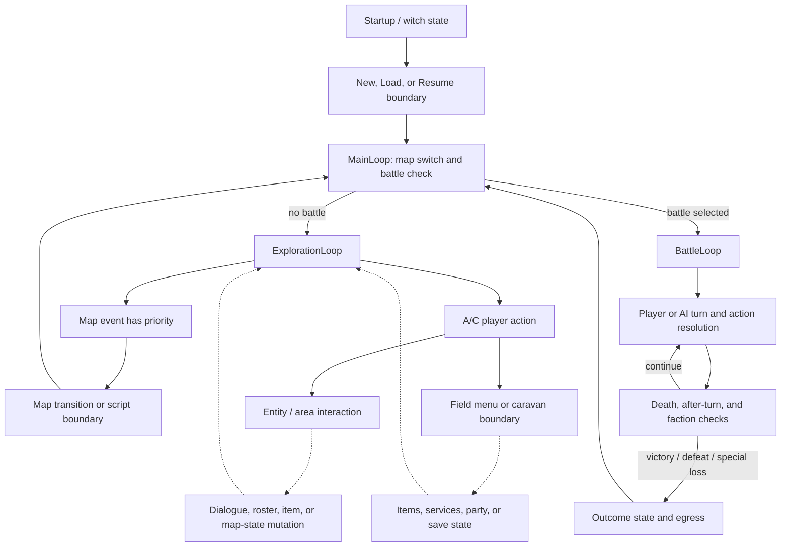

# Gameplay Overview and System Boundaries

- Status: **design synthesis over accepted evidence**; this document adds no original-game fact and
  selects no remake engine, product shape, or balance direction.
- Record date: 2026-08-01
- Audience: researchers, design-document authors, and fidelity implementers who need to understand
  player actions, top-level states, and subsystem handoffs.
- Scope: connect only gameflow, map, input, dialogue, party/roster, service, battle, growth, and save
  contracts accepted on current `main`; every interpretation retains its **Confirmed**,
  **Inferred**, or **Unknown** label.

This is the first Layer B synthesis described by the
[documentation roadmap](../documentation-roadmap.md). It provides navigation and does not replace any
research owner, fixture, or subsystem contract. **Confirmed** means the stated boundary is supported
by linked Layer A evidence. **Inferred** means multiple confirmed boundaries have been connected into
a neutral player-facing explanation. **Unknown** means current evidence does not support further
interpretation.

## Supported and Unsupported Judgments

This document supports judgments about:

- the confirmed state boundaries at which a player can move, interact, manage resources, choose a
  battle action, or save;
- the categories of state handed among exploration, script/service, battle, growth, and save owners;
- the existing contracts and fixtures from which a fidelity implementation should obtain acceptance
  facts.

This document does not support judgments about:

- a complete campaign route, story beats, character motivations, or the narrative experience a
  player is supposed to have;
- map-author intent, intended strategy, the best roster, difficulty/numerical curves, or economic
  balance;
- original interface feel, frame-exact input latency, visible animation/audio timing, or
  hardware-level rendering parity;
- remake engine, platform, UI, accessibility, save-reliability modernization, or intentional
  rebalance decisions.

## Player Verbs and Immediate Goals

The table translates source-facing behavior into neutral player-action phrases. It does not treat a
program symbol as original player-facing meaning or derive a long-term design purpose from one state
mutation.

| Player action | Immediate goal supported by current evidence | Label and boundary |
| --- | --- | --- |
| Start, load, or resume | Enter a new or existing game state; resume a suspended battle | Witch/save action routing, the two-slot data boundary, and the battle-resume entry are **Confirmed**. The complete visible choice flow, cross-process durability, and power-loss behavior remain **Unknown**. |
| Move on a map | Change the controlled entity position and allow map movement/event logic to continue evaluating | Entity movement/action update order, position/collision units, and map-event polling are **Confirmed**. Route purpose, movement feel, and every visible frame are **Unknown**. |
| Activate or inspect | Face a nearby entity, area, or inspectable block and request a script, event, or item result | Admission, priority, object categories, and inventory handoff are **Confirmed**. Normal-story reachability, text/animation/audio presentation, and long-term persistence of most results remain **Unknown**. |
| Open a menu and manage items | Select a field/battle menu action and use, give, equip, or drop a legal item | Battle player-control and service/stat owners confirm bounded branches and mutation order. This document does not claim every field-menu page, cancellation feel, or complete visible feedback. |
| Use a service | Exchange resources or change member state through the confirmed shop, church, caravan/depot, or blacksmith action surface | Action, cancellation, and gold/item/member mutation order are **Confirmed static**. Map/NPC admission, return to exploration, persistence, and presentation remain **Unknown**. |
| Position, target, and act in battle | Choose a legal tile/target and an attack, magic, item, stay/search, or other supported outcome | The player-control state machine and action-resolution boundaries are **Confirmed static**, with H3 coverage for selected math/status paths. Tactical intent, AI fairness, complete battle pacing, and general simulation accuracy are outside this document. |
| Receive growth or recovery | Apply EXP, level-up, status recovery, or service mutations to character state | Existing contracts confirm selected inputs, order, clamps, and outputs. Player roster tradeoffs, build intent, growth experience, and complete numerical curves remain **Unknown**. |
| Save, copy, delete, or suspend | Preserve, duplicate, clear, or temporarily interrupt state at a confirmed storage seam | SRAM layout, checksum, slot actions, and in-process H3 behavior are **Confirmed**. Original power-loss atomicity and long-term physical-device durability remain **Unknown**. |

**Inferred action-goal alignment:** together, these actions allow the player to advance currently
reachable state, resolve a local battle or resource constraint, and retain recoverable progress.
Interpreting them further as “explore the world,” “build an ideal force,” or “master a particular
tactic” may fit genre expectations, but campaign reachability, player observation, and authorial
intent evidence in this repository do not yet confirm those meanings.

## Top-Level State Flow

The following is design synthesis, not engine architecture. Solid lines represent handoffs whose
existence and order are recorded by owning documents. Dashed lines represent an **Inferred
player-level connection** between confirmed boundaries whose complete caller, visible transition, or
persistence has not been closed.

### Confirmed Flow Anchors

1. `MainLoop` applies flag-driven map switching before checking for a battle; `-1` is the no-battle
   sentinel. A real battle return passes through map switching again, and an exploration
   warp-style transition also returns to the outer loop.
2. `ExplorationLoop` establishes or restores map/entity state, loads map resources, runs setup, and
   then loops between map events and A/C actions. Both polling and dispatch check the map event first,
   so an event wins when both values are visible in the same iteration.
3. The player-action path tests A before C. A enters the field-menu path. C can route to caravan,
   entity activation, area inspection, or field-menu fallback, with a separate debug route outside
   the ordinary gameplay explanation.
4. `BattleLoop` distinguishes suspended and new-battle entries. A new battle crosses initialization,
   cutscene, roster, region, spawn, and turn-order boundaries. After each action, death and faction
   outcomes are processed on both sides of the after-turn effect.
5. Victory, defeat, and the battle-4 special loss return distinct outcome state. Those returns join
   the main/map egress boundary, but this document does not supply narrative meaning for them.

### Transitions That Cannot Yet Be Closed

- when service, dialogue, roster commands, or item handoffs occur across all normal-story callers;
- player-visible completion, cancellation, return-to-exploration, and audio/window timing for each
  interaction;
- cross-process persistence of all map, party, service, and battle state after save/load;
- the actual reachable order of every branch, battle, and map in the campaign.

All are **Unknown**. A dashed connection must not become an implicit remake route without a decision.

## Loops and System Dynamics

### Confirmed Local Loops

- **Exploration polling loop:** map/entity update produces or retains state. `WaitForEvent` observes a
  pending map event before A/C, and the outer loop still dispatches the event first. That priority is
  **Confirmed**; the exact VInt publication edge is **Unknown**.
- **Battle round/action loop:** a new or resumed battle enters individual-turn processing. Death and
  outcome checks surround the after-turn effect, and a `0xFF` turn-order entry starts the next round.
  The top-level order is **Confirmed**; neither complete action-by-action presentation nor the full
  set of runtime caller states is fully confirmed.
- **Service/menu loop:** current service contracts confirm actions, cancellation branches, and
  mutation order. Describing them as an economic/recovery loop repeatedly visited by the player is
  **Inferred**, because admission, return, and campaign frequency are not closed.

### Feedback Relationships with Evidence Boundaries

| State relationship | Current label | Conclusion it must not become |
| --- | --- | --- |
| battle action → HP/status/death → outcome checks | Individual edges and selected formula/status cases are **Confirmed**; the complete battle experience is **Inferred**. | Intended tactics, target-priority meaning, difficulty, or pacing |
| battle EXP/reward → level/stat/resource mutation → character state consumed later | Individual reward, level-up, gold/item, and service boundaries have **Confirmed** contracts; the campaign-wide feedback loop is **Inferred**. | Optimal builds, appropriate grinding, or player/enemy numerical curves |
| flag/map setup/event/script → map, dialogue, or roster state | Selectors, command shape, handler order, and selected H3 cases are **Confirmed**. | Plot beats, authorial intent, or complete story consequences |
| damage/status/item limits → church/shop/caravan/item actions | Service resource order and selected stat state are **Confirmed**; visit frequency and player pressure are **Unknown**. | Economic balance, supply pacing, or strategic necessity |
| save/suspend action → serialized/resumed state | Layout, helper order, and bounded H3 are **Confirmed**. | A complete snapshot of every subsystem, power-loss safety, or modern save UX |

The repository can therefore describe multiple local state machines and their interfaces, but cannot
yet promote those interfaces into a proven complete core loop, campaign loop, or meta-progression
loop.

## Evidence Matrix

| Synthesis boundary | Label and bounded claim | Evidence owner / executable trace | Remaining question |
| --- | --- | --- | --- |
| main and exploration routing | **Confirmed** map switching, battle sentinel, event-before-input order, and interaction admission/order | [gameflow research](../../research/gameflow-core.md); `sf2-gameflow-core-static-v1` ([`gameflow-core-static-v1.json`](../../../tests/fixtures/h2/gameflow-core-static-v1.json)) | VInt edge, transition frames, normal-story reachability |
| map state and movement/event | **Confirmed** map import, setup/event order, working layout, and bounded movement/action behavior | [map contract](../contracts/map-exploration.md) and its itemized H2/H3 fixture list; `sf2-map-interaction-trigger-runtime-v1` ([`map-interaction-trigger-v1.json`](../../../tests/fixtures/h3/map-interaction-trigger-v1.json)) | Final rendering, complete player route, selected persistence |
| input seam | **Confirmed** raw sampling, current/repeat state, and wait helpers | [input contract](../contracts/input-system.md); `sf2-tech-services-static-v1` ([`tech-services-static-v1.json`](../../../tests/fixtures/h2/tech-services-static-v1.json)) owns raw sampling and wait helpers, while `sf2-tech-interrupts-static-v1` ([`tech-interrupts-static-v1.json`](../../../tests/fixtures/h2/tech-interrupts-static-v1.json)) owns the VInt-derived current/repeat stage | Controller protocol, frame-exact latency, player-visible repeat cadence |
| dialogue handoff | **Confirmed** six command layouts, handler order, and 21-case handler-local runtime seam | [dialogue contract](../contracts/dialogue-system.md); `sf2-map-script-dialogue-runtime-v1` ([`map-script-dialogue-v1.json`](../../../tests/fixtures/h3/map-script-dialogue-v1.json)) | Text/portrait/audio rendering, story reachability, persistence |
| party/roster handoff | **Confirmed** ten source forms, branch/mutation/call order, and bounded active-party effect | [party/roster contract](../contracts/party-roster-state.md); `sf2-map-script-engine-static-v1` ([`map-script-engine-static-v1.json`](../../../tests/fixtures/h2/map-script-engine-static-v1.json)) and `sf2-force-state-active-party-runtime-v1` ([`force-state-active-party-v1.json`](../../../tests/fixtures/h3/force-state-active-party-v1.json)) | Roster/list capacity, story lifecycle, save persistence, player choice space |
| service actions | **Confirmed static** shop/church/caravan/blacksmith actions and resource-mutation order | [service contract](../contracts/service-interactions.md); `sf2-common-menus-static-v1` ([`common-menus-static-v1.json`](../../../tests/fixtures/h2/common-menus-static-v1.json)) | Admission, return, presentation, persistent outcome |
| battle entry, turn, and outcome | **Confirmed static** new/resume, round/action/death/outcome order | [battle-loop research](../../research/battle-loop.md); top-level executable trace `sf2-battle-control-static-v1` ([`battle-control-static-v1.json`](../../../tests/fixtures/h2/battle-control-static-v1.json)). [Battle-functions research](../../research/battle-functions.md) and `sf2-battle-functions-static-v1` ([`battle-functions-static-v1.json`](../../../tests/fixtures/h2/battle-functions-static-v1.json)) support only the shared individual-turn/player-control surface | Complete player-visible loop, runtime caller states, tactical interpretation |
| action resolution | **Confirmed** implementation-neutral physical, spell, status, EXP, and selected replay boundaries | [combat contract](../contracts/combat-resolution.md), [spell contract](../contracts/spell-resolution.md), [randomness contract](../contracts/randomness.md), and their fixture lists | Unobserved branches, distribution isolation, general battle simulation |
| growth | **Confirmed** level-up order, growth, clamps, spells, and refresh boundary | [level-up contract](../contracts/level-up.md) and its H2/H3 fixture list | Campaign context, roster choice, intended curves, balance intent |
| save and suspend | **Confirmed** two-slot layout, checksum, action routing, and bounded in-process replay | [save contract](../contracts/save-system.md); `sf2-witch-save-actions-runtime-v1` ([`witch-save-actions-v1.json`](../../../tests/fixtures/h3/witch-save-actions-v1.json)) | Cross-process behavior, power loss, complete subsystem persistence, visible UX |

The table provides owner navigation only. Exact expectations remain defined by each fixture's schema,
extractor/verifier, and owning contract; this document must not copy a weaker expectation set.

## Original Fidelity and Modernization

### Fidelity Rules

A future implementation claiming fidelity for a boundary covered here should at minimum:

1. consume map, input, script, party, service, battle, growth, and save state from owning
   contracts/fixtures rather than deriving data structures from this diagram or a player-facing
   phrase;
2. preserve confirmed selectors, priorities, branch polarity, mutation/call order, clamps, and
   sentinels;
3. make no original-game claim for **Unknown** reachability, presentation, timing, capacity, or
   persistence;
4. report deliberate deviations separately from original-compatible expectations.

### Modernization Decisions Not Yet Made

Modern input mapping, acceleration/skipping, UI information hierarchy, accessibility, autosave,
atomic saves, cross-platform storage, content reordering, character rebalancing, enemy-stat
retargeting, and a new battle simulator may all be reasonable directions, but none is decided here.
Any such choice should state its rationale in `docs/decisions/` or a future remake specification and
separate its expected-deviation/H4 acceptance from original parity.

## H4 Integration and Stop Conditions

This document is not a new executable contract and does not register an aggregate golden weaker than
the subsystem fixtures. An H4 adapter should consume evidence-matrix owners as needed and use the
same fixture to verify the same implementation-neutral fact against the original harness and remake
adapter. A cross-subsystem scenario may be added only after all input, state-unit, order, and output
boundaries have accepted owners.

Stop expanding this document and leave the question in the owner queue whenever:

- the answer requires an unaccepted reverse-engineering branch, unobserved normal-story
  reachability, or visible timing;
- a source name, static call, or single fixture case would need to become player intent, balance, or
  a campaign rule;
- engine architecture, product experience, or an intentional deviation must be selected;
- complete map-design principles, roster choice space, player/enemy curves, or battle simulation are
  required.

Those four upper-layer directions remain in the documentation roadmap's
[long-term directions](../documentation-roadmap.md#long-term-directions) until their entry criteria are
satisfied and a separate design-synthesis slice begins.
