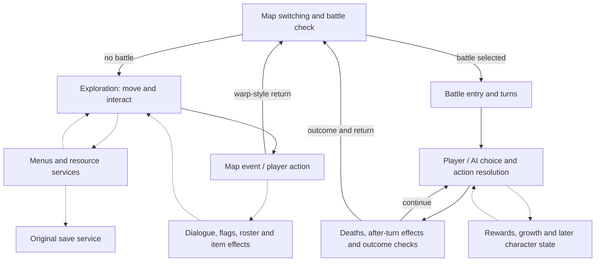

# Gameplay Overview and System Boundaries

- Status: **user-accepted design synthesis over accepted evidence** under
  [Issue #669](https://github.com/FrankHZ/md-sf2-reverse-engineering/issues/669).
- Review baseline: accepted `main` at `3d550cd9db7a7508bd7f95d0307302ed05dddb7a`.
- Audience: readers choosing which gameplay directions to understand more deeply, and researchers,
  design authors and implementers following those directions to their evidence owners.
- Scope: explain the connected gameplay systems, the demonstrated private Map 3 → Battle 01 →
  return slice, accepted remake choices and remaining questions. This overview adds no original-game
  fact, balance target or product decision.

Play connects movement and interaction with changes to the world and the force. In exploration, a
player moves, faces an entity or searchable place, and requests an interaction. Map and story state
select what happens next: dialogue, an item transfer, a roster change, a transition or a battle.
In battle, the player positions a member and chooses an action; its result changes combatant and
resource state, which the battle controller uses to continue play or resolve an outcome. Growth,
equipment and recovery connect that result to later actions. Original save and suspend services
provide separate re-entry boundaries.

That is an **Inferred cross-system explanation** of the accepted rules, not a proven chronology for
the entire campaign. A connected exploration-to-victory-to-usable-return slice is now accepted for
the private remake, with bounded original observations supporting its route. The sections below
distinguish that demonstrated slice from rules whose wider callers, presentation or persistence
remain **Unknown**.

The [documentation roadmap](../documentation-roadmap.md) owns the writing and review agreement.
Here, **Confirmed** identifies a source-backed rule or named bounded observation; its paragraph
states which. **Inferred** identifies a supported connection that has not been established at the
wider boundary. **Unknown** identifies a question the accepted material cannot yet answer. Remake
decisions are stated separately: working remake behavior cannot establish an original-game fact.
Exact parameters and expectations remain in the linked contracts and fixtures.

## Exploration: moving, facing and discovering a result

**Confirmed original rules:** moving changes the controlled entity's position, and facing a nearby
entity or searchable location lets the player request an interaction. Map setup and event selection
use current map, entity and flag state to determine which local programs are available. Event tables
select the first matching record, while setup variants use the last set flag in source order. These
different rules matter when conditions overlap: the same location can select different local behavior
as state changes.

The original action path tests A before C: A opens the field-menu path, while C can activate an entity,
inspect an area, enter the co-located caravan or fall back to the field menu. Search distinguishes
chests and other object categories. A found item is offered to the player, then another force member;
when all inventories are full, the item is restored rather than silently lost. These are
source-confirmed admission and
handoff rules, not a claim about every search message or animation.

A pending map event takes priority over an A/C action when both are visible in the same exploration
poll. A warp-style transition returns to top-level routing, where map switching and the battle check
select subsequent play. The exact original interrupt edge that publishes an event relative to input
sampling remains **Unknown**; it does not make the recorded priority undecided.

**Inferred design connection:** position, facing, flags and inventory capacity jointly determine what
an exploration action can accomplish. A successful interaction can therefore change more than the
location of the player: it can supply a resource or alter the conditions for a later program. This
explains how movement and interaction connect to story and party state without assigning purpose to
an unobserved route or claiming that every path is useful or reachable.

Read [map exploration](../contracts/map-exploration.md) for geometry, working-layout preservation,
ordered selectors and movement rules, and [gameflow research](../../research/gameflow-core.md) for
event/input priority and interaction admission. [Map Design Principles](map-design-principles.md)
explains the structural content. **Unknown:** campaign-wide route quality, authorial intent and
original movement feel. Reached map/motion consumers in the accepted private slice have their own
[composition boundary](../contracts/map3-battle01-continuous-scenario.md#complete-reached-field-motion-and-consumer-binding);
that does not establish hardware frame equality or every map's behavior.

## Interaction and story: state selects the next local behavior

**Confirmed original structure:** map programs inspect and mutate flags, dialogue state, roster state
and map state. Dialogue commands select text through a cursor and retain distinct continuing,
single-window and close/clear paths. Party commands likewise retain separate join, active-party,
AI-control, reset, defeated-list, revive and follower operations. A text reference or a command named
`join` establishes a source operation; by itself it does not explain a character's motive or when a
normal playthrough reaches it.

**Inferred design connection:** an interaction's lasting significance comes from the state it leaves
for later selectors, not merely the fact that text was requested. A flag change can select a different
map setup or program; a roster change can affect later party state; a transition hands the current
world state back to routing. Dialogue and movement can accompany those changes, but a program return
alone cannot prove that the player saw or heard them finish.

That presentation distinction is important for input. The [dialogue contract](../contracts/dialogue-system.md)
now includes reached text-wait bindings beyond its older handler-local matrix. The accepted private
composition binds reached displayed text, acknowledgement, continuation and actual input readiness.
Reached presentation semantics are accepted within that composition. **Unknown original behavior**
still includes unobserved callers, complete original service timing and hardware output;
the earlier shims remain handler observations, not retroactive proof of unshimmed display.

Use [Story Progression](story-progression.md) for the wider state-routing explanation and
[party/roster state](../contracts/party-roster-state.md) for command and runtime boundaries. The
[continuous scenario](../contracts/map3-battle01-continuous-scenario.md) owns the reached route and
source/consumer connections. Those narrower current owners govern reached behavior where older
synthesis prose retains broader Unknowns. **Unknown:** complete plot chronology, route exclusivity,
player-choice consequences and the meaning of unobserved story flags.

## The force: membership, active roles and character growth

**Confirmed original boundaries:** joining the force, entering the active battle party, AI control
and following on the map are distinct state operations. A follower is not automatically a combatant
selected for battle, and joined membership is not interchangeable with an active-party list. The
party contract preserves mutation/call order even where a handler-local list temporarily differs
from already-changed membership flags. Its controlled matrices establish selected effects, not a
complete player-facing recruitment or capacity lifecycle.

Characters also have distinct current HP/MP, maxima, base stats and derived battle stats. Equipment
and status contribute to the latter. **Confirmed for the growth contract's observed paths:** a
level-up applies gains, increments level, handles the matching spell-learning threshold and refreshes
derived stats. Increasing maximum HP or MP does not itself refill current HP or MP. For example,
the observed Slade refresh raises his maximum HP while leaving his current HP at the input value.
Growth and immediate recovery therefore solve different state changes.

Battle EXP connects action results to that growth. **Confirmed at the named reward/replay seams:**
action-local EXP is finalized into a command, then applied to stored EXP; threshold handling can call
`LevelUp`. Stored level, effective reward-comparison level and spell-learning level are separate
quantities. Class/promotion and spell-list rules must come from their owners, rather than a single
generic idea of “higher level.”

**Inferred design connection:** the force carried forward from interactions and previous actions
provides the members, stats, equipment and spells consumed by later battles. That supports an
explanation of preparation and growth, but it does not prove an optimal party, promotion time,
character role or intended difficulty curve.

Follow [party/roster state](../contracts/party-roster-state.md), [common stats](../../research/common-stats.md),
[level-up](../contracts/level-up.md) and [ally growth](../../research/ally-growth.md) for definitions and
parameters; [Progression and Economy](progression-and-economy.md) connects reward stages. **Unknown:**
the complete player roster choice space, recruitment lifecycle and campaign-level growth experience.
The accepted slice's roster and growth results do not close those wider questions.

## Tactical battle: legal choices become effects and outcomes

**Confirmed original player-control rules:** movement and targeting are choices within the current
battle state. Terrain, occupancy, movement budget and action range constrain legal positions and
targets. The action menu provides attack, magic, item and stay/search routes. Cancellation can restore
the pre-action position and leave the action uncommitted. Choosing a target, committing an action and
applying its result are separate handoffs; cursor placement alone is not damage or a spent resource.

The controller supplies the context for those choices. **Confirmed original control rules:** a new
battle and a suspended battle enter differently. New battle initialization passes through cutscene,
roster, region and loading work before turns. Each new round activates enemies, runs region-cutscene
and spawn work, then generates turn order. A turn dispatches through the actor's life/status/control
conditions; ownership of a turn and membership of a faction are separate concerns. Player and AI
paths select an action before the resolution path consumes it.

**Confirmed for the combat/spell contract subsets:** physical attacks and spells resolve from the
actor, targets, stats, status, terrain and applicable random state. The contracts preserve integer
arithmetic, branch conditions and random-call order. They also distinguish temporary state used to
construct a battle scene from the state applied by its commands. Restoring temporary HP before
replay is not healing the target. AI scoring is likewise not actual damage: decision construction
and executed effects have different owners.

After an action, the controller processes deaths and checks factions before and after the after-turn
effect. Continued play selects another actor or starts a round; an outcome leaves that loop. Victory
has source-confirmed party recovery, after-battle program and flag effects. Defeat and the special
battle-4 loss have distinct source paths. **Confirmed bounded original observation:** the selected
Battle 01 lineage reaches natural victory, after-program return and stable field readiness; it is
not evidence of every loss, retreat or special battle route.

**Inferred design connection:** positioning affects available actions; actions affect HP, status and
resources; those effects affect who remains available and whether battle continues. Rewards and
outcome state connect the local tactical loop back to growth and the world. This explains a tactical
decision surface without recommending a strategy or inferring fairness, balance or pacing.

Read [Tactical Battle Loop](tactical-battle-loop.md), [battle-loop research](../../research/battle-loop.md),
[combat resolution](../contracts/combat-resolution.md), [spell resolution](../contracts/spell-resolution.md)
and [randomness](../contracts/randomness.md). The accepted slice has reached action/AI/turn/scene
compositions; broader action families and caller states retain their owners' limits. **Unknown:** a
general full-game simulation's predictive accuracy, complete encounter behavior and intended tactics.

## Resources: items, magic, services and recovery

**Confirmed bounded original example:** the observed HEAL 1 action spends the caster's MP and restores
the target's missing HP up to the permitted recovery amount. It can also produce EXP under the
applicable healer/reward rules. The [healing fixture](../../../tests/fixtures/h3/spell-healing-v1.json)
and [spell contract](../contracts/spell-resolution.md) retain that controlled self-cast's cost,
recovery and replay; it is not a rule for every spell or caster.

HP, MP, held items, gold, EXP and stored service resources are different state. **Confirmed bounded
rules:** magic and item routes have action-specific eligibility, cost and result rules; damage,
recovery, status effects and rewards must not be collapsed into one generic effect. The accepted
private battle slice includes physical actions, HEAL and Medical Herb consumption. It does not
establish complete original spell/item coverage or make all field item effects runnable.

Resource movement also has destinations and conditions. An exploration pickup depends on inventory
capacity. Source-confirmed shop actions buy, sell, repair and use deals: buying decreases gold before
granting the item; selling increases gold before dropping the held item, with separate rare-item
routing. Caravan/depot actions distinguish member-held items from storage and preserve transfer order.
Blacksmith fulfillment and order placement use their own material, member and payment gates. Those
static transactions explain the resource interfaces; they do not prove that every service is
available at a particular map/NPC or that its result survives a later reload.

The Church's raise, cure, promote and save routes connect resources to member and persistence state.
**Confirmed bounded runtime results:** accepted Raise cases observe affordability, payment, HP
restoration with the original cap and mapsprite helper completion; Cure cases observe ordered status
and equipment commits; Save cases observe prompt branches, original save-call completion and the
continue/suspend entry split. Each confirms its named transaction and terminal seam. Wider caller
return, UI, durable storage and normal campaign admission remain **Unknown**. Promotion retains source
level/data gates and class/promotion call order; that is not proof of optimal timing.

**Inferred design connection:** resources gained or retained in one activity become inputs to later
choices. A damaged member, a spell's MP requirement, inventory capacity or a service price can limit
the next legal action. How often players encounter those constraints, and whether they create
scarcity or grinding pressure, remain **Unknown** without campaign and balance context.

The [service contract](../contracts/service-interactions.md), [spell contract](../contracts/spell-resolution.md),
[common stats](../../research/common-stats.md) and [Progression and Economy](progression-and-economy.md)
own these distinctions and parameter tables. A source inventory or one successful battle is not a
campaign economy. Reached HEAL/item presentation belongs to the continuous composition; service
menus outside that slice keep their separate evidence and implementation limits.

## World return and persistence: continuing play is distinct from saving it

**Confirmed original routing:** the outer loop applies flag-driven map switching before checking
for battle. A battle return passes through map switching again; a warp-style exploration transition
also returns to that loop. Returning from a controller is one boundary. A settled map with usable
input is a later boundary, established separately in the demonstrated slice below.

The following diagram shows the source-confirmed routing skeleton. Solid arrows express recorded
control handoffs; dashed arrows summarize **Inferred** cross-system relationships. They do not
establish every caller's return, visible completion or saved-state lifetime.

```mermaid
flowchart TD
    Route["Map switching and battle check"] -->|"no battle"| Explore["Exploration: move and interact"]
    Route -->|"battle selected"| Battle["Battle entry and turns"]
    Explore --> Event["Map event / player action"]
    Event -->|"warp-style return"| Route
    Event -.-> Local["Dialogue, flags, roster and item effects"]
    Local -.-> Explore
    Explore -.-> Services["Menus and resource services"]
    Services -.-> Explore
    Battle --> Action["Player / AI choice and action resolution"]
    Action --> Checks["Deaths, after-turn effects and outcome checks"]
    Checks -->|"continue"| Action
    Checks -->|"outcome and return"| Route
    Action -.-> Growth["Rewards, growth and later character state"]
    Growth -.-> Action
    Services -.-> Save["Original save service"]
```

**Confirmed original save boundaries:** the original has two logical SRAM save slots, checksums and
occupied flags, with distinct save/load/copy/delete operations. In-process matrices observe those
helpers and selected Witch action-admission and New-game handoffs. Battle suspend has a separate
save/flag/transfer path and re-entry branch. These results describe original state and control; they
do not establish complete player-driven startup UI, cross-process survival, power-loss recovery or
that every subsystem is serialized.

Even within roster state, the owning matrix distinguishes joined membership and HP in the saved
combatant-data domain from the defeated list outside it. A mutation being retained during play does
not automatically mean it is part of a durable save. **Unknown:** complete campaign-state survival
and physical-medium behavior.

Read [save-system](../contracts/save-system.md) and [party/roster](../contracts/party-roster-state.md)
for those original boundaries. The current remake milestone explicitly excludes user save/load and
suspend under [ADR 0010's persistence scope](../../decisions/0010-map3-battle01-product-acceptance.md#6-save-and-resume-scope).
A playable return therefore does not claim a modern save system. Autosave, atomic writes, recovery
UX and broader persistence remain future product decisions with their own acceptance scope.

## A demonstrated connected slice

**Confirmed accepted private remake milestone:** the
[current acceptance owner](map3-battle01-readiness.md#accepted-current-milestone) accepts one continuous
Map 3 → Battle 01 victory → usable field return composition. Its player-facing connection is:

1. Enter the controlled admitted Map 3 state and use ordinary movement and interaction along the
   selected mandatory route. This is a product start seam, not a complete visible original New/load
   flow or unrestricted Map 3 exploration.
2. Continue through messenger, Map 19, royal/guard and castle/tower programs to natural Battle 01
   admission. Dialogue, state changes, movement, waits and before/start presentation are part of that
   route rather than a summary card that substitutes for it.
3. Control the ally turns through movement, target/action selection, confirmation and the admitted
   cancel/reselect path, while source-bound enemy decisions and the battle rules continue play.
   Reached actions, effects, rewards and their actual presentation consumers connect within the
   accepted composition.
4. Win, complete the after-battle program and world return, then reach a settled field that accepts
   ordinary input. Victory result alone is insufficient; usable return is the endpoint.

The [original acquisition owner](../../research/map3-messenger-acceptance.md#native-victory-and-stable-field-readiness)
establishes a bounded savestate-linked winning lineage from controlled R1 to natural victory and
stable Map 57 readiness. It is not uninterrupted wall time or a natural New/load route. A separate
[return-input observation](map3-battle01-readiness.md#accepted-original-frontier) confirms an ordinary
Down input and settled displacement. Terminal original pairs remain nonresumable. These observations
support their named original boundaries; they do not turn the modern clock's trajectory into an
unchanged original golden or establish full-game presentation.

The accepted composition includes gameplay and reached presentation semantics: actual content use,
commands/effects, completion, acknowledgement and input readiness. It excludes pixel/frame/waveform/
chip and original hardware-clock equality. Private content is local only; acceptance grants no public
distribution right. The [composition review](../../../remake/docs/development-and-verification.md#accepted-composition-review)
owns exact dependencies and reproduction routes.

Historical A10/default/matrix reports remain Unavailable with `milestonePass=false`, and scoped outputs
retain their false milestone field. No fresh full executable report or corrected whole-A trajectory
was produced. The milestone was accepted through independent composition review of executed route,
parent and child evidence, not by relabeling those reports. Historical seed, HEAL timing and
provenance/review failures remain preserved; terminal internal completion is **Inferred** and its
delay **Unknown**. Those scientific limits neither invalidate the accepted boundary nor automatically
schedule new runtime acquisition.

## Made remake choices and remaining product choices

The following are **Confirmed accepted remake decisions**, not inferred original behavior:

- **Modern logical time:** finite music uses the accepted
  [deterministic clock policy](../contracts/music-wait-service.md#accepted-modern-finite-music-policy).
  Logical completion and actual matching playback completion are separate gates. Host delivery delay
  adds no logical opportunities or tick debt. This can change shared RNG history, actor order and
  later resources, so acceptance keeps matched-state local rules and mandatory route effects rather
  than requiring the old whole-history trace unchanged. It authorizes no production reseed.
- **Player waiting:** the [evidenced Wait policy](../contracts/map3-battle01-continuous-scenario.md#evidenced-gameplay-waits)
  permits player waiting only at admitted consumers with the required caller/service/phase binding.
  Mandatory logical work, a player Wait and display/audio delivery delay are distinct. Different
  interactive choices can diverge from the reproducible acceptance trace.
- **Input scope:** [default keyboard A is required](../../decisions/0010-map3-battle01-product-acceptance.md#current-keyboard-scope);
  keyboard C is supplemental and gamepad B/D are excluded from current milestone comparison.
  Existing remapping, swapped buttons, reduced flash and adjustable text do not create extra required
  full-route variants simply because they exist. The milestone still requires manual player agency.
- **Fast text and speech:** the [accepted omission policy](../../../remake/docs/presentation-and-assets.md#accepted-fast-text-speech-policy)
  skips speech for omitted character reveals in instant/reveal-all text, preserves an already-playing
  speech tail across reveal, and retains legitimate later cue replacement. Reveal-only input emits
  no acknowledgement or gameplay opportunity. The accepted controlled reveal-tail witness proves
  that mechanism; the historical supplemental C interval keeps its sampling limit.
- **Content and presentation:** [7C/8D/10A](../../decisions/0010-map3-battle01-product-acceptance.md)
  requires the reached private content and presentation semantics, including actual consumption and
  readiness, while keeping hardware parity and public redistribution outside this milestone.

Engine direction and runnable/unsupported capabilities remain owned by
[ADR 0019](../../decisions/0019-state-and-content-driven-remake-engine.md) and the
[capability ledger](../../../remake/docs/capability-status.md), not this overview. Broader art/UI/UX,
campaign scope, gamepad acceptance, durable user saves and intentional rebalance are separate product
choices. No preferred solution or implementation ticket follows from describing them here.

## Design directions for the user's next review

These directions identify what further understanding would be useful. They are not priorities,
completion targets or an automatic research queue. “Research” means resolving an original-game
question; “synthesis” means explaining or organizing already accepted content; “product decision”
means choosing a remake behavior. A direction can need more than one kind of work.

| Direction | Accepted knowledge and owner | Question that remains | Kind of useful next work |
| --- | --- | --- | --- |
| Exploration and map content | Ordered setup/events, working layouts, interaction and movement rules in [map exploration](../contracts/map-exploration.md); structural reading in [Map Design Principles](map-design-principles.md); one connected route is demonstrated. | Which additional reachable interactions and routes should readers understand, and which should the remake offer beyond the mandatory slice? | Synthesis can organize existing map/interaction content. A new reach/outcome claim needs original research; broader playable exploration needs a product decision. |
| Story and world progression | Flag/program/dialogue/transition boundaries in [Story Progression](story-progression.md) and [dialogue](../contracts/dialogue-system.md), with reached chronology in the [continuous scenario](../contracts/map3-battle01-continuous-scenario.md). | What is the supported chronology and consequence of other story paths, rather than the meaning suggested by a source name? | Organize accepted program/state relationships first. New campaign chronology or choice consequences need original research; narrative changes need a product decision. |
| Party, classes and growth | Distinct membership/active/AI/follower state in [party/roster](../contracts/party-roster-state.md); source-backed growth and refresh in [level-up](../contracts/level-up.md). | What complete player choice and capacity lifecycle is supported, and how do recruitment, promotion, equipment and growth connect over the campaign? | Synthesis can explain accepted character/class content. Wider lifecycle and numerical application gaps need research; roster or balance changes need a product decision. |
| Tactical rules and encounters | Local control, movement/target, resolution and outcome owners linked by [Tactical Battle Loop](tactical-battle-loop.md), plus accepted reached Battle 01 compositions. | Which unobserved action, AI, terrain or encounter branches matter for the next bounded behavior? Can the accepted contracts support that behavior together? | Organize existing action/encounter content. A concrete missing original rule needs research; broader action scope or rebalance needs a product decision. A general simulator is not implied. |
| Items, magic, services and economy | Bounded spell/item/reward flows in [Progression and Economy](progression-and-economy.md), [spells](../contracts/spell-resolution.md) and [services](../contracts/service-interactions.md), including Church runtime seams. | Where and when are services admitted, what survives later reload, and what campaign context supports a resource or curve explanation? | Synthesis can join existing definitions and transaction rules. New admission/persistence or campaign claims need research; modern service UX or economy changes need a product decision. |
| Persistence and re-entry | Original slots and in-process save/suspend boundaries in [save-system](../contracts/save-system.md); current milestone excludes user persistence. | What original state survives the complete lifecycle, and what modern save/recovery behavior should be offered? | Original survival/failure behavior needs research if required by a fidelity claim. Modern storage and recovery require a product decision before implementation; usable field return already has its separate accepted boundary. |
| Interface, feedback and accessibility | Reached consumer semantics and accepted input/text/music choices in the [current milestone](map3-battle01-readiness.md#accepted-current-milestone) and [presentation owner](../../../remake/docs/presentation-and-assets.md). | Which wider information, accessibility, asset and input experience is wanted beyond this private keyboard slice? | Synthesis can explain accepted feedback and deviations. Wider UX/art/input coverage requires product choices; original presentation research is justified only by a concrete required semantic gap, not every hardware Unknown. |

The user accepts this overview before main-gate plans later research/documentation tickets by
direction. Chinese synchronization remains deferred until the selected English sources are stable.
Detailed tactical, resource, story and map syntheses remain useful reading owners; their revisions
are separately scoped. This document must stop at the linked evidence boundary when a wider answer
would require a new fact, decision, acquisition or owner change.
