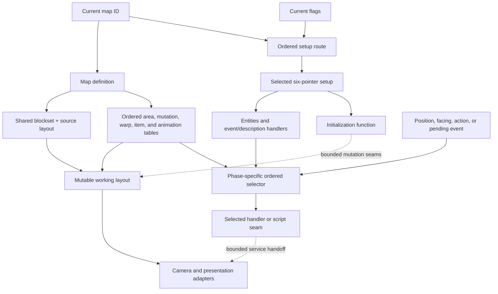

# Map Design Principles: Evidence-Bounded Structural Patterns

- Status: **Inferred Layer B synthesis** over accepted map-content, setup, event, and runtime-seam
  evidence; this document is not a claim about authorial intent or a remake level-design decision.
- Record date: 2026-08-02
- Audience: researchers, fidelity implementers, and future map designers who need a concise model of
  what the original evidence already constrains.
- Scope: observable structure, state selection, mutation phases, interaction ordering, and the
  evidence needed before spatial or experiential map analysis can begin.

## Judgment Boundary

This document can support five bounded judgments:

1. an original map is a package of shared geometry, ordered content tables, and a separately selected
   setup rather than a single self-contained scene;
2. map identity and active map state are distinct because flags can select among ordered setup
   variants and runtime operations can mutate a working layout;
3. source order and dispatch phase are part of the behavioral contract;
4. event selection, script execution, movement/collision, and presentation are separate evidence
   boundaries even when they meet during exploration;
5. a future remake map representation must preserve those boundaries before it introduces a new
   editor, renderer, navigation model, or content pipeline.

It cannot yet support claims about intended routes, exploration pacing, challenge, landmarks,
discoverability, secrets, bottlenecks, visual composition, or player preference. Those judgments
require spatial metrics, normal-route reachability, collision/pathfinding behavior, and visible
presentation evidence that the current tracked fixtures do not provide. They remain **Unknown**.

**Inferred synthesis rule:** the principles below are the smallest structural interpretation that
keeps all accepted owners compatible. Fixture facts remain **Confirmed** only within their named
observation boundaries.

## Pre-Synthesis Evidence Audit

The audit compared owning research prose, the evidence-bound
[map and exploration contract](../contracts/map-exploration.md), fixture payloads and IDs, and the focused
commands named by each owner. It deliberately checked aggregate units, alias counts, selection
quantifiers, mutation lifecycle, and whether runtime harnesses execute later story or presentation
effects.

| Surface reviewed | Cross-check and disposition | Boundary retained |
| --- | --- | --- |
| map content and geometry | [Map-content research](../../research/map-content.md), `sf2-map-content-static-v1`, `sf2-map-layout-decode-v1`, and `sf2-canonical-map-import-v1` agree on 79 map definitions, 77 block/layout payload pairs, two map aliases, 64x64 layouts, 3x3-tile blocks, and 1,027 map-content logical records. Fresh content, layout, and canonical-import reproduction passes after the owner correction recorded below. | The tracked fixtures retain aggregate structure, not redistributable layouts or a rendered-map result. |
| setup variants | [Map-data research](../../research/map-data-inventory.md), the static setup fixture, and the ten-case runtime selector agree on 64 routed map IDs, 126 setup definitions, 15 missing routes, ordered flag scanning, and last-set-flag-wins. | The runtime matrix uses the debug Map Test path; normal-save flag combinations and story reachability are **Unknown**. |
| entity, zone, and item selection | The static event owner records 1,134 physical records and first-match dispatch. The nine-case runtime matrix confirms selected offsets/targets while replacing each selected script entry with `rts`. | Script effects, transition persistence, facing/presentation consequences, and normal-story admission are outside that fixture. |
| area descriptions | `sf2-map-descriptions-static-v1` owns 75 targets and 227 physical entries plus first-match consumer shape. It also distinguishes normal exploration's `d6=1` path from conditioned functions. | No runtime fixture closes text content, player-visible presentation, or nonstandard callers. |
| working-layout mutation | [Map-content research](../../research/map-content.md) owns rebuild/preservation phases. The seven-case block-mutation fixture confirms ordered word copies and update-bit seams on bounded layout windows. | Collision, pathfinding, save/reload persistence, normal-story reachability, and visible VDP effects remain **Unknown**. |
| triggers, camera, and transitions | The interaction, camera, and transition fixtures confirm only bounded handler entry/return, state transfer, and service seams. | Source labels and successful returns do not prove player-visible movement, camera composition, fade duration, event consumption, or route meaning. |

No semantic contradiction was found among the accepted fixture payloads or their owning prose. Fresh
reproduction on the initial base `e9b60f18832e9e74ed8749239d7726e871710d7b` did find an owner
integration mismatch: `uv run sf2 h2 map-import` read stale `callTargets` from map-init source rows
that exposed `directCallTargets`, and exited with `KeyError`. The design lane did not alter that
tooling, fixture, or schema surface. The research owner corrected the mismatch through
[Issue #22](https://github.com/FrankHZ/md-sf2-reverse-engineering/issues/22); after this branch was
updated to main `5f1dbcca961a678cac774a4eadf1e21e3bd1c03b`, a fresh map-import run passed with
79 maps, 1,859 resources, and 15,805 logical records. This history records the adversarial review
without treating the earlier failure as a current evidence boundary.

The audit also found an important quantifier boundary: complete static corpora coexist with
deliberately narrow runtime cases. This document therefore uses corpus counts to describe available
channels and identities, but never uses the runtime matrices to claim complete campaign behavior.

## Structural Vocabulary

| Term | Meaning in this synthesis | What it does not mean |
| --- | --- | --- |
| map definition | One of 79 content records that references palette/tilesets, blockset/layout, ordered area and interaction tables, items, and optional animation. | A complete playable scene or a unique asset bundle. |
| setup route | An ordered map-ID/default/flag selection record that may resolve to a six-pointer setup definition. | A story chapter, quest state, or unordered variant dictionary. |
| setup definition | A selected bundle of entity list, entity/zone/item event handlers, area descriptions, and init function. | Proof that every referenced handler executes in normal play. |
| source layout | The immutable decoded 64x64 block-index/flag array associated with a map definition. | The only state from which the displayed or traversable map is derived. |
| working layout | The 8 KiB mutable layout on which flag, chest, roof, step, door, and scripted block changes can act according to distinct phases. | A confirmed persistence or collision model. |
| interaction selector | An ordered consumer that chooses a bounded entity, zone, item, description, roof, step, or warp record. | The later script effect or player-visible outcome. |
| presentation adapter | Camera, planes, palette, animation, windows, fades, and rendering that consume map state. | Ownership of map content, event state, or route semantics. |

## Evidence-Bounded Map Model

Solid edges represent directly owned data references or consumer inputs. Dashed edges are
**Inferred system relationships** assembled from separately confirmed handler-local seams; they do
not claim end-to-end visible effects, normal-story reachability, or a remake engine architecture.

## Structural Principles

### 1. Treat a map as a layered package, not a monolithic level

The 79 definitions reference multiple independently owned resources. Geometry is shared in two
cases, optional pointers remain absent rather than becoming fabricated empty tables, and the setup
bundle is selected through a different route from the content record. The smallest faithful model is
therefore a graph of identities and ordered records.

**Inferred design consequence:** a future editor or importer should expose geometry, setup state,
interaction tables, and presentation resources as distinct layers. Flattening them into one scene
may be an implementation choice, but it must not erase aliases, absent references, or source order.

### 2. Separate place identity from stateful configuration

The current map ID selects content, while an ordered flag route selects one of 126 setup definitions
for 64 routed IDs. All flag rows are scanned, and each set row replaces the current candidate, so the
last set flag in source order wins. Four later aliases can restore a default setup.

**Inferred design consequence:** variation is modeled as ordered state resolution, not merely as
duplicated maps or a first-match branch tree. This supports the neutral observation that a place can
retain geometry identity while changing its population or handlers. Which variants a normal player
can reach, and what those changes mean narratively, remain **Unknown**.

### 3. Preserve order because order resolves ambiguity

Different subsystems use different ordering rules:

- setup variants scan all rows and retain the last set flag;
- entity, zone, item, and description tables choose the first matching record;
- flag block copies all apply in source order during layout construction;
- roof-on-load and step/warp scans choose their first matching record;
- controlled walking checks enter-caravan, enter-raft, door, warp, zone, then passability, and a door
  mutation is re-read before later warp/zone checks.

These are not one universal priority list. They operate at different lifecycle phases and must remain
separate in a fidelity implementation.

**Inferred design consequence:** overlap is a valid authored input whose result depends on the owning
consumer's order. Tools should reveal order and overlap rather than silently sort, deduplicate, or
normalize them.

### 4. Make mutable terrain derived state

New-map and scrolling-warp paths rebuild a working layout from source before replaying owned state.
A negative current-map reload preserves the existing working layout, while explicit reset first
clears the 8 KiB buffer and then follows that preserving reload path. Flag, chest, roof, step, door,
and script-driven changes do not all occur at the same point.

**Inferred design consequence:** immutable imported content and runtime layout state need separate
identities. A cache keyed only by map ID cannot decide whether mutations survive. This principle does
not establish which mutations persist through save/load, nor how collision/pathfinding reacts to a
changed word; both are **Unknown** outside the bounded owners.

### 5. Keep selection distinct from consequence

The corpus has separate channels for entity, zone, item, and area-description selection. Static
evidence closes their record shapes and target identities; the event runtime fixture closes nine
selection cases without executing the chosen scripts. A successful match therefore proves which
target is handed off, not what the player sees or what story state changes afterward.

**Inferred design consequence:** a future map tool should be able to validate selector behavior before
story scripts, dialogue, animation, or persistence are connected. This separation makes ambiguity
visible and permits small parity fixtures without redistributing map content.

### 6. Keep navigation, interaction, and presentation as separate questions

Geometry is confirmed as 64x64 raw words referencing 3x3-tile blocks, but the tracked corpus does not
provide a complete player-traversability graph. Entity obstruction has a bounded movement contract,
and specific marker consumers have confirmed order, yet full collision/pathfinding behavior across
all layouts is not closed. Camera and transition fixtures likewise observe handler-local state and
service seams, not the resulting composition or route experience.

**Inferred design consequence:** spatial analysis must not use raw block indices as a substitute for
passability, and presentation analysis must not use camera command names as a substitute for visible
framing. Navigation metrics, interaction reach, and visual landmarks are three future evidence
products, not interchangeable readings of the same layout array.

## What the Current Corpus Can and Cannot Describe

| Design question | Supported now | Stop condition |
| --- | --- | --- |
| How is a location represented? | **Inferred** layered model over Confirmed content/setup identities, aliases, geometry, and ordered tables. | Do not call the representation a remake scene graph or editor architecture. |
| How can a location vary with state? | **Confirmed** ordered setup selection; **Inferred** separation of place identity from active configuration. | Normal-save combinations, narrative meaning, and complete persistence are **Unknown**. |
| How are overlapping authored conditions resolved? | **Confirmed** consumer-specific first-match, last-set, all-in-order, and phase-priority rules. | Do not combine them into a universal event priority. |
| Can terrain change? | **Confirmed** working-layout copy and rebuild/preserve seams; **Inferred** derived-state model. | Collision, pathfinding, save persistence, and visible update consequences are **Unknown**. |
| Where do interactions lead? | **Confirmed** bounded selector target identity for accepted cases. | Script effect, dialogue, reward, transition, and presentation are not established by selection alone. |
| What makes a map enjoyable or readable? | Nothing in the current fixtures closes this judgment. | Route choice, pacing, landmarks, difficulty, and player experience remain **Unknown**. |

## Evidence Matrix

| Design surface | Bounded evidence | Owner and exact executable trace | Remaining boundary |
| --- | --- | --- | --- |
| content envelope | **Confirmed static** 79 definitions, 662 source sections, 154 private payloads, optional-pointer boundary | [map-content research](../../research/map-content.md); `sf2-map-content-static-v1` ([`map-content-static-v1.json`](../../../tests/fixtures/h2/map-content-static-v1.json)) | Rendered content and private payloads are not tracked |
| geometry and aliases | **Confirmed static** 77 payload pairs serve 79 references, with two aliases; every decoded layout is 64x64 and every block reference is in range | [common-map research](../../research/common-maps.md); `sf2-map-layout-decode-v1` ([`map-layout-decode-v1.json`](../../../tests/fixtures/h2/map-layout-decode-v1.json)) | Passability, collision graph, and rendered parity |
| engine-neutral resource graph | **Confirmed static** 79 definitions and 1,859 identity-preserving resources with resolved non-null references and raw flags | [map-content research](../../research/map-content.md); `sf2-canonical-map-import-v1` ([`canonical-map-import-v1.json`](../../../tests/fixtures/h2/canonical-map-import-v1.json)) | Full generated import is private; no engine/editor decision |
| state-selected setup | **Confirmed static/runtime** 64 routes, 126 setup definitions, 15 missing routes, all-row scan, last-set-wins, and bounded default/alias cases | [map-data research](../../research/map-data-inventory.md); `sf2-map-setup-static-v1` ([`map-setup-static-v1.json`](../../../tests/fixtures/h2/map-setup-static-v1.json)) and `sf2-map-setup-selection-runtime-v1` ([`map-setup-selection-v1.json`](../../../tests/fixtures/h3/map-setup-selection-v1.json)) | Normal-save combinations, selected-setup meaning, and story reachability |
| entity/zone/item selectors | **Confirmed static/runtime** 1,134 physical records, first-match rules, and nine bounded selected target cases | [map-data research](../../research/map-data-inventory.md); `sf2-map-events-static-v1` ([`map-events-static-v1.json`](../../../tests/fixtures/h2/map-events-static-v1.json)) and `sf2-map-event-dispatch-runtime-v1` ([`map-event-dispatch-v1.json`](../../../tests/fixtures/h3/map-event-dispatch-v1.json)) | Selected scripts were stubbed; later effects and presentation are **Unknown** |
| area descriptions | **Confirmed static** 75 targets, 227 physical entries, first-match shape, and normal-exploration `d6` boundary | [map-data research](../../research/map-data-inventory.md); `sf2-map-descriptions-static-v1` ([`map-descriptions-static-v1.json`](../../../tests/fixtures/h2/map-descriptions-static-v1.json)) | Text, nonstandard callers, runtime reachability, and presentation |
| scripted block mutation | **Confirmed static/runtime seam** source-shaped block-copy commands plus seven bounded forward-copy/update observations | [map/exploration contract](../contracts/map-exploration.md); `sf2-map-script-engine-static-v1` ([`map-script-engine-static-v1.json`](../../../tests/fixtures/h2/map-script-engine-static-v1.json)) and `sf2-map-block-mutation-runtime-v1` ([`map-block-mutation-v1.json`](../../../tests/fixtures/h3/map-block-mutation-v1.json)) | Collision/pathfinding consumers, persistence, normal reachability, and visible timing |
| roof and step triggers | **Confirmed bounded runtime** six hit/miss/gate cases over original handlers and table scans | [map/exploration contract](../contracts/map-exploration.md); `sf2-map-interaction-trigger-runtime-v1` ([`map-interaction-trigger-v1.json`](../../../tests/fixtures/h3/map-interaction-trigger-v1.json)) | Full layout effects, collision/pathfinding, audio/presentation, persistence, and story reachability |
| camera seam | **Confirmed bounded runtime** seven target/destination/speed handler cases and state/service chronology | [common-scripting research](../../research/common-scripting.md); `sf2-map-camera-control-runtime-v1` ([`map-camera-control-v1.json`](../../../tests/fixtures/h3/map-camera-control-v1.json)) | Player-visible camera behavior and normal-story reachability |
| transition seam | **Confirmed bounded runtime** five interpreter streams including `warp`, bounded event bytes, state fields, and direct service entry/return | [common-scripting research](../../research/common-scripting.md); `sf2-map-script-transition-runtime-v1` ([`map-script-transition-v1.json`](../../../tests/fixtures/h3/map-script-transition-v1.json)) | Event consumption, fade/display timing, persistence, collision/pathfinding, and normal-story reachability |

## Original Fidelity and Future Map Design

An original-fidelity implementation must preserve resource identity, raw layout words, optional
references, ordered setup selection, consumer-specific match rules, lifecycle-specific mutations,
and the distinction between selected target and later effect. It may use any internal representation
that reproduces those facts through compact H4 cases without committing original map assets.

No current decision selects a map editor, scene format, renderer, navigation mesh, streaming model,
or authoring workflow. A future remake may deliberately simplify or redesign any of these surfaces,
but each deviation needs an explicit decision and an expected-deviation acceptance boundary. A
modernization must not be described as evidence about the original game.

## Expansion Gates

The next layer of map-design analysis should wait for the following evidence products:

1. **spatial metrics:** a research-owned, redistributable aggregate over the private canonical import
   that defines passability inputs before measuring connected space, route alternatives, or
   chokepoints;
2. **normal-route reachability:** grouped fixtures that distinguish source references from map/setup/
   event combinations actually admitted by representative saves;
3. **collision and pathfinding:** compatible exploration movement, marker, obstruction, and layout-
   mutation contracts that can answer whether a geometric connection is traversable;
4. **interaction outcomes:** grouped execution evidence for selected entity/zone/item/description
   targets rather than target identity alone;
5. **visible presentation:** rendered layout/palette/camera/transition evidence sufficient to discuss
   landmarks, framing, readability, or transition rhythm;
6. **battlefield relationship:** an explicit join between exploration maps, battle maps, deployment,
   terrain, and encounter context before claiming a campaign-level spatial difficulty curve.

Until those gates close, this document is the design boundary: it explains how original map content
is structured and resolved, not whether any particular map is well designed or how a remake should
redesign it.
