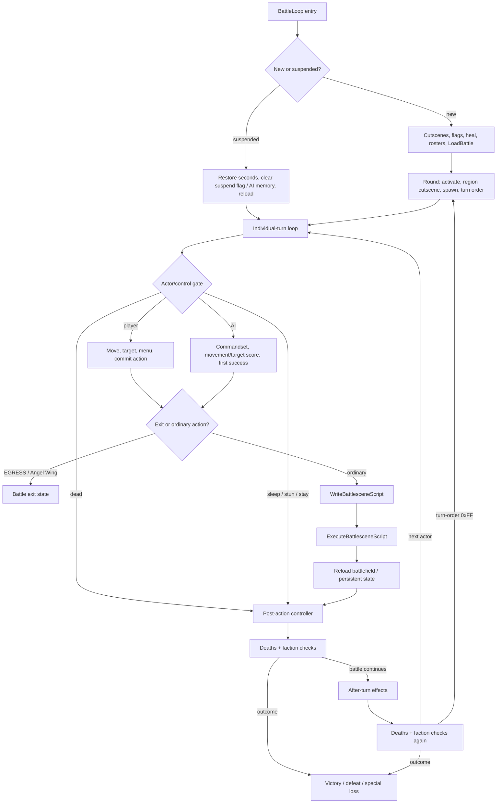

# Tactical Battle Loop and State Handoffs

- Status: **design synthesis over accepted evidence**; this document adds no original-game fact and
  defines no new battle simulator.
- Record date: 2026-08-01
- Audience: researchers, design-document authors, and fidelity implementers who need to understand
  player/AI control, action construction, resolution, state replay, and outcome handoffs within
  battle.
- Scope: consume only battle-loop, battle-functions, battle-actions, battle-AI,
  battlefield/pathfinding, battle-scene, combat, spell, randomness, and save evidence accepted on
  current `main`.

This is the second Layer B synthesis described by the
[documentation roadmap](./documentation-roadmap.md), expanding the battle boundary in the
[gameplay overview](./gameplay-overview.md). It does not replace a research owner, fixture, or
evidence-bound subsystem contract. **Confirmed** means the boundary has linked Layer A support.
**Inferred** means several confirmed boundaries have been connected into a neutral player-facing
loop. **Unknown** means current evidence does not permit further interpretation.

## Supported and Unsupported Judgments

This document supports judgments about:

- the bounded order from a new or resumed battle through a round, individual turn, action,
  after-turn processing, and outcome;
- the categories of state owned by player control, AI control, movement/target construction, the
  action builder, resolution/replay, and the battle controller;
- the existing fixtures from which a fidelity implementation should consume branch/order/result
  facts.

This document does not support judgments about:

- an “optimal tactic,” unit role, encounter-design purpose, AI fairness, expected win rate,
  difficulty, or pacing;
- treating the AI potential-damage score as real damage or generalizing one Battle 01 fixture to
  every battle;
- complete runtime semantics for every action, spell, item, special attacker, or pathfinding edge;
- exact input latency, cursor/menu feel, animation/message/audio timing, or rendered battle-scene
  parity;
- a general battle-simulation architecture, predictive accuracy, or remake rebalance decision.

## Player Verbs and Immediate Goals

| Player action | Confirmed direct result | Evidence boundary |
| --- | --- | --- |
| Move the cursor and confirm a tile | A, B, or C can confirm a tile; chosen coordinates are stored and the cursor is hidden | **Confirmed static player control**. The grid/path owner for legal movement is confirmed, but complete visible cursor timing and all cancel/re-entry combinations remain **Unknown**. |
| Browse or confirm a target | An empty list returns `-1`; B cancels; A/C confirms; all four directions wrap among candidates | **Confirmed static**. Formation and order of the target list belong separately to action, range, or AI owners and do not establish target-selection intent. |
| Choose attack, magic, item, or stay/search | The diamond menu records an action; cancellation restores the original position and leaves action `-1` | **Confirmed static**. Menu presentation, input cadence, and all caller-visible timing are not runtime-closed. |
| Manage a battle item | The item menu supports use/give/equip/drop and retains curse, capacity, Deals, and turn-consumption branches | **Confirmed static**. This document does not interpret an inventory branch as recommended tactics or economic value. |
| Open the battlefield menu or suspend | Members, minimap, options, and suspend form the confirmed choice surface; Battle 0 rejects suspend | **Confirmed static**. Normal suspend save/flag/transfer order is confirmed; cross-process restoration and visible UX remain **Unknown**. |
| Use EGRESS or Angel Wing | Exit before battle-scene construction, pay the corresponding MP or remove the item, and obtain egress state | **Confirmed static**. Special callers, map results, and complete presentation remain bounded by battle-loop/map owners. |

**Inferred action-goal alignment:** these actions allow the player to position an actor within the
current legal state, choose a committable action, and pass its result into persistent battle state.
Interpreting that process as “use terrain,” “protect a key member,” or “optimize resources” requires
encounter context, player observation, and balance evidence and therefore remains **Unknown**.

## Top-Level Tactical Loop

The following diagram synthesizes ordered handoffs from several confirmed owners; it is not modern
engine architecture. Solid lines represent control handoffs whose existence is confirmed by
source/H2/H3 evidence. The “tactical loop” as a whole remains an **Inferred** player experience.

### Entry and Round Anchors

1. **Confirmed static:** a new battle clears elapsed seconds, runs before/start cutscenes, clears
   region flags 90-105, restores the living/immortal party, initializes both rosters, and then calls
   `LoadBattle`.
2. **Confirmed static:** a suspended battle restores saved seconds, clears flag 88 and AI memory,
   reloads, and resumes the individual-turn loop. Cross-process suspend persistence remains
   **Unknown**.
3. **Confirmed static:** each round runs enemy activation, region cutscene, spawn
   admission/animation, and turn-order generation in that order. Battle 01 region activation and turn
   order each have bounded H3 coverage; that does not close runtime state for every battle.
4. **Confirmed static:** a `0xFF` turn-order entry starts the next round.

### Individual-Turn Control Gate

- `ExecuteIndividualTurn` skips a dead actor. MUDDLE, the AI-controlled bit, ally auto-battle, and a
  normal enemy enter AI control; the opponent-control toggle can route an enemy into player control.
- SLEEP, STUN, and STAY consume an action without constructing a battle scene.
- An ordinary action writes and executes the battle-scene script, ends the scene, and reloads the
  battlefield.
- EGRESS and Angel Wing exit before scene construction; they are not damage branches of ordinary
  resolution.

These are **Confirmed static control-flow** facts. Why an actor has a given status, player-visible
skip messaging, and natural reachability of every special action remain with their owners.

## Movement, Target, and Control Ownership

### Battlefield Grid and Legal-Space Seam

**Confirmed:** battlefield arrays use a 48x48 row-major grid. Movement propagation maintains
total-cost and movable grids; terrain/occupancy determine rejection; attack/spell range uses
Manhattan rings. One H3 matrix observes weighted propagation, budget-128 bucket wrap, controlled
flat-row crossing, and boundary-helper entry.

This does not mean shipped battles expose the controlled row-crossing edge or that AI and player
control use identical selection policies. Grid, range, occupancy, target list, and move string should
remain distinguishable state owners in an adapter; a single “walkable” boolean cannot represent them
without loss.

### Player Control

**Confirmed static:** the player path owns cursor/tile confirmation, target-list navigation, diamond
menu, item menu, and battlefield-menu branch/order facts. Cancellation can restore the pre-action
position and leave the action uncommitted; only a committed action enters the later builder.

**Unknown:** complete movement preview, range highlighting, cursor animation, key repeat,
message/window timing, and player-visible behavior of every nested cancellation path.

### AI Control

**Confirmed static:** AI-controlled allies use commandset 6. Enemies select among 16 commandsets,
execute ordered commands, and stop at the first success. AI movement, healing, support, attack
category, and target priority each have separate static owners. Temporary terrain flags are cleared
on every exit. Special attackers and swarm behavior have explicit routes.

**Confirmed runtime, bounded:** one 14-case H3 matrix observes seven non-empty viable shapes for final
attack action, the associated RNG families, AQUA bypass, ordinary target priority, movement
tie-breaking, and equal-movement results.

**Inferred/Unknown:** remaining caller-visible AI behavior, signed/overflow edges, complete commandset
semantics, path choice on natural maps, and AI “intent.” The AI potential-damage model is a
target-scoring input, not the real result formula in
[physical combat](./combat-resolution.md) or [spell resolution](./spell-resolution.md).

## Action Commit, Construction, and Replay

### Action Intent to Scene Script

`WriteBattlesceneScript` clears EXP, gold, attack type, and transient action flags when construction
begins. It then constructs and always sorts targets for attack, cast spell, use item, Burst Rock,
muddled, or prism laser actions. Each target goes through switch-target, apply-effect, and enemy-drop
handling in order. After the list, the builder processes actor idle, used-item break,
double/counter validation, optional Burst Rock re-entry, and script termination.

That is **Confirmed static ordering**. An implementation must distinguish:

- the player/AI committed action intent;
- ordered targets and transient accumulators produced by the builder;
- scene/reaction commands;
- persistent combatant, EXP, gold, item, and battle state after replay.

### Physical, Spell, and Item Resolution

- **Confirmed:** the physical route processes dodge, base damage, critical, damage application,
  ailment, curse damage, and double/counter determination in order. Dodge and lethal branches skip
  explicitly documented later stages.
- **Confirmed at owned fixture seams:** the physical contract preserves integer intermediates, HP
  clamps, reaction order, follow-up validation, snapshot restoration, persistent replay, and
  EXP/reward boundaries.
- **Confirmed at owned fixture seams:** the spell contract covers its listed damage, healing, status,
  support, MP, EXP, and after-turn status subsets. This document cannot complete an unlisted spell or
  natural multi-target order.
- **Confirmed static:** a battle item uses its spell index/level through the ordinary cast-spell
  route. Consumption and break routing retain equipment, ally-use, and RNG gates.

### Scene Execution and Persistent Replay

`ExecuteBattlesceneScript` reads word commands from `$FF0000`, terminates on `$FFFF`, and dispatches
21 command families covering actor/action/reaction, EXP, message/input, and related operations. Scene
initialization, assets, animation setup/update pairing, and loader order have complete static
contracts.

**Confirmed at replay seams:** resolution can construct commands against temporary state, restore
snapshots, and then persist HP, MP, status, EXP, gold, and related results in command order. Every
supported mutation must trace to its specific combat/spell/reward fixture; this document does not
claim that one general replay model covers every command.

**Unknown:** exact frame duration, palette/VDP effects, weapon placement, message/input-wait
appearance, the rendered result of each animation pair, and the effect of scene timing on player
decision pacing.

## Post-Action, After-Turn, and Outcome

**Confirmed static controller order:**

1. after an action, process killed combatants and check both factions' remaining counts;
2. if battle continues, process the actor's after-turn effects;
3. process killed combatants and check both factions again;
4. if battle still continues, advance the turn index; a turn-order terminator starts the next round.

The after-turn status fixture confirms one-step transition/message/stat-normalization matrices for
the listed MUDDLE, SILENCE, SLOW, ATTACK, BOOST, and related counters. It does not replace an unlisted
ailment or a complete multi-round encounter.

**Confirmed static outcomes:**

- victory restores the party, runs the after-battle cutscene, clears the unlocked flag, sets the
  completed flag, and returns `D4=1`;
- ordinary defeat restores leader HP, halves gold with unsigned floor division, obtains the egress
  position, and returns `D4=-1`;
- battle 4 defeat uses a hardcoded complete/upgrade path and returns `D4=0`;
- individual-turn EGRESS/Angel Wing also exits with `D4=0`, but its reason and state route must remain
  separate from battle-4 loss.

Upgrade/egress special cases, spawn-reset failures, suspended-battle persistence, death/spawn
visuals, and complete campaign meaning of these outcomes remain **Unknown**.

## State Ownership and Handoff Matrix

| Owner boundary | Input / readable state | Output / mutation | Must not decide |
| --- | --- | --- | --- |
| battle controller | battle ID, flags, seconds, rosters, region/spawn/turn state | round order, actor scheduling, death checks, outcome code | player/AI target policy, damage formula, rendering |
| individual-turn control | actor life/status/control flags, current action state | skip, player/AI route, scene/exit handoff | complete AI intent, combat math |
| battlefield/pathfinding | terrain, occupancy, MOV, range, combatant positions | reachable/cost grids, targets, attack position, move string | actual damage, player tactic, shipped reachability of test-only edges |
| player control | input-derived menu/cursor state, legal target list | position/target/action commit or cancellation | input hardware timing, AI decision, resolution math |
| AI control | commandset, combatant/resources, movement/target scoring state, thinking RNG | move string, target/action, or Stay | true damage result, player-facing fairness, unobserved branches |
| action builder | committed action, ordered target inputs, items/spells/stats | scene commands, transient EXP/gold/flags, follow-up candidates | final rendered timing, campaign reward balance |
| resolution/replay | fixture-owned stats, RNG results, temporary snapshots, commands | persistent HP/MP/status/EXP/gold/item mutation | unsupported spells/actions, general simulation completeness |
| battle-scene presentation | scene commands, graphics/animation selectors, VInt/window services | bounded command dispatch and loader/update state | gameplay formulas, exact visuals not yet observed |

## Evidence Matrix

| Synthesis boundary | Label and bounded claim | Evidence owner / executable trace | Remaining question |
| --- | --- | --- | --- |
| battle entry, round, post-action, and outcomes | **Confirmed static** new/resume, round, double death/faction check, and return order | [battle-loop research](../research/battle-loop.md); `sf2-battle-control-static-v1` ([`battle-control-static-v1.json`](../../tests/fixtures/h2/battle-control-static-v1.json)) and `sf2-battle-loop-static-v1` ([`battle-loop-static-v1.json`](../../tests/fixtures/h2/battle-loop-static-v1.json)) | Suspended persistence, special cases, visual timing |
| turn order and region activation | Specific Battle 01/boundary H3 scheduling and activation facts | `sf2-battle01-turn-order-v1` ([`battle01-turn-order-v1.json`](../../tests/fixtures/h3/battle01-turn-order-v1.json)), `sf2-turn-order-boundaries-v1` ([`turn-order-boundaries-v1.json`](../../tests/fixtures/h3/turn-order-boundaries-v1.json)), and `sf2-battle01-region-activation-v1` ([`battle01-region-activation-v1.json`](../../tests/fixtures/h3/battle01-region-activation-v1.json)) | Other battles/caller states; do not extrapolate global encounter pacing |
| individual-turn and player control | **Confirmed static** control routing, cursor/target/menu, suspend/item/chest branches | [battle-functions research](../research/battle-functions.md); `sf2-battle-functions-static-v1` ([`battle-functions-static-v1.json`](../../tests/fixtures/h2/battle-functions-static-v1.json)) | Runtime input, presentation, complete cancellation nesting |
| movement, range, and target grids | **Confirmed** 48x48 arrays, weighted propagation, range/occupancy/target seam, and five runtime cases | [battlefield/pathfinding research](../research/battlefield-pathfinding.md); `sf2-battlefield-static-v1` ([`battlefield-static-v1.json`](../../tests/fixtures/h2/battlefield-static-v1.json)) and `sf2-battlefield-movement-runtime-v1` ([`battlefield-movement-matrix-v1.json`](../../tests/fixtures/h3/battlefield-movement-matrix-v1.json)) | Shipped row-crossing reachability, late callers, signed/overflow edges |
| AI action/movement/target choice | Complete source inventory and major-command static owners; 14-case final-action H3 | [battle-AI research](../research/battle-ai.md); `sf2-battle-ai-static-v1` ([`battle-ai-static-v1.json`](../../tests/fixtures/h2/battle-ai-static-v1.json)), `sf2-battle-ai-action-choice-static-v1` ([`battle-ai-action-choice-static-v1.json`](../../tests/fixtures/h2/battle-ai-action-choice-static-v1.json)), and `sf2-battle-ai-action-choice-runtime-v1` ([`battle-ai-action-choice-v1.json`](../../tests/fixtures/h3/battle-ai-action-choice-v1.json)) | Grouped H3 queue, caller-visible defects, AI intent/fairness |
| action construction | **Confirmed static** accumulator reset, target families/sort, per-target order, item/break, and follow-up sequence | [battle-actions research](../research/battle-actions.md); `sf2-battle-actions-static-v1` ([`battle-actions-static-v1.json`](../../tests/fixtures/h2/battle-actions-static-v1.json)) | Unmodeled ailment/special helpers, message/animation timing |
| physical resolution | Fixture-owned arithmetic, branches, reactions, follow-ups, rewards, and replay subsets | [combat contract](./combat-resolution.md); `sf2-physical-damage-land-archer-v1` ([`physical-damage-v1.json`](../../tests/fixtures/h3/physical-damage-v1.json)), `sf2-attack-chain-double-counter-v1` ([`attack-chain-v1.json`](../../tests/fixtures/h3/attack-chain-v1.json)), and `sf2-battle-scene-replay-v1` ([`battle-scene-replay-v1.json`](../../tests/fixtures/h3/battle-scene-replay-v1.json)) | Itemized Unknowns in the contract; do not generalize to the complete action set |
| spell/status resolution | Listed damage/heal/status/support/cost/replay subsets in the contract | [spell contract](./spell-resolution.md); `sf2-spell-damage-resistance-v1` ([`spell-damage-resistance-v1.json`](../../tests/fixtures/h3/spell-damage-resistance-v1.json)) and `sf2-after-turn-status-lifecycle-v1` ([`after-turn-status-lifecycle-v1.json`](../../tests/fixtures/h3/after-turn-status-lifecycle-v1.json)) | Unsupported spells, natural target order, complete multi-round state |
| scene command/presentation boundary | **Confirmed static** 21-command dispatch, initialization/loaders, and setup/update pairing | [battle-scene research](../research/battle-scene-engine.md); `sf2-battle-scene-engine-static-v1` ([`battle-scene-engine-static-v1.json`](../../tests/fixtures/h2/battle-scene-engine-static-v1.json)) | Exact frame/VDP/palette/audio/rendered output |
| suspend handoff | **Confirmed static** menu/save/flag/transfer seam and bounded save format/actions | [battle-functions research](../research/battle-functions.md) and `sf2-battle-functions-static-v1` ([`battle-functions-static-v1.json`](../../tests/fixtures/h2/battle-functions-static-v1.json)) own the battlefield-menu → seconds/save/flag/transfer seam; the [save contract](./save-system.md) provides bounded format/action context | Cross-process battle persistence, power loss, visible UX |

The table provides exact owner navigation only. This document must not copy a weaker aggregate
expectation or use one fixture's natural/controlled setup in place of another subsystem's input
preconditions.

## Original Fidelity and Modernization

### Fidelity Rules

An implementation claiming fidelity for a tactical boundary covered here should at minimum:

1. preserve observable state boundaries among battle controller, turn control, movement/target,
   action builder, resolution/replay, and presentation;
2. preserve confirmed order, sentinels, branch polarity, target ordering, integer intermediates,
   snapshot/replay behavior, and persistent mutation;
3. separate AI scoring from real combat/spell results and scene commands from final rendered frames;
4. consume the owning H2/H3 fixture for every supported action instead of filling an unknown branch
   because a “similar action should behave similarly”;
5. report deliberate deviations separately from original-compatible expectations.

### Modernization Decisions Not Yet Made

Undo, movement preview, threat range, AI explainability, animation acceleration/skipping, action logs,
rebalancing, seed policy, save points, failure penalties, and battle-simulation architecture may all
be future choices, but none is decided here. A deviation from the original requires an explicit
decision or future specification and a separate expected-deviation/H4 fixture.

## H4 Integration and Stop Conditions

This document registers no new aggregate golden. An H4 adapter should consume existing fixtures from
the evidence matrix by function and report input/control result, movement/target result, constructed
action trace, temporary resolution, persistent replay, post-action/after-turn state, and final
outcome separately. A cross-subsystem parity case may be added only when all of its input units,
branches, RNG seams, ordering, and persistence owners have been accepted.

Stop expanding this document whenever:

- a static inventory, source label, or single controlled case would need to become player tactics,
  AI intent, or balance;
- an unaccepted action/spell/item/special-attacker/pathfinding branch would need completion;
- exact presentation, input timing, normal campaign reachability, or suspend persistence is needed;
- simulation architecture, a predictive model, modern UI, or intentional rebalance must be selected.

Complete battle simulation remains in the roadmap's
[long-term directions](./documentation-roadmap.md#long-term-directions). Before that slice begins, it
requires mutually compatible battle-loop, action, AI, pathfinding, and state contracts plus a bounded
H4 adapter acceptance surface. This document provides navigation only and does not claim that every
entry criterion has been satisfied.
