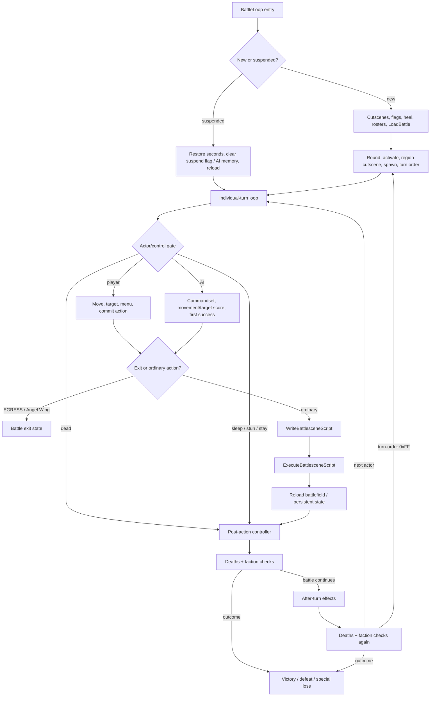

# 战术战斗循环与状态交接

- 状态：**已接受证据的设计综合**；本文不新增原版事实，也不定义新的 battle simulator。
- 记录日期：2026-08-01
- 受众：需要理解战斗内玩家/AI control、action construction、resolution、state replay 与 outcome
  handoff 的研究者、设计说明作者和 fidelity implementer。
- 范围：只消费当前 `main` 已接受的 battle-loop、battle-functions、battle-actions、battle-AI、
  battlefield/pathfinding、battle-scene、combat、spell、randomness 与 save 证据。

本文是[文档路线图](./documentation-roadmap.md)的第二篇 B 层综合说明，也是
[玩法总览](./gameplay-overview.md)中 battle boundary 的展开。它不替代 research owner、fixture 或
evidence-bound subsystem contract。文中的 **Confirmed** 表示对应边界已由链接的 A 层证据确认；
**Inferred** 表示把若干已确认边界连接成中性的玩家向 loop；**Unknown** 表示当前证据不允许继续
解释。

## 本文支持与不支持的判断

本文支持：

- 从 new/resumed battle 到 round、individual turn、action、after-turn 与 outcome 的有界顺序；
- player control、AI control、movement/target、action builder、resolution/replay 和 battle controller
  分别拥有哪类状态；
- fidelity implementation 应从哪些现有 fixture 消费 branch/order/result facts。

本文不支持：

- “最优战术”、单位定位、遭遇设计目的、AI 公平性、预期胜率、难度或 pacing；
- 把 AI 的 potential-damage score 当作真实 damage，或把单个 Battle 01 fixture 外推到所有战斗；
- 所有 action、spell、item、special attacker 或 pathfinding edge 的完整 runtime semantics；
- 精确输入延迟、cursor/menu 手感、animation/message/audio timing 或 rendered battle-scene parity；
- 通用 battle simulation architecture、预测准确性或 remake rebalance 决定。

## 玩家动词与即时目标

| 玩家动作 | 已确认的直接结果 | 证据边界 |
| --- | --- | --- |
| 移动 cursor、确认 tile | A/B/C 可确认 tile，chosen coordinates 被存储，cursor 隐藏 | **Confirmed static player-control**；legal movement 的 grid/path owner 已确认，但完整可见 cursor timing 与所有 cancel/re-entry 组合仍 **Unknown**。 |
| 浏览或确认 target | 空列表返回 `-1`，B cancel，A/C confirm，四方向在候选间 wrap | **Confirmed static**；target list 的 formation/order 由 action、range 或 AI owner 分别定义，不能从这里推导 target-selection intent。 |
| 选择 attack、magic、item 或 stay/search | diamond menu 产生已记录 action，cancel 恢复原位置并留下 action `-1` | **Confirmed static**；menu presentation、input cadence 与全部 caller-visible timing 未经 runtime 闭合。 |
| 管理 battle item | item menu 支持 use/give/equip/drop，并保留 curse、capacity、Deals 与 turn-consumption 分支 | **Confirmed static**；本文不把 inventory branch 解释成推荐战术或经济价值。 |
| 打开 battlefield menu 或 suspend | members、minimap、options、suspend 构成已确认选择面；Battle 0 拒绝 suspend | **Confirmed static**；normal suspend 的 save/flag/transfer 顺序已确认，跨进程恢复和可见 UX 仍 **Unknown**。 |
| 执行 EGRESS 或 Angel Wing | 在 battle-scene construction 前退出，支付对应 MP 或移除 item，并取得 egress state | **Confirmed static**；特殊 caller、地图结果与完整 presentation 仍受 battle-loop/map owner 限制。 |

**Inferred action–goal alignment：**这些动作允许玩家在当前 legal state 中定位 actor、选择一个可提交的
action，并让结果进入持久 battle state。把这个过程解释为“利用地形”“保护关键成员”或“优化资源”需要
遭遇 context、player observation 与 balance evidence，当前仍为 **Unknown**。

## 顶层 tactical loop

下图是多个已确认 owner 的顺序综合，不是现代 engine architecture。节点间实线表示 source/H2/H3 已
确认存在的 control handoff；“战术循环”作为整体的玩家体验仍是 **Inferred**。

### Entry 与 round anchors

1. **Confirmed static：**new battle 清除 elapsed seconds，执行 before/start cutscenes，清除 region
   flags 90–105，恢复 living/immortal party，初始化双方 rosters，再调用 `LoadBattle`。
2. **Confirmed static：**suspended battle 恢复 saved seconds，清除 flag 88 与 AI memory，reload 后直接
   恢复 individual-turn loop；跨进程 suspend persistence 仍 **Unknown**。
3. **Confirmed static：**每轮依次执行 enemy activation、region cutscene、spawn admission/animation 与
   turn-order generation。Battle 01 region activation 和 turn order 各有 bounded H3；不能因此声称所有
   battle 的 runtime state 都已闭合。
4. **Confirmed static：**`0xFF` turn-order entry 开启下一 round。

### Individual-turn control gate

- `ExecuteIndividualTurn` 跳过 dead actor；MUDDLE、AI-controlled bit、ally auto-battle 与普通 enemy
  进入 AI control，opponent-control toggle 可让 enemy 进入 player control。
- SLEEP、STUN 与 STAY 消耗 action 而不构造 battle scene。
- ordinary action 会 write/execute battle-scene script，然后结束 scene 并 reload battlefield。
- EGRESS 与 Angel Wing 在 scene construction 前退出；它们不是 ordinary resolution 的一种 damage
  branch。

这些均为 **Confirmed static control flow**。actor 为什么处于某状态、player-visible skip messaging 以及
所有特殊行动的 natural reachability 仍由各 owner 保留。

## Movement、target 与 control ownership

### Battlefield grid 与 legal-space seam

**Confirmed：**battlefield arrays 使用 48×48 row-major grid。movement propagation 维护 total-cost 与
movable grids，terrain/occupancy 决定拒绝条件；attack/spell range 使用 Manhattan rings。pathfinder 的
weighted propagation、budget-128 bucket wrap、受控 flat-row crossing 和 boundary helper entry 已由一组
H3 matrix 观察。

这不意味着 shipped battles 会暴露受控 row-crossing edge，也不意味着 AI 与 player 使用完全相同的
selection policy。grid、range、occupancy、target list 和 move string 应在 adapter 中保持可区分的 state
owner；它们不能被一个“可走/不可走”布尔值无损替代。

### Player control

**Confirmed static：**player path 拥有 cursor/tile confirmation、target-list navigation、diamond menu、
item menu 和 battlefield menu 的 branch/order facts。cancel 可恢复 pre-action position 并留下未提交
action；committed action 才能进入后续 builder。

**Unknown：**完整 movement preview、range highlighting、cursor animation、key repeat、message/window
timing 和所有 cancel nesting 的 player-visible behavior。

### AI control

**Confirmed static：**AI-controlled allies 使用 commandset 6；enemies 从 16 个 commandsets 选择，按
ordered commands 执行并在第一个 success 停止。AI movement、healing、support、attack category 与 target
priority 各有独立 static owner；temporary terrain flags 在所有 exit 上清除。特殊 attacker 与 swarm
另有显式 routes。

**Confirmed runtime（有界）：**一组 14-case H3 观察了 final attack action 的七种非空 viable shape、
相关 RNG family、AQUA bypass、ordinary target priority、movement tie-break 与 equal-movement result。

**Inferred/Unknown：**其余 caller-visible AI behavior、signed/overflow edges、完整 commandset semantics、
自然地图上的 path choice 和 AI “意图”。AI 的 potential-damage model 是 target-scoring input，不是
[physical combat](./combat-resolution.md)或[spell resolution](./spell-resolution.md)的真实结果公式。

## Action commit、construction 与 replay

### Action intent 到 scene script

`WriteBattlesceneScript` 在 construction 开始时清除 EXP、gold、attack type 与 transient action flags；
然后按 attack、cast spell、use item、Burst Rock、muddled 或 prism laser 构造 targets，并始终排序。
每个 target 依次经历 switch-target、apply-effect 与 enemy-drop handling；列表结束后处理 actor idle、
used-item break、double/counter validation、可选 Burst Rock re-entry，最后结束 script。

以上为 **Confirmed static ordering**。它要求 implementation 区分：

- 玩家/AI 已提交的 action intent；
- builder 生成的 ordered targets 与 transient accumulators；
- scene/reaction commands；
- replay 后的 persistent combatant、EXP、gold、item 与 battle state。

### Physical、spell 与 item resolution

- **Confirmed：**physical route 依次处理 dodge、base damage、critical、damage application、ailment、
  curse damage 与 double/counter determination；dodge 和 lethal branches 会跳过明确的后续阶段。
- **Confirmed at owned fixture seams：**physical contract 保留 integer intermediates、HP clamp、reaction
  order、follow-up validation、snapshot restore、persistent replay 与 EXP/reward boundary。
- **Confirmed at owned fixture seams：**spell contract 覆盖已列明的 damage、heal、status、support、MP、
  EXP 与 after-turn status subsets；未列明 spell 或 natural multi-target ordering 不能由本文补全。
- **Confirmed static：**battle item 使用其 spell index/level 进入 ordinary cast-spell route；consumption
  与 break routing 仍保留 equipment/ally-use/RNG gates。

### Scene execution 与 persistent replay

`ExecuteBattlesceneScript` 读取 `$FF0000` 的 word commands，以 `$FFFF` 结束，并通过 21-entry dispatcher
处理 actor/action/reaction、EXP、message/input 等 command families。scene initialization、assets、
animation setup/update pairing 与 loader order 有完整 static contracts。

**Confirmed at replay seams：**resolution 可先对 temporary state 构造 commands，再恢复 snapshots，随后
按 command order 把 HP、MP、status、EXP、gold 等结果持久化。每一种被支持的 mutation 必须回到其具体
combat/spell/reward fixture；本文不声称一个通用 replay model 已覆盖所有 commands。

**Unknown：**精确 frame duration、palette/VDP effect、weapon placement、message/input wait appearance、
每个 animation pair 的 rendered result，以及 scene timing 对玩家决策 pacing 的影响。

## Post-action、after-turn 与 outcome

**Confirmed static controller order：**

1. action 后先处理 killed combatants，并检查双方 remaining count；
2. battle 若继续，处理 actor 的 after-turn effects；
3. 再次处理 killed combatants，并再次检查双方；
4. 若仍继续，advance turn index；turn-order terminator 则开始下一 round。

after-turn status fixture 已确认 MUDDLE、SILENCE、SLOW、ATTACK、BOOST 等列明 counter 的单步
transition/message/stat-normalization matrix。它不是未列明 ailment 或完整多回合 encounter 的替代品。

**Confirmed static outcomes：**

- victory 恢复 party，执行 after-battle cutscene，清除 unlocked flag、设置 completed flag，并返回
  `D4=1`；
- ordinary defeat 恢复 leader HP，以 unsigned floor division 将 gold 减半，取得 egress position，返回
  `D4=-1`；
- battle 4 defeat 使用 hardcoded complete/upgrade path 并返回 `D4=0`；
- individual-turn EGRESS/Angel Wing 也是 `D4=0` exit，但其原因和 state route 必须与 battle-4 loss 分开。

upgrade/egress special cases、spawn reset failures、suspended-battle persistence、death/spawn visuals 与
这些 outcomes 的完整 campaign meaning 仍为 **Unknown**。

## State ownership 与 handoff matrix

| Owner boundary | 输入 / readable state | 输出 / mutation | 不应由其决定 |
| --- | --- | --- | --- |
| battle controller | battle ID、flags、seconds、rosters、region/spawn/turn state | round order、actor scheduling、death checks、outcome code | player/AI target policy、damage formula、rendering |
| individual-turn control | actor life/status/control flags、current action state | skip、player/AI route、scene/exit handoff | complete AI intent、combat math |
| battlefield/pathfinding | terrain、occupancy、MOV、range、combatant positions | reachable/cost grids、targets、attack position、move string | actual damage、player tactic、shipped reachability of test-only edges |
| player control | input-derived menu/cursor state、legal target list | position/target/action commit 或 cancel | input hardware timing、AI decision、resolution math |
| AI control | commandset、combatant/resources、movement/target scoring state、thinking RNG | move string、target/action 或 Stay | true damage result、player-facing fairness、unobserved branches |
| action builder | committed action、ordered target inputs、items/spells/stats | scene commands、transient EXP/gold/flags、follow-up candidates | final rendered timing、campaign reward balance |
| resolution/replay | fixture-owned stats、RNG results、temporary snapshots、commands | persistent HP/MP/status/EXP/gold/item mutation | unsupported spells/actions、generic simulation completeness |
| battle-scene presentation | scene commands、graphics/animation selectors、VInt/window services | bounded command dispatch 与 loader/update state | gameplay formulas、exact visuals not yet observed |

## Evidence matrix

| 综合边界 | 标签与 bounded claim | Evidence owner / executable trace | Remaining question |
| --- | --- | --- | --- |
| battle entry、round、post-action 与 outcomes | **Confirmed static** 的 new/resume、round、double death/faction check 与 return order | [battle-loop research](../research/battle-loop.md)；`sf2-battle-control-static-v1`（[`battle-control-static-v1.json`](../../tests/fixtures/h2/battle-control-static-v1.json)）与 `sf2-battle-loop-static-v1`（[`battle-loop-static-v1.json`](../../tests/fixtures/h2/battle-loop-static-v1.json)） | suspended persistence、special cases、visual timing |
| turn order 与 region activation | Battle 01/边界 H3 确认的具体 scheduling 和 activation facts | `sf2-battle01-turn-order-v1`（[`battle01-turn-order-v1.json`](../../tests/fixtures/h3/battle01-turn-order-v1.json)）、`sf2-turn-order-boundaries-v1`（[`turn-order-boundaries-v1.json`](../../tests/fixtures/h3/turn-order-boundaries-v1.json)）与 `sf2-battle01-region-activation-v1`（[`battle01-region-activation-v1.json`](../../tests/fixtures/h3/battle01-region-activation-v1.json)） | 其他 battles/caller states，不外推全局 encounter pacing |
| individual-turn 与 player control | **Confirmed static** 的 control routing、cursor/target/menu、suspend/item/chest branches | [battle-functions research](../research/battle-functions.md)；`sf2-battle-functions-static-v1`（[`battle-functions-static-v1.json`](../../tests/fixtures/h2/battle-functions-static-v1.json)） | runtime input、presentation、完整 cancel nesting |
| movement、range 与 target grids | **Confirmed** 的 48×48 arrays、weighted propagation、range/occupancy/target seam 与五个 runtime cases | [battlefield/pathfinding research](../research/battlefield-pathfinding.md)；`sf2-battlefield-static-v1`（[`battlefield-static-v1.json`](../../tests/fixtures/h2/battlefield-static-v1.json)）与 `sf2-battlefield-movement-runtime-v1`（[`battlefield-movement-matrix-v1.json`](../../tests/fixtures/h3/battlefield-movement-matrix-v1.json)） | shipped row-crossing reachability、late callers、signed/overflow edges |
| AI action/movement/target choice | complete source inventory与 major-command static owners；14-case final-action H3 | [battle-AI research](../research/battle-ai.md)；`sf2-battle-ai-static-v1`（[`battle-ai-static-v1.json`](../../tests/fixtures/h2/battle-ai-static-v1.json)）、`sf2-battle-ai-action-choice-static-v1`（[`battle-ai-action-choice-static-v1.json`](../../tests/fixtures/h2/battle-ai-action-choice-static-v1.json)）与 `sf2-battle-ai-action-choice-runtime-v1`（[`battle-ai-action-choice-v1.json`](../../tests/fixtures/h3/battle-ai-action-choice-v1.json)） | grouped H3 queue、caller-visible defects、AI intent/fairness |
| action construction | **Confirmed static** 的 accumulator reset、target families/sort、per-target order、item/break、follow-up sequence | [battle-actions research](../research/battle-actions.md)；`sf2-battle-actions-static-v1`（[`battle-actions-static-v1.json`](../../tests/fixtures/h2/battle-actions-static-v1.json)） | unmodeled ailment/special helpers、message/animation timing |
| physical resolution | fixture-owned arithmetic、branch、reaction、follow-up、reward 与 replay subsets | [combat contract](./combat-resolution.md)；`sf2-physical-damage-land-archer-v1`（[`physical-damage-v1.json`](../../tests/fixtures/h3/physical-damage-v1.json)）、`sf2-attack-chain-double-counter-v1`（[`attack-chain-v1.json`](../../tests/fixtures/h3/attack-chain-v1.json)）与 `sf2-battle-scene-replay-v1`（[`battle-scene-replay-v1.json`](../../tests/fixtures/h3/battle-scene-replay-v1.json)） | contract 中逐项 Unknown，不泛化到完整 action set |
| spell/status resolution | contract 列明的 damage/heal/status/support/cost/replay subsets | [spell contract](./spell-resolution.md)；`sf2-spell-damage-resistance-v1`（[`spell-damage-resistance-v1.json`](../../tests/fixtures/h3/spell-damage-resistance-v1.json)）与 `sf2-after-turn-status-lifecycle-v1`（[`after-turn-status-lifecycle-v1.json`](../../tests/fixtures/h3/after-turn-status-lifecycle-v1.json)） | unsupported spells、natural target order、完整多回合状态 |
| scene command/presentation boundary | **Confirmed static** 的 21-command dispatch、initialization/loaders 与 setup/update pairing | [battle-scene research](../research/battle-scene-engine.md)；`sf2-battle-scene-engine-static-v1`（[`battle-scene-engine-static-v1.json`](../../tests/fixtures/h2/battle-scene-engine-static-v1.json)） | exact frame/VDP/palette/audio/rendered output |
| suspend handoff | **Confirmed static** 的 menu/save/flag/transfer seam 和 bounded save format/actions | [save contract](./save-system.md)、[battle-functions research](../research/battle-functions.md) | cross-process battle persistence、power loss、visible UX |

表中 fixture 只提供 exact owner 导航。本文不得复制较弱的 aggregate expectation，也不得用一个 fixture
的自然/受控 setup 代替另一个 subsystem 的输入前提。

## Original fidelity 与 modernization

### Fidelity rules

若 implementation 声称复现本文覆盖的 tactical boundary，至少应：

1. 保留 battle controller、turn control、movement/target、action builder、resolution/replay 与
   presentation 的可观察 state boundary；
2. 保留已确认的 order、sentinel、branch polarity、target ordering、integer intermediate、snapshot/
   replay 和 persistent mutation；
3. 将 AI scoring 与真实 combat/spell result 分开，将 scene command 与最终 rendered frame 分开；
4. 对每个支持 action 直接消费 owning H2/H3 fixture，不以“同类 action 应该类似”补全未知分支；
5. 将 deliberate deviation 与 original-compatible expectation 分开报告。

### 尚未作出的 modernization decisions

undo、movement preview、threat range、AI explainability、动画加速/跳过、action log、重新平衡、seed policy、
存档点、失败惩罚和 battle simulation 架构都可能是未来选择，但当前一项也未由本文决定。若选择偏离
原版，需进入明确 decision/future specification，并用独立 expected-deviation/H4 fixture 标识。

## H4 接入与停止条件

本文不注册新的 aggregate golden。H4 adapter 应按功能消费 evidence matrix 中现有 fixture，并能分别
报告：input/control result、movement/target result、constructed action trace、temporary resolution、persistent
replay、post-action/after-turn state 和 final outcome。只有当 scenario 的所有输入单位、branch、RNG seam、
ordering 与 persistence owner 都已接受时，才可增加跨 subsystem parity case。

在下列条件下停止扩张：

- 需要从 static inventory、source label 或单个 controlled case 推导玩家战术、AI intent 或 balance；
- 需要补全未接受的 action/spell/item/special-attacker/pathfinding branch；
- 需要精确 presentation、input timing、normal campaign reachability 或 suspend persistence；
- 需要选择 simulation architecture、预测模型、现代 UI 或 intentional rebalance。

完整 battle simulation 继续保留在[路线图长期方向](./documentation-roadmap.md#长期方向)。进入该 slice 前
必须先有彼此兼容的 battle-loop、action、AI、pathfinding、state contracts 和有范围的 H4 adapter
acceptance surface；本文仅提供导航，不宣称这些 entry criteria 已全部满足。
