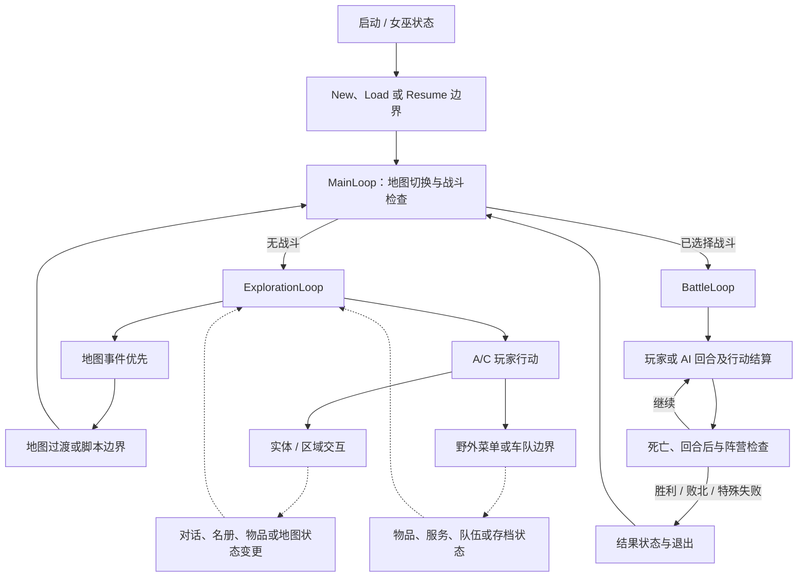

# 游戏总览与系统边界

- 状态：**基于已接受证据的设计综合**；本文档不新增原版游戏事实，也不选择重制引擎、产品形态或平衡方向。
- 记录日期：2026-08-01
- 读者：需要理解玩家动作、顶层状态与子系统交接的研究者、设计文档作者与保真实现者。
- 范围：只连接当前 `main` 上已接受的 gameflow、地图、输入、对话、队伍/名册、服务、战斗、成长与存档合同；每个解读都保留其 **已确认**、**推断** 或 **未知** 标签。

> 本文件是 [`gameplay-overview.md`](../../synthesis/gameplay-overview.md) 的中文镜像。英文原文始终是审阅基线；本镜像为派生文档，遵循 [`glossary.md`](../../glossary.md) 的术语规则（R1–R7）。证据标签按 R1 使用固定中文译法；源码标识符、fixture ID 与路径按 R2 原样保留。

这是[文档路线图](../../documentation-roadmap.md) 所述的第一篇 Layer B 综合。它提供导航，不替换任何研究所有者、测试夹具或子系统合同。**已确认** 指所述边界有链接的 Layer A 证据支持。**推断** 指多个已确认边界被连接成中性的面向玩家解释。**未知** 指当前证据不支持进一步解释。

## 支持与不支持的判断

本文档支持以下方面的判断：

- 玩家可以移动、交互、管理资源、选择战斗行动或存档的已确认状态边界；
- 在探索、脚本/服务、战斗、成长与存档所有者之间交接的状态类别；
- 保真实现应从中获取验收事实的现有合同与测试夹具。

本文档不支持以下方面的判断：

- 完整战役路线、剧情节拍、角色动机或玩家应获得的叙事体验；
- 地图作者意图、预期策略、最优名册、难度/数值曲线或经济平衡；
- 原版界面手感、帧级输入延迟、可见动画/音频时序或硬件级渲染一致性；
- 重制引擎、平台、UI、可访问性、存档可靠性现代化或有意的重平衡决定。

## 玩家动作与即时目标

该表把面向源码的行为翻译成中性的玩家动作短语。它不把程序符号当作原版面向玩家的含义，也不从单个状态变更推导长期设计目的。

| 玩家动作 | 当前证据支持的即时目标 | 标签与边界 |
| --- | --- | --- |
| 开始、读取或继续 | 进入新的或既有游戏状态；继续被挂起的战斗 | Witch/存档动作路由、双槽数据边界与战斗恢复入口为 **已确认**。完整可见选择流程、跨进程持久性与断电行为保持 **未知**。 |
| 在地图上移动 | 改变受控实体位置并让地图移动/事件逻辑继续求值 | 实体移动/动作更新顺序、位置/碰撞单位与地图事件轮询为 **已确认**。路线用途、移动手感与每个可见帧保持 **未知**。 |
| 激活或查看 | 面向附近实体、区域或可检查瓦片，并请求脚本、事件或物品结果 | 准入、优先级、对象类别与物品交接为 **已确认**。正常剧情可达性、文本/动画/音频呈现与大多数结果的长期持久性保持 **未知**。 |
| 打开菜单并管理物品 | 选择野外/战斗菜单动作并使用、给予、装备或丢弃合法物品 | 战斗玩家控制与服务/属性所有者确认受限分支与变更顺序。本文档不声称每个野外菜单页、取消手感或完整可见反馈。 |
| 使用服务 | 通过已确认的商店、教堂、车队/仓库或铁匠动作面交换资源或改变成员状态 | 动作、取消与金币/物品/成员变更顺序为 **已确认静态**。地图/NPC 准入、返回探索、持久性与呈现保持 **未知**。 |
| 在战斗中定位、瞄准并行动 | 选择合法格子/目标以及攻击、魔法、物品、待机/搜索或其他受支持结果 | 玩家控制状态机与动作解决边界为 **已确认静态**，对所选数学/状态路径有 H3 覆盖。战术意图、AI 公平性、完整战斗节奏与一般模拟精度在本文档范围之外。 |
| 获得成长或恢复 | 对角色状态应用 EXP、升级、状态恢复或服务变更 | 既有合同确认所选输入、顺序、钳位与输出。玩家名册权衡、构筑意图、成长体验与完整数值曲线保持 **未知**。 |
| 存档、复制、删除或挂起 | 在已确认的存储接缝处保留、复制、清除或临时中断状态 | SRAM 布局、校验和、槽位动作与进程内 H3 行为为 **已确认**。原版断电原子性与长期物理设备耐用性保持 **未知**。 |

**推断 的动作-目标对齐：** 这些动作合起来让玩家推进当前可达状态、解决局部战斗或资源约束，并保留可恢复的进度。进一步把它们解读为“探索世界”“组建理想部队”或“精通某种战术”可能符合类型期待，但本仓库中的战役可达性、玩家观察与作者意图证据尚未确认这些含义。

## 顶层状态流

以下是设计综合，不是引擎架构。实线表示存在与顺序由所属文档记录的交接。虚线表示已确认边界之间的 **推断 玩家层连接**，其完整调用方、可见过渡或持久性尚未闭合。

### 已确认流程锚点

1. `MainLoop` 在检查战斗前应用标志驱动的地图切换；`-1` 是无战斗哨兵。真实战斗返回再次经过地图切换，探索的 warp 式过渡也返回外层循环。
2. `ExplorationLoop` 建立或恢复地图/实体状态、加载地图资源、运行配置，然后在地图事件与 A/C 动作之间循环。轮询与分发都先检查地图事件，因此当两个值在同一迭代中可见时事件胜出。
3. 玩家动作路径先测 A 再测 C。A 进入野外菜单路径。C 可路由到车队、实体激活、区域查看或野外菜单回退，另有独立的调试路由在普通玩法说明之外。
4. `BattleLoop` 区分挂起与新战斗入口。新战斗跨越初始化、过场、名册、区域、生成与行动顺序边界。每次动作后，在回合后效果两侧处理死亡与阵营结果。
5. 胜利、败北与战斗 4 的特殊失败返回不同结果状态。这些返回汇入主/地图退出边界，但本文档不为它们提供叙事含义。

### 尚不能闭合的过渡

- 跨所有正常剧情调用方发生服务、对话、名册命令或物品交接的时机；
- 每个交互的玩家可见完成、取消、返回探索与音频/窗口时序；
- 存档/读档后所有地图、队伍、服务与战斗状态的跨进程持久性；
- 战役中每个分支、战斗与地图的实际可达顺序。

全部为 **未知**。虚线连接在没有决定时不得成为隐含的重制路线。

## 循环与系统动态

### 已确认的本地循环

- **探索轮询循环：** 地图/实体更新产生或保留状态。`WaitForEvent` 在 A/C 之前观察待处理地图事件，外层循环仍先分发事件。该优先级为 **已确认**；精确的 VInt 发布边界为 **未知**。
- **战斗回合/动作循环：** 新战斗或恢复战斗进入单回合处理。死亡与结果检查围绕回合后效果，`0xFF` 行动顺序条目开始下一回合。顶层顺序为 **已确认**；完整的逐动作呈现与完整运行时调用方状态集都未完全确认。
- **服务/菜单循环：** 当前服务合同确认动作、取消分支与变更顺序。把它们描述为玩家反复访问的经济/恢复循环是 **推断**，因为准入、返回与战役频率未闭合。

### 带证据边界的反馈关系

| 状态关系 | 当前标签 | 不得变成的结论 |
| --- | --- | --- |
| 战斗动作 → HP/状态/死亡 → 结果检查 | 单个边与所选公式/状态用例为 **已确认**；完整战斗体验为 **推断**。 | 预期战术、目标优先级含义、难度或节奏 |
| 战斗 EXP/奖励 → 等级/属性/资源变更 → 后续消费的角色状态 | 单个奖励、升级、金币/物品与服务边界有 **已确认** 合同；战役级反馈循环为 **推断**。 | 最优构筑、合理刷级或玩家/敌人数值曲线 |
| 标志/地图配置/事件/脚本 → 地图、对话或名册状态 | 选择器、命令形状、处理器顺序与所选 H3 用例为 **已确认**。 | 剧情节拍、作者意图或完整故事后果 |
| 伤害/状态/物品限制 → 教堂/商店/车队/物品动作 | 服务资源顺序与所选属性状态为 **已确认**；访问频率与玩家压力为 **未知**。 | 经济平衡、补给节奏或策略必要性 |
| 存档/挂起动作 → 序列化/恢复状态 | 布局、辅助顺序与受限 H3 为 **已确认**。 | 每个子系统的完整快照、断电安全或现代存档 UX |

因此仓库可以描述多个本地状态机及其接口，但尚不能把这些接口提升为已被证明的完整核心循环、战役循环或元推进循环。

## 证据矩阵

| 综合边界 | 标签与受限主张 | 证据所有者 / 可执行追踪 | 剩余问题 |
| --- | --- | --- | --- |
| 主循环与探索路由 | **已确认** 地图切换、战斗哨兵、事件先于输入的顺序与交互准入/顺序 | [gameflow 研究](../../../research/gameflow-core.md)；`sf2-gameflow-core-static-v1`（[`gameflow-core-static-v1.json`](../../../../tests/fixtures/h2/gameflow-core-static-v1.json)） | VInt 边界、过渡帧、正常剧情可达性 |
| 地图状态与移动/事件 | **已确认** 地图导入、配置/事件顺序、工作布局与受限移动/动作行为 | [地图合同](../../contracts/map-exploration.md) 及其分项的 H2/H3 测试夹具列表；`sf2-map-interaction-trigger-runtime-v1`（[`map-interaction-trigger-v1.json`](../../../../tests/fixtures/h3/map-interaction-trigger-v1.json)） | 最终渲染、完整玩家路线、所选持久性 |
| 输入接缝 | **已确认** 原始采样、当前/重复状态与等待辅助 | [输入合同](../../contracts/input-system.md)；`sf2-tech-services-static-v1`（[`tech-services-static-v1.json`](../../../../tests/fixtures/h2/tech-services-static-v1.json)）拥有原始采样与等待辅助，而 `sf2-tech-interrupts-static-v1`（[`tech-interrupts-static-v1.json`](../../../../tests/fixtures/h2/tech-interrupts-static-v1.json)）拥有 VInt 派生的当前/重复阶段 | 控制器协议、帧级延迟、玩家可见重复节奏 |
| 对话交接 | **已确认** 六种命令布局、处理器顺序与 21 用例处理器局部运行时接缝 | [对话合同](../../contracts/dialogue-system.md)；`sf2-map-script-dialogue-runtime-v1`（[`map-script-dialogue-v1.json`](../../../../tests/fixtures/h3/map-script-dialogue-v1.json)） | 文本/立绘/音频渲染、剧情可达性、持久性 |
| 队伍/名册交接 | **已确认** 十个源码形式、分支/变更/调用顺序与受限活跃队伍效果 | [队伍/名册合同](../../contracts/party-roster-state.md)；`sf2-map-script-engine-static-v1`（[`map-script-engine-static-v1.json`](../../../../tests/fixtures/h2/map-script-engine-static-v1.json)）与 `sf2-force-state-active-party-runtime-v1`（[`force-state-active-party-v1.json`](../../../../tests/fixtures/h3/force-state-active-party-v1.json)） | 名册/列表容量、剧情生命周期、存档持久性、玩家选择空间 |
| 服务动作 | **已确认静态** 商店/教堂/车队/铁匠动作与资源变更顺序 | [服务合同](../../contracts/service-interactions.md)；`sf2-common-menus-static-v1`（[`common-menus-static-v1.json`](../../../../tests/fixtures/h2/common-menus-static-v1.json)） | 准入、返回、呈现、持久结果 |
| 战斗入口、回合与结果 | **已确认静态** 新/恢复、回合/动作/死亡/结果顺序 | [battle-loop 研究](../../../research/battle-loop.md)；顶层可执行追踪 `sf2-battle-control-static-v1`（[`battle-control-static-v1.json`](../../../../tests/fixtures/h2/battle-control-static-v1.json)）。[battle-functions 研究](../../../research/battle-functions.md) 与 `sf2-battle-functions-static-v1`（[`battle-functions-static-v1.json`](../../../../tests/fixtures/h2/battle-functions-static-v1.json)）只支持共享的单回合/玩家控制面 | 完整玩家可见循环、运行时调用方状态、战术解读 |
| 动作解决 | **已确认** 实现无关的物理、法术、状态、EXP 与所选回放边界 | [战斗合同](../../contracts/combat-resolution.md)、[法术合同](../../contracts/spell-resolution.md)、[随机性合同](../../contracts/randomness.md) 及其测试夹具列表 | 未观察分支、分布隔离、一般战斗模拟 |
| 成长 | **已确认** 升级顺序、成长、钳位、法术与刷新边界 | [升级合同](../../contracts/level-up.md) 及其 H2/H3 测试夹具列表 | 战役上下文、名册选择、预期曲线、平衡意图 |
| 存档与挂起 | **已确认** 双槽布局、校验和、动作路由与受限进程内回放 | [存档合同](../../contracts/save-system.md)；`sf2-witch-save-actions-runtime-v1`（[`witch-save-actions-v1.json`](../../../../tests/fixtures/h3/witch-save-actions-v1.json)） | 跨进程行为、断电、完整子系统持久性、可见 UX |

该表只提供所有者导航。精确预期仍由每个测试夹具的 schema、提取器/验证器与所属合同定义；本文档不得复制更弱的预期集。

## 原版保真与现代化

### 保真规则

声称对本文档覆盖边界保真的未来实现至少应：

1. 从所属合同/测试夹具消费地图、输入、脚本、队伍、服务、战斗、成长与存档状态，而不是从本图或面向玩家的短语推导数据结构；
2. 保留已确认的选择器、优先级、分支极性、变更/调用顺序、钳位与哨兵；
3. 不对 **未知** 的可达性、呈现、时序、容量或持久性作原版游戏主张；
4. 把刻意偏差与兼容原版的预期分开报告。

### 尚未作出的现代化决定

现代输入映射、加速/跳过、UI 信息层级、可访问性、自动存档、原子存档、跨平台存储、内容重排、角色重平衡、敌人属性重设目标与新的战斗模拟器都可能是合理方向，但这里都没有决定。任何此类选择都应在 `docs/decisions/` 或未来的重制规格中说明理由，并把其 expected-deviation/H4 验收与原版一致性分开。

## H4 集成与停止条件

本文档不是新的可执行合同，也不注册弱于子系统测试夹具的聚合黄金值。H4 适配器应按需消费证据矩阵所有者，并使用同一测试夹具对原版测试台与重制适配器验证同一实现无关事实。只有所有输入、状态单位、顺序与输出边界都有已接受所有者时，才可添加跨子系统场景。

在以下情况停止扩展本文档并把问题留给所有者队列：

- 答案需要未接受的逆向分支、未观察的正常剧情可达性或可见时序；
- 源码名、静态调用或单个测试夹具用例需要变成玩家意图、平衡或战役规则；
- 必须选择引擎架构、产品体验或刻意偏差；
- 需要完整地图设计原则、名册选择空间、玩家/敌人曲线或战斗模拟。

这四个上层方向在满足其入场标准且开始独立的设计综合切片之前，保持在文档路线图的[长期方向](../../documentation-roadmap.md#long-term-directions)中。
