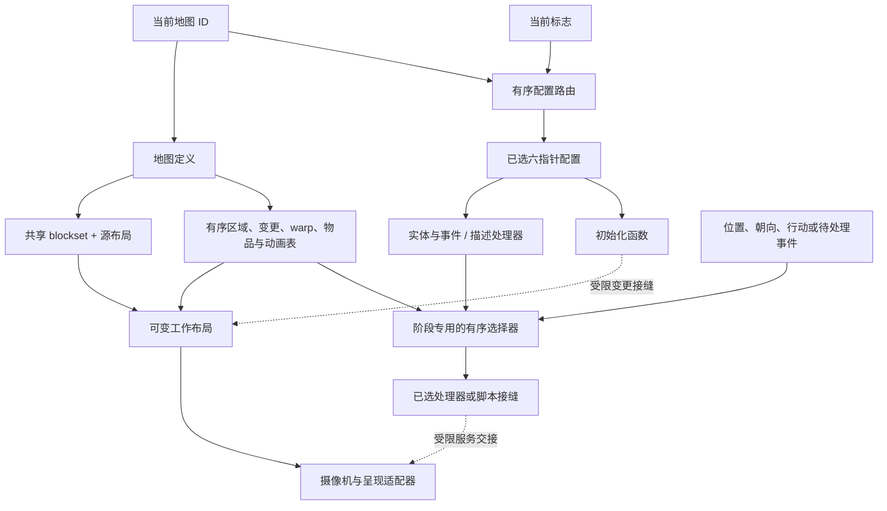

# 地图设计原则：证据受限的结构模式

- 状态：基于已接受的地图内容、配置、事件与运行时接缝证据的 **推断** Layer B 综合；本文档不是关于作者意图的主张，也不是重制关卡设计决定。
- 记录日期：2026-08-02
- 读者：研究者、保真实现者与未来地图设计者，需要一份原版证据已经约束了什么因素的简明模型。
- 范围：可观察的结构、状态选择、变更阶段、交互排序，以及在空间或体验式地图分析开始之前所需的证据。

> 本文件是 [`map-design-principles.md`](../../synthesis/map-design-principles.md) 的中文镜像。英文原文始终是审阅基线；本镜像为派生文档，遵循 [`glossary.md`](../../glossary.md) 的术语规则（R1–R7）。证据标签按 R1 使用固定中文译法；源码标识符、fixture ID 与路径按 R2 原样保留。

## 判断边界

本文档可以支持五种受限判断：

1. 一张原版地图是共享几何、有序内容表与单独选择的配置组成的包，而不是一个自包含的场景；
2. 地图同一性与活动地图状态是不同的，因为标志可以在有序配置变体之间选择，而运行时操作可以变更工作布局；
3. 源码顺序与分发阶段是行为合同的一部分；
4. 事件选择、脚本执行、移动/碰撞与呈现是彼此独立的证据边界，即使它们在探索期间汇合；
5. 未来的重制地图表示在引入新编辑器、渲染器、导航模型或内容管线之前必须保留这些边界。

它还不能支持关于预期路线、探索节奏、挑战、地标、可发现性、秘密、瓶颈、视觉构图或玩家偏好的主张。这些判断需要空间度量、常规路线可达性、碰撞/寻路行为，以及当前受追踪 fixture 不提供的可见呈现证据。它们保持 **未知**。

**推断综合规则：** 下面的原则是保持所有已接受所有者兼容的最小结构解读。fixture 事实仅在各自的命名观察边界内保持 **已确认**。

## 综合前证据审计

该审计比较了所属研究文章、证据绑定的[地图与探索合同](../../contracts/map-exploration.md)、fixture 载荷与 ID，以及每个所有者命名的聚焦命令。它特意检查了聚合单位、别名计数、选择量词、变更生命周期，以及运行时测试台是否执行后期剧情或呈现效果。

| 审查面 | 交叉检查与处置 | 保留的边界 |
| --- | --- | --- |
| 地图内容与几何 | [地图内容研究](../../../research/map-content.md)、`sf2-map-content-static-v1`、`sf2-map-layout-decode-v1` 与 `sf2-canonical-map-import-v1` 一致：79 个地图定义、77 对图块/布局载荷、两个地图别名、64x64 布局、3x3 瓦片图块与 1,027 条地图内容逻辑记录。在下方记录的所有者修正之后，内容、布局与规范导入复现均通过。 | 受追踪 fixture 保留聚合结构，而非可分发的布局或渲染地图结果。 |
| 配置变体 | [地图数据研究](../../../research/map-data-inventory.md)、静态配置 fixture 与十案例运行时选择器一致：64 个有路由的地图 ID、126 个配置定义、15 条缺失路由、有序标志扫描与最后设置标志胜出。 | 运行时矩阵使用调试 Map Test 路径；正常存档标志组合与剧情可达性为 **未知**。 |
| 实体、区域（事件）与物品选择 | 静态事件所有者记录 1,134 条物理记录与首匹配分发。九案例运行时矩阵在把每个选中脚本条目替换为 `rts` 的同时确认所选偏移/目标。 | 脚本效果、过渡持久性、朝向/呈现后果与正常剧情准入在该 fixture 之外。 |
| 区域描述 | `sf2-map-descriptions-static-v1` 拥有 75 个目标与 227 条物理条目以及首匹配使用方形状。它还区分正常探索的 `d6=1` 路径与条件函数。 | 没有运行时 fixture 闭合文本内容、玩家可见呈现或非标准调用方。 |
| 工作布局变更 | [地图内容研究](../../../research/map-content.md) 拥有重建/保留阶段。七案例图块变更 fixture 在有界布局窗口上确认有序字复制与更新位接缝。 | 碰撞、寻路、存档/读档持久性、正常剧情可达性与可见 VDP 效果仍为 **未知**。 |
| 触发、摄像机与过渡 | 交互、摄像机与过渡 fixture 只确认有界的处理器进入/返回、状态传递与服务接缝。 | 源码标签与成功返回并不能证明玩家可见的移动、摄像机构图、淡入淡出时长、事件消耗或路线含义。 |

在已接受 fixture 载荷或其所属文章之间没有发现语义矛盾。在初始基线 `e9b60f18832e9e74ed8749239d7726e871710d7b` 上复现时确实发现一个所有者集成不匹配：`uv run sf2 h2 map-import` 从 map-init 源码行读取了过期的 `callTargets`，而该行暴露的是 `directCallTargets`，并以 `KeyError` 退出。设计车道没有改动该工具、fixture 或 schema 表面。研究所有者通过 [Issue #22](https://github.com/FrankHZ/md-sf2-reverse-engineering/issues/22) 修正了该不匹配；在本分支更新到 main `5f1dbcca961a678cac774a4eadf1e21e3bd1c03b` 之后，一次新的 map-import 运行以 79 个地图、1,859 个资源与 15,805 条逻辑记录通过。这段历史记录了对抗性审查，而不把早期失败当作当前的证据边界。

该审计还发现一个重要量词边界：完整的静态语料与刻意狭窄的运行时用例并存。因此本文档用语料计数描述可用的通道与同一性，但绝不用运行时矩阵声称完整的战役行为。

## 结构词汇

| 术语 | 本综合中的含义 | 它不表示什么 |
| --- | --- | --- |
| 地图定义 | 79 条内容记录之一，引用调色板/瓦片集、图块集/布局、有序区域与交互表、物品与可选动画。 | 一个完整可玩的场景或一个唯一的资源包。 |
| 配置路由 | 一条有序的地图 ID/默认/标志选择记录，可解析为一个六指针配置定义。 | 一个剧情章节、任务状态或无顺序的变体字典。 |
| 配置定义 | 一个选中的实体列表、实体/区域（事件）/物品事件处理器、区域描述与初始化函数的包。 | 证明每个被引用处理器在正常游玩中都会执行。 |
| 源码布局 | 与地图定义关联的不可变解码 64x64 图块索引/标志数组。 | 显示或可遍历地图派生自的唯一状态。 |
| 工作布局 | 8 KiB 可变布局，标志、宝箱、屋顶、踩踏、门与脚本化图块变更可按不同阶段作用于其上。 | 一个已确认的持久性或碰撞模型。 |
| 交互选择器 | 一个有序使用方，选择一条有界的实体、区域（事件）、物品、描述、屋顶、踩踏或传送记录。 | 之后的脚本效果或玩家可见的结果。 |
| 呈现适配器 | 消费地图状态的摄像机、平面、调色板、动画、窗口、淡入淡出与渲染。 | 地图内容、事件状态或路线语义的所有权。 |

## 证据受限的地图模型

实线边代表直接拥有的数据引用或使用方输入。虚线边是 **推断** 的系统关系，由分别确认的处理器局部接缝组装而成；它们不声称端到端可见效果、正常剧情可达性或重制引擎架构。

## 结构原则

### 1. 把地图当作分层包，而不是单体关卡

79 个定义引用多个独立拥有的资源。几何在两个案例中共享，可选指针保持缺失而不是被虚构为空表，且配置包通过与内容记录不同的路由选择。因此最小的保真模型是同一性与有序记录构成的图。

**推断设计后果：** 未来的编辑器或导入器应把几何、配置状态、交互表与呈现资源暴露为不同层。把它们压平到一个场景可以是一种实现选择，但它不得抹掉别名、缺失引用或源码顺序。

### 2. 把地点同一性与有状态配置分开

当前地图 ID 选择内容，而有序标志路由为 64 个有路由的 ID 选择 126 个配置定义之一。所有标志行都被扫描，每个被设置的行替换当前候选，因此源码顺序中最后设置的标志胜出。四个后续别名可以恢复默认配置。

**推断设计后果：** 变体被建模为有序状态解析，而不只是复制的地图或首匹配分支树。这支持一个中性观察：一个地点可以在改变其人口或处理器的同时保留几何同一性。正常玩家能到达哪些变体、这些变化在叙事上意味着什么，仍为 **未知**。

### 3. 保留顺序，因为顺序消解歧义

不同子系统使用不同的排序规则：

- 配置变体扫描所有行并保留最后设置的标志；
- 实体、区域（事件）、物品与描述表选择第一条匹配记录；
- 标志图块复制在布局构造期间全部按源码顺序应用；
- 加载时屋顶与踩踏/传送扫描选择它们的第一条匹配记录；
- 受控行走依次检查进入车队、进入木筏、门、传送、区域（事件），然后是可通过性，并且门变更在之后的传送/区域（事件）检查之前被重新读取。

这些不是一个通用的优先级列表。它们在不同生命周期阶段运作，并且必须在保真实现中保持分离。

**推断设计后果：** 重叠是一种有效的编写输入，其结果取决于所属使用方的顺序。工具应揭示顺序与重叠，而不是静默排序、去重或规范化它们。

### 4. 让可变地形成为派生状态

新地图与滚动传送路径在重放所有状态之前先从源码重建工作布局。负的当前地图重载保留现有工作布局，而显式重置先清除 8 KiB 缓冲区，再走那条保留式重载路径。标志、宝箱、屋顶、踩踏、门与脚本驱动的变更并不都发生在同一点。

**推断设计后果：** 不可变导入内容与运行时布局状态需要独立同一性。仅以地图 ID 为键的缓存无法决定变更是否存活。该原则不确立哪些变更会通过存档/读档持续，也不确立碰撞/寻路对已变更字的反应；两者在各自所有者之外都是 **未知**。

### 5. 把选择与后果分开

语料为实体、区域（事件）、物品与区域描述选择提供独立通道。静态证据闭合了它们的记录形状与目标同一性；事件运行时 fixture 闭合了九个选择用例而不执行所选脚本。因此，成功的匹配证明哪个目标被交接，而不是玩家看到什么或之后哪些剧情状态改变。

**推断设计后果：** 未来的地图工具应能在剧情脚本、对话、动画或持久性接入之前验证选择器行为。这种分离让歧义可见，并允许在不重新分发地图内容的情况下建立小型一致性 fixture。

### 6. 把导航、交互与呈现作为独立问题

几何被确认为引用 3x3 瓦片图块的 64x64 原始字，但受追踪语料不提供完整的玩家可遍历图。实体阻挡有有界的移动合同，特定标记使用方有已确认的顺序，但所有布局上的完整碰撞/寻路行为尚未闭合。摄像机与过渡 fixture 同样观察处理器局部状态与服务接缝，而非最终构图或路线体验。

**推断设计后果：** 空间分析不得用原始图块索引替代可通过性，呈现分析不得用摄像机命令名替代可见取景。导航度量、交互可达与视觉地标是三个未来的证据产品，而不是对同一布局数组的三种可互换解读。

## 当前语料能与不能描述什么

| 设计问题 | 目前支持 | 停止条件 |
| --- | --- | --- |
| 一个地点如何被表示？ | 基于已确认内容/配置同一性、别名、几何与有序表的 **推断** 分层模型。 | 不得把该表示称为重制场景图或编辑器架构。 |
| 一个地点如何随状态变化？ | 有序配置选择的 **已确认**；地点同一性与活动配置分离的 **推断**。 | 正常存档组合、叙事含义与完整持久性为 **未知**。 |
| 重叠编写条件如何被解析？ | **已确认** 的使用方特定首匹配、最后设置、全序与阶段优先级规则。 | 不得把它们合并成一个通用事件优先级。 |
| 地形能改变吗？ | 工作布局复制与重建/保留接缝的 **已确认**；派生状态模型的 **推断**。 | 碰撞、寻路、存档持久性与可见更新后果为 **未知**。 |
| 交互通向哪里？ | 已接受用例的有界选择器目标同一性的 **已确认**。 | 脚本效果、对话、奖励、过渡与呈现不能仅由选择确立。 |
| 什么让地图有趣或可读？ | 当前 fixtures 中没有任何东西闭合这一判断。 | 路线选择、节奏、地标、难度与玩家体验仍为 **未知**。 |

## 证据矩阵

| 设计面 | 有界证据 | 所有者与精确可执行溯源 | 剩余边界 |
| --- | --- | --- | --- |
| 内容包 | **已确认静态** 79 个定义、662 个源码区段、154 个私有载荷、可选指针边界 | [地图内容研究](../../../research/map-content.md)；`sf2-map-content-static-v1`（[`map-content-static-v1.json`](../../../../tests/fixtures/h2/map-content-static-v1.json)） | 渲染内容与私有载荷不受追踪 |
| 几何与别名 | **已确认静态** 77 对载荷服务 79 个引用，含两个别名；每个解码布局都是 64x64，且每个图块引用都在范围内 | [通用地图研究](../../../research/common-maps.md)；`sf2-map-layout-decode-v1`（[`map-layout-decode-v1.json`](../../../../tests/fixtures/h2/map-layout-decode-v1.json)） | 可通过性、碰撞图与渲染一致性 |
| 引擎中立资源图 | **已确认静态** 79 个定义与 1,859 个保留同一性的资源，含已解析的非空引用与原始标志 | [地图内容研究](../../../research/map-content.md)；`sf2-canonical-map-import-v1`（[`canonical-map-import-v1.json`](../../../../tests/fixtures/h2/canonical-map-import-v1.json)） | 完整生成的导入为私有；无引擎/编辑器决定 |
| 状态选择的配置 | **已确认静态/运行时** 64 条路由、126 个配置定义、15 条缺失路由、全行扫描、最后设置胜出与有界的默认/别名用例 | [地图数据研究](../../../research/map-data-inventory.md)；`sf2-map-setup-static-v1`（[`map-setup-static-v1.json`](../../../../tests/fixtures/h2/map-setup-static-v1.json)）与 `sf2-map-setup-selection-runtime-v1`（[`map-setup-selection-v1.json`](../../../../tests/fixtures/h3/map-setup-selection-v1.json)） | 正常存档组合、所选配置含义与剧情可达性 |
| 实体/区域（事件）/物品选择器 | **已确认静态/运行时** 1,134 条物理记录、首匹配规则与九个有界选中目标用例 | [地图数据研究](../../../research/map-data-inventory.md)；`sf2-map-events-static-v1`（[`map-events-static-v1.json`](../../../../tests/fixtures/h2/map-events-static-v1.json)）与 `sf2-map-event-dispatch-runtime-v1`（[`map-event-dispatch-v1.json`](../../../../tests/fixtures/h3/map-event-dispatch-v1.json)） | 所选脚本被 stub；后续效果与呈现为 **未知** |
| 区域描述 | **已确认静态** 75 个目标、227 条物理条目、首匹配形状与正常探索 `d6` 边界 | [地图数据研究](../../../research/map-data-inventory.md)；`sf2-map-descriptions-static-v1`（[`map-descriptions-static-v1.json`](../../../../tests/fixtures/h2/map-descriptions-static-v1.json)） | 文本、非标准调用方、运行时可达性与呈现 |
| 脚本化图块变更 | **已确认静态/运行时接缝** 源码形状的图块复制命令加上七个有界前向复制/更新观察 | [地图/探索合同](../../contracts/map-exploration.md)；`sf2-map-script-engine-static-v1`（[`map-script-engine-static-v1.json`](../../../../tests/fixtures/h2/map-script-engine-static-v1.json)）与 `sf2-map-block-mutation-runtime-v1`（[`map-block-mutation-v1.json`](../../../../tests/fixtures/h3/map-block-mutation-v1.json)） | 碰撞/寻路使用方、持久性、正常可达性与可见时序 |
| 屋顶与踩踏触发 | **已确认有界运行时** 原始处理器与表扫描上的六个命中/未命中/门控用例 | [地图/探索合同](../../contracts/map-exploration.md)；`sf2-map-interaction-trigger-runtime-v1`（[`map-interaction-trigger-v1.json`](../../../../tests/fixtures/h3/map-interaction-trigger-v1.json)） | 完整布局效果、碰撞/寻路、音频/呈现、持久性与剧情可达性 |
| 摄像机接缝 | **已确认有界运行时** 七个目标/目的地/速度处理器用例与状态/服务时间线 | [通用脚本研究](../../../research/common-scripting.md)；`sf2-map-camera-control-runtime-v1`（[`map-camera-control-v1.json`](../../../../tests/fixtures/h3/map-camera-control-v1.json)） | 玩家可见摄像机行为与正常剧情可达性 |
| 过渡接缝 | **已确认有界运行时** 五条解释器流，含 `warp`、有界事件字节、状态字段与直接服务进入/返回 | [通用脚本研究](../../../research/common-scripting.md)；`sf2-map-script-transition-runtime-v1`（[`map-script-transition-v1.json`](../../../../tests/fixtures/h3/map-script-transition-v1.json)） | 事件消耗、淡入淡出/显示时序、持久性、碰撞/寻路与正常剧情可达性 |

## 原版保真与未来地图设计

原版保真实现必须保留资源同一性、原始布局字、可选引用、有序配置选择、使用方特定匹配规则、生命周期特定变更，以及选中目标与后续效果之间的区分。它可以采用任何内部表示，只要通过紧凑 H4 用例复现这些事实而不提交原版地图资源。

当前没有任何决定选择地图编辑器、场景格式、渲染器、导航网格、流式模型或编写流程。未来的重制可以刻意简化或重新设计其中任何表面，但每个偏差都需要显式决定与 expected-deviation 验收边界。现代化不得被描述为关于原版游戏的证据。

## 扩展门禁

下一层地图设计分析应等待以下证据产品：

1. **空间度量：** 由研究拥有的、可再分发的私有规范导入聚合，在测量连通空间、路线替代或瓶颈之前定义可通过性输入；
2. **常规路线可达性：** 区分源码引用与实际被代表性存档准入的地图/配置/事件组合的分组 fixtures；
3. **碰撞与寻路：** 兼容的探索移动、标记、阻挡与布局变更合同，可回答一个几何连接是否可遍历；
4. **交互结果：** 所选实体/区域（事件）/物品/描述目标的执行证据分组，而不只是目标同一性；
5. **可见呈现：** 足以讨论地标、取景、可读性或过渡节奏的渲染布局/调色板/摄像机/过渡证据；
6. **战场关系：** 在声称战役级空间难度曲线之前，把探索地图、战斗地图、部署、地形与遭遇上下文显式连接起来。

在这些门禁闭合之前，本文档就是设计边界：它解释原版地图内容如何被结构化与解析，而不是任何特定地图是否设计良好或重制应如何重新设计它。
