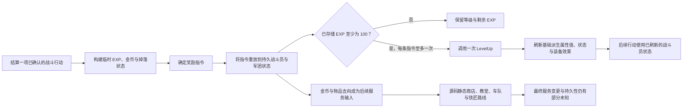

# 推进与经济

- 状态：**已确认的受限资源流**，带 **推断** 的反馈关系与显式 **未知** 的战役、平衡、服务运行时与持久性边界。
- 记录日期：2026-08-01
- 读者：需要区分原版资源规则与后续产品决定的研究者、保真实现者与设计师。
- 范围：连接已接受的 EXP、升级、金币、敌人掉落、物品转移与服务证据，而不声称完整的战役经济或预期难度曲线。

> 本文件是 [`progression-and-economy.md`](../../synthesis/progression-and-economy.md) 的中文镜像。英文原文始终是审阅基线；本镜像为派生文档，遵循 [`glossary.md`](../../glossary.md) 的术语规则（R1–R7）。证据标签按 R1 使用固定中文译法；源码标识符、fixture ID 与路径按 R2 原样保留。

## 判断边界

本文档解释多个已接受合同如何连接。它不替换[升级合同](../../contracts/level-up.md)、[物理战斗合同](../../contracts/combat-resolution.md)、[法术合同](../../contracts/spell-resolution.md)、[服务合同](../../contracts/service-interactions.md)或[存档合同](../../contracts/save-system.md)，也不是关于原版游戏的独立证据。

受支持的判断很窄：对所列测试夹具与源码静态服务路由，原版有独立动作奖励构建、持久资源变更、阈值驱动升级、属性刷新、物品路由与服务调用阶段。它们的顺序与单位很重要。

以下判断尚不受支持：

- 预期遭遇难度、等级曲线、价格曲线、稀缺性或刷级压力；
- 战役收入与支出来源的完整列表；
- 最优装备、转职时机、队伍构成或名册选择空间；
- 商店/服务可用性、正常剧情可达性或终身购买机会；
- 跨地图变更、存档/读档或断电的服务变更持久结果；
- 超出 fixture 所属接缝的玩家可见奖励、菜单、动画、声音或时序行为。

## 综合前证据审计

本切片在组合其结论之前，审查了所属研究文章、设计合同、fixture JSON 载荷与精确 ID、schema/验证器注册、聚焦测试与 CLI 归属。以下窄命令于 2026-08-01 通过：

```powershell
uv run sf2 h2 common-stats
uv run sf2 h2 common-menus
uv run sf2 h2 enemy-gold
uv run sf2 h2 enemy-drops
uv run sf2 h3 growth
uv run sf2 h3 battle-exp
uv run sf2 h3 kill-exp
uv run sf2 h3 award-exp
uv run sf2 h3 exp-command
uv run sf2 h3 gold
uv run sf2 h3 enemy-drops
```

可执行所有者对下文综合的值与顺序一致。原始审计还发现两个所有者文档不一致，并刻意没有复制它们。两个发现随后都已在所属文档中解决：

1. [Issue #11](https://github.com/FrankHZ/md-sf2-reverse-engineering/issues/11) 记录了珍稀掉落 RNG、满背包/Deals 路由与已设置掉落标志的过期奖励队列。已合并的[所有者修正 PR #18](https://github.com/FrankHZ/md-sf2-reverse-engineering/pull/18) 移除了该队列，并显式保留了覆盖这些分支的已接受十用例 `sf2-enemy-item-drop-behavior-v1` 证据。
2. [Issue #12](https://github.com/FrankHZ/md-sf2-reverse-engineering/issues/12) 记录了过宽的 Church Raise 摘要。已合并的[所有者修正 PR #19](https://github.com/FrankHZ/md-sf2-reverse-engineering/pull/19) 现在只保留源码派生的过滤变更辅助顺序 `j_DecreaseGold` → `j_IncreaseCurrentHp`（在 `move.w #CHAR_STATCAP_HP,d1` 之后）→ `UpdateAllyMapsprite`。该顺序不声称没有其他调用介入；最终当前 HP 与调用方可视运行时结果保持 **未知**。

这些是已解决的审计发现，不是待办后续工作。本综合继续消费已接受的掉落测试夹具与受限 Raise 调用接缝，而不把二者提升为更广泛的奖励 UX、服务完成、持久性或玩家可见结果主张。

## 资源与等级词汇

同一个日常词可以指不同阶段。保真实现及其测试必须把这些值分开。

| 术语 | 本综合中的已确认含义 | 必须保持可见的边界 |
| --- | --- | --- |
| 动作 EXP 累加器 | 动作解决时构建的临时战斗演出值。已确认的伤害/击杀路径饱和于 49；已确认的治疗累积饱和于 25。 | 这些是动作族边界，不是每个法术或命令的通用 EXP 上限。 |
| 最终 EXP 命令 | 应用适用的战斗表调整、两次有序随机检查与已确认敌人目标最低值后发出的动作后金额。 | 它既不是累加器也不是已存储 EXP。同侧与不受支持的动作路径不得自动继承敌人目标规则。 |
| 已存储 EXP | 由 EXP 命令增加并在阈值处理前钳位于 200 的持久行动者字节。 | 一条命令最多减去一个 100 点阈值；之后已存储 EXP 可能仍为 100。 |
| 已存储等级 | 保留在战斗员上的职业局部值。已确认上限为 ID 12 以下职业的 40 与 ID 12 起职业的 99。 | 它不一定是被每个比较使用的等级。 |
| 有效奖励等级 | 对已确认的伤害/击杀档位，转职后的行动者在与目标已存储等级比较前加 20。 | 该偏移只限于已确认的比较；不要改写持久等级。 |
| 升级法术阈值 | `LevelUp` 递增已存储等级，然后应用其职业相关的有效等级规则学习法术。 | TORT 的类 11 比较缺陷与 `$FE` 法术列表继承仍是原版保真事实。 |
| 当前对最大/基础/派生属性 | 升级改变最大值与基础属性，然后刷新派生战斗属性与装备/状态效果。 | 当前 HP 与 MP 不会只因最大值增长而增加。 |
| 金币 | 持久无符号 32 位资源；已确认的增加行为在进位或超上限加法时把它钳位于 9,999,999。 | 减少行为与非战斗变更结果不在金币 H3 测试夹具覆盖内。 |
| 持有物品、Deals 计数与车队存储 | 具有独立容量与顺序规则的独立物品去向。Deals 计数是打包的四位量，饱和于 15。 | 静态服务辅助顺序本身不证明持久性或最终运行时状态。 |

## 连接起来的资源流



进入后续动作使用与后续服务选择使用的链接是 **推断 系统关系**：更强的战斗员状态与保留资源可以影响后续选择，因为后续系统读取这些字段。该图不声称原版设计师意图某种特定强度曲线、消费节奏或最优循环。

## 战斗驱动的推进

### 1. 构建动作局部奖励

对已确认的物理与攻击法术伤害路径，行动者的有效奖励等级与目标的已存储等级比较。低于 3 的差值产生 50 点击杀档位；精确差值 3、4、5、6 分别产生 40、30、20、10；至少 7 的差值产生零。转职职业在比较前加 20。伤害 EXP 用最终伤害除以目标最大 HP 并整数截断来缩放该档位。致命结果随后在伤害贡献之后加上击杀档位。两个加法在其已确认路径中都计入同一个 49 点动作上限。

该档位不是已存储等级改写。测试夹具的 HERO 已存储等级 1 只在与目标等级 18 的比较中有效等级为 21，因此取差值-3/40 档位。

治疗使用不同的已确认规则。合格 PRST、VICR 与 MMNK 行动者计算 `floor(25 * 恢复 HP / 目标最大 HP)`，在除法路径有效时应用最低 10 的贡献，并让动作累积至多 25。不合格职业、敌人行动者与零最大 HP 目标跳过已确认贡献。状态与特殊法术有各自的 fixture 受限贡献；本综合不把它们压平成伤害或治疗。

### 2. 确定命令金额

对已确认的敌人目标 Battle 01 路径，动作累加器右移一位，因为 Battle 01 匹配减半 EXP 表。两次有序 `RNG(16)` 调用随后在第一次掷出零时加一、在第二次掷出零时减一。非正的最终值在 EXP 命令发出前变成一。通过的测试夹具保留这些不同示例：

| 累加器 | 第一次/第二次掷骰 | 命令 EXP |
| ---: | --- | ---: |
| 49 | 4 / 4 | 24 |
| 49 | 0 / 3 | 25 |
| 49 | 14 / 0 | 23 |
| 49 | 0 / 0 | 24 |
| 0 | 4 / 4 | 1 |

Battle ID 0 缺失该单条目减半表只在攻击法术测试夹具中确认。其他战斗、同侧奖励与不受支持的动作保留自己的证据边界。

### 3. 回放到持久 EXP 并处理一个阈值

EXP 命令首先以 200 为上限增加已存储 EXP。然后测试 100、减去该阈值一次，并至多调用一次 `LevelUp`。该顺序产生三个重要的已观察边界：

- `75 + 24 -> 99`，无升级；
- `76 + 24 -> 100 -> 0`，一次升级；
- `199 + 24 -> 200 -> 100`，仍只有一次升级。

在基础等级 40 与转职等级 99 时，命令仍减 100 并调用 `LevelUp`。`LevelUp` 返回 255、让封顶等级不变，命令把 EXP 留在零。重制不能用通用循环或到达上限即丢弃的规则替换该序列，除非记录刻意偏差。

### 4. 应用升级并刷新战斗员状态

对低于其上限的匹配职业块，`LevelUp` 按顺序处理最大 HP、最大 MP、基础 ATT、基础 DEF 与基础 AGI；递增已存储等级；解决精确法术阈值；然后刷新派生战斗员状态。[升级合同](../../contracts/level-up.md) 拥有随机成长公式、30 级后投影规则、职业块扫描、习得法术载荷、上限、钳位与已知原版缺陷。

连接的战斗测试夹具展示了为什么这是持久回放阶段的一部分，而不是孤立的属性计算器。Bowie 从 99 EXP 的 1 级开始，接收 24 点命令，从已存储 EXP 123 经过残差 23，到达 2 级，并刷新基础与派生属性。当前 HP/MP 保持 `12/8`，即使最大 HP 变为 14。仅动作的 ATT/AGI 值被刷新值替换而不是沿用。

转职不是本综合证明的第二次升级。静态数据确认教堂的 20 级门、数据驱动的常规/特殊职业映射与 `SetClass -> Promote` 调用顺序。完整转职属性变更、物品边界用例、可见选择流程与持久性在专门的运行时所有者闭合它们之前保持 **未知**。

## 金币与物品经济边界

### 已确认的战斗结果

- 敌人金币是与 103 个敌人定义对齐的 103 条目大端序字表。其后 69 字 ROM 尾部显式未使用，不能变成额外敌人行。
- 已确认的运行时加法使用无符号 32 位中间值。普通 `0 + 30` 产生 30；精确上限、超上限与 32 位进位用例产生 9,999,999。
- 敌人掉落使用按战斗、敌人战斗员、持有物品与一次性标志索引的 30 条记录。三个具名 Boss 武器要求 `RNG(32) == 0`；其余 27 条记录在前置条件匹配后不消耗掉落 RNG。
- 成功掉落时，已确认顺序是适用时的珍稀掷骰、测试/设置持久标志、移除敌人物品，然后路由。有空间的存活行动者接收它。直接交付失败时，只有珍稀物品进入 Deals；非珍稀物品被丢弃。
- 重复标志在中止前仍走成功的珍稀掷骰。Deals 金额 `14 -> 15`，而 15 在其四位字段中保持饱和。

这些是资源变更，不是玩家如何或何时看到奖励摘要的证据。

### 源码静态服务交换

服务轨道确认路由数据流与辅助调用顺序，而不是完成的运行时事务。该表刻意说“调用”，而不是把辅助名转成玩家可见结果。

| 服务面 | 已确认的源码静态价格或门 | 已确认的变更调用顺序 | 运行时边界 |
| --- | --- | --- | --- |
| 商店购买 | 16 位物品价格；金币与四槽检查先于接收方路径 | `DecreaseGold -> AddItem` | 最终金币/物品状态、取消副作用与持久性为 **未知**。 |
| 商店出售 | `(price * 3) >> 2`；不可售与珍稀检查不同 | `IncreaseGold -> DropItemBySlot`，带条件 Deals 辅助 | 舍入是源码数据流；辅助结果不在服务 H3 测试夹具覆盖内。 |
| 商店修理 | `price >> 2`；损坏物品门 | `DecreaseGold -> RepairItemBySlot` | 最终修理状态在运行时为 **未知**。 |
| Deals 购买 | 16 位物品价格；金币与四槽检查 | `DecreaseGold -> AddItem -> RemoveItemFromDeals` | 失败回滚/原子性与持久性为 **未知**。 |
| 教堂复活 | `level * 10`，转职数据结果后加 200 | `DecreaseGold -> IncreaseCurrentHp(200) -> UpdateAllyMapsprite` | 最终 HP 与调用方可视复活结果为 **未知**。 |
| 教堂治愈 | 中毒 10、眩晕 20、诅咒物品价格 `>> 2` 操作数 | 支付后分离的状态写入路径 | 完整总额、最终状态与呈现未在运行时闭合。 |
| 教堂转职 | 20 级加常规/特殊转职数据门 | `SetClass -> Promote`；特殊分支包括物品/法术/武器处理 | 完整属性效果、物品边界用例与持久性为 **未知**。 |
| 车队 | 部队 12、存储 64 与成员物品 4 是不同守卫 | 存入先加车队再丢弃成员；derive/give 有不同常规与交换序列 | 辅助内部结果与持久性为 **未知**。 |
| 铁匠下订单 | 秘银物品 123、转职职业门、放置后四顺序延续边界（非准入门）与 5,000 金币消耗 | 早期门之后 `DecreaseGold -> DropItemBySlot -> PickMithrilWeapon -> ClearFlag` | RNG 分布、订单持久性与最终履行生命周期为 **未知**。 |

已确认的战斗掉落进入 Deals 的路由是运行时证据。商店、车队与铁匠对 Deals 的使用保持源码静态，除非所列运行时测试夹具拥有同一路径。这两个证据层级不得仅仅因为触及同一存储字段而合并。

## 持久性边界

[存档系统合同](../../contracts/save-system.md) 确认双槽表示、校验和、存档/读档/复制/删除辅助顺序与受限进程内动作矩阵。它不建立跨进程 SRAM 存活、中断写入，或每个服务、Deals、车队、订单、掉落标志、金币、EXP 或战斗员变更在所有生命周期路径上的持久性。

因此本综合可以在已观察回放或原版状态结构中把字段识别为持久，但不声称每个连接的变更都有端到端存档/读档 H3 用例。未来的经济验收套件必须显式测试该生命周期，而不是把 `SaveGame` 的存在当作每个子系统的证据。

## 证据矩阵

| 边界 | 证据标签与受限主张 | 精确所有者 | 剩余问题 |
| --- | --- | --- | --- |
| 成长存储与升级 | **已确认** 曲线/职业块加运行时增益、上限、法术、扫描与刷新用例 | [ally-growth 研究](../../../research/ally-growth.md)、[成长 manifest](../../../../manifests/extractions/growth-data.json)、[成长 schema](../../../../schemas/growth-data.schema.json)；`sf2-calculate-stat-gain-startup-v1`（[`stat-gain-v1.json`](../../../../tests/fixtures/h3/stat-gain-v1.json)）、`sf2-level-up-tort-boundary-v1`（[`level-up-v1.json`](../../../../tests/fixtures/h3/level-up-v1.json)）、`sf2-level-up-boundaries-v1`（[`level-up-boundaries-v1.json`](../../../../tests/fixtures/h3/level-up-boundaries-v1.json)）与 `sf2-level-up-refresh-v1`（[`level-up-refresh-v1.json`](../../../../tests/fixtures/h3/level-up-refresh-v1.json)） | 自然战役分布、预期曲线、剩余钳位边界 |
| 战斗 EXP 到升级 | **已确认运行时** 命令经一个阈值回放与持久刷新 | [运行时战斗数学研究](../../../research/runtime-rng-and-battle-math.md)；`sf2-battle-exp-level-up-v1`（[`battle-exp-level-up-v1.json`](../../../../tests/fixtures/h3/battle-exp-level-up-v1.json)） | 其他奖励修饰符与重复命令 |
| 奖励档位、确定与存储 | **已确认运行时** 有效等级档位、Battle 01 调整/随机化/最低值、存储上限 200 与一个阈值 | `sf2-kill-exp-level-difference-v1`（[`kill-exp-level-difference-v1.json`](../../../../tests/fixtures/h3/kill-exp-level-difference-v1.json)）、`sf2-award-exp-randomization-v1`（[`award-exp-randomization-v1.json`](../../../../tests/fixtures/h3/award-exp-randomization-v1.json)）与 `sf2-exp-command-boundaries-v1`（[`exp-command-boundaries-v1.json`](../../../../tests/fixtures/h3/exp-command-boundaries-v1.json)） | 其他战斗、同侧路由、多动作/上限生命周期 |
| 物理动作构建与回放 | **已确认运行时子集** 伤害/击杀累加器上限与持久命令回放 | [战斗合同](../../contracts/combat-resolution.md)；`sf2-physical-damage-application-v1`（[`physical-damage-application-v1.json`](../../../../tests/fixtures/h3/physical-damage-application-v1.json)）与 `sf2-battle-scene-replay-v1`（[`battle-scene-replay-v1.json`](../../../../tests/fixtures/h3/battle-scene-replay-v1.json)） | 完整动作集与呈现时序 |
| 法术推进贡献 | **已确认运行时子集** 攻击法术档位/上限与治疗者资格/最低值/上限 | [法术合同](../../contracts/spell-resolution.md)；`sf2-spell-damage-exp-v1`（[`spell-damage-exp-v1.json`](../../../../tests/fixtures/h3/spell-damage-exp-v1.json)）与 `sf2-healing-exp-boundaries-v1`（[`spell-healing-exp-boundaries-v1.json`](../../../../tests/fixtures/h3/spell-healing-exp-boundaries-v1.json)） | 不受支持的法术族与泛化动作策略 |
| 敌人金币 | **已确认静态/运行时** 103 条已用行加未用尾部，以及增加/上限/进位用例 | [敌人奖励研究](../../../research/enemy-promotions.md)；`sf2-enemy-gold-v1`（[`enemy-gold-v1.json`](../../../../tests/fixtures/h2/enemy-gold-v1.json)）与 `sf2-gold-boundaries-v1`（[`gold-boundaries-v1.json`](../../../../tests/fixtures/h3/gold-boundaries-v1.json)） | DecreaseGold 与非战斗调用方 |
| 敌人物品掉落与 Deals 路由 | **已确认静态/运行时** 30 条记录、三个随机物品、一次性标志、接收方路由与半字节饱和 | `sf2-enemy-item-drops-v1`（[`enemy-item-drops-v1.json`](../../../../tests/fixtures/h2/enemy-item-drops-v1.json)）与 `sf2-enemy-item-drop-behavior-v1`（[`enemy-item-drop-behavior-v1.json`](../../../../tests/fixtures/h3/enemy-item-drop-behavior-v1.json)） | 玩家可见奖励流与完整存档生命周期 |
| 服务经济 | **已确认静态** 仅价格/门数据流与有序直接变更调用 | [common-menu 研究](../../../research/common-menus.md)；`sf2-common-menus-static-v1`（[`common-menus-static-v1.json`](../../../../tests/fixtures/h2/common-menus-static-v1.json)） | 分组服务 H3、原子性、最终状态、准入、返回、持久性 |
| 共享状态辅助 | **已确认静态**，只有分项运行时钳位覆盖 | [common-stats 研究](../../../research/common-stats.md)；`sf2-common-stats-static-v1`（[`common-stats-static-v1.json`](../../../../tests/fixtures/h2/common-stats-static-v1.json)） | 现有 H3 测试夹具之外的调用方相关变更结果 |
| 存档交接 | **已确认表示与受限进程内动作** | [存档合同](../../contracts/save-system.md)；`sf2-tech-services-static-v1`（[`tech-services-static-v1.json`](../../../../tests/fixtures/h2/tech-services-static-v1.json)）与 `sf2-witch-save-actions-runtime-v1`（[`witch-save-actions-v1.json`](../../../../tests/fixtures/h3/witch-save-actions-v1.json)） | 跨进程/断电行为与子系统完整持久性 |

## 原版保真与现代化

原版保真行为即使在现代实现使用不同内部结构时也保留证据拥有的阶段边界。特别是，它保留有序 RNG 使用、整数截断、动作族上限、命令回放、单阈值规则、当前/最大属性分离、32 位进位到金币上限用例、一次性掉落标志、物品路由顺序与 fixture 拥有的升级缺陷。

现代化可以选择更清晰的等级显示、连续多级处理、修正的 TORT 分类、修正的 prowess 处理、原子服务事务、不同的物品路由或平台原生存档耐用性。每个都是带具名预期偏差与独立 H4 测试夹具的未来产品决定；任何都不得作为新推断的原版规则引入。

## H4 验收与扩展门

本切片的首个重制适配器应在不要求原版命令缓冲表示的情况下消费现有测试夹具。它必须暴露等价的包含以下内容的有序轨迹：

1. 动作局部贡献与上限；
2. 最终奖励变换与 RNG 消费；
3. 持久 EXP 增加、一个阈值决定、`LevelUp` 调用与残差 EXP；
4. 升级增益加当前/基础/派生属性刷新；
5. 金币增加/上限与物品掉落路由；
6. 与运行时确认变更分开的源码静态服务意图。

在已接受证据闭合分组服务运行时矩阵、完整转职效果、非战斗金币调用方、战役服务/奖励可达性与端到端存档/读档持久性之前，扩展停止。数值曲线分析、名册选择、地图设计原则与战斗模拟仍是[文档路线图](../../documentation-roadmap.md)下的后期综合方向，不是本资源流文档的隐含交付物。
