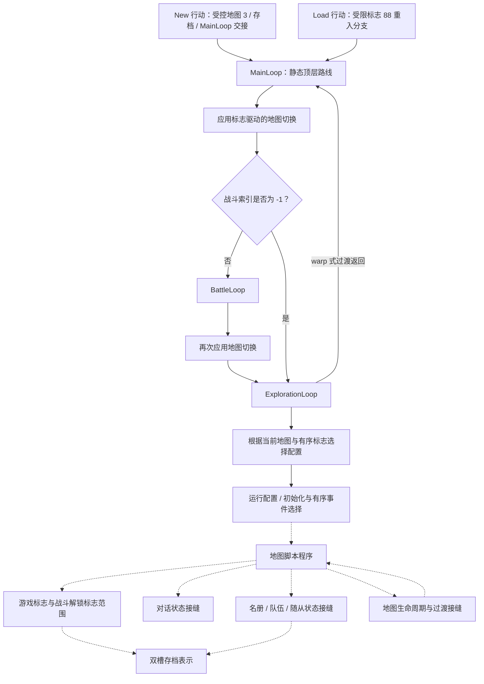

# 故事推进

- **已确认原版行为：** 受限的新游戏/重入交接、顶层地图/战斗/探索路由、有序配置与事件选择、完整 map-script 程序图、处理器局部故事标志变更、对话游标/控制接缝、名册变更、地图生命周期/过渡边界，以及下文描述的进程内存档动作。
- **推断原版行为：** 这些独立确认的接缝形成可复用的推进架构，其中地图、标志、队伍与战斗状态选择后续局部行为。
- **未知原版行为：** 完整正常玩法时间线、剧情节拍含义、玩家选择后果、路线排他性、完整存档持久性与玩家可见故事呈现。
- 重制状态：实现无关的 Layer B 综合；尚未选择引擎、战役重写或叙事数据模型。
- 证据日期：2026-08-02。
- 源码基线：`ShiningForceCentral/SF2DISASM` `master` `c834c652b6862bc5679fd7f69a38a7093206efc6`。

> 本文件是 [`story-progression.md`](../../synthesis/story-progression.md) 的中文镜像。英文原文始终是审阅基线；本镜像为派生文档，遵循 [`glossary.md`](../../glossary.md) 的术语规则（R1–R7）。证据标签按 R1 使用固定中文译法；源码标识符、fixture ID 与路径按 R2 原样保留。

## 判断边界

本文档解释已接受的原版游戏状态与控制边界如何支持故事推进。它不是剧情摘要，也不是按时间线的攻略。源码标签、静态传入引用或成功的处理器局部回放不能建立正常存档到达该代码、何时到达、玩家看到什么或事件在叙事中的含义。

因此安全的综合是一个**推进框架**，而不是战役路线：

1. 顶层控制根据当前状态选择战斗或探索；
2. 当前地图加有序标志选择六部分地图配置；
3. 有序地图事件与 map-script 分支选择局部程序；
4. 局部程序可以检查或变更标志、对话状态、名册状态与地图状态；
5. warp 式探索返回与返回的 `BattleLoop` 交接重入顶层路线；
6. 存档服务可以序列化受限战斗员数据区域，但完整子系统持久性尚未被证明。

[文档路线图](../../documentation-roadmap.md) 刻意把本综合放在[游戏总览](../../synthesis/gameplay-overview.md)、[战术战斗循环](../../synthesis/tactical-battle-loop.md)与[推进/经济综合](../../synthesis/progression-and-economy.md)之后。那些文档解释故事推进所协调的局部系统；没有一份提供缺失的叙事时间线。

## 综合前证据审计

本综合对照精确可执行所有者检查，而不是只依赖文章或源码名。审计保持以下区分不变：

- [gameflow 研究](../../../research/gameflow-core.md) 拥有静态 `MainLoop` 与 `ExplorationLoop` 顺序。它没有精确过渡帧或中断边缘事件/输入时序的运行时测试夹具。
- [map-data 研究](../../../research/map-data-inventory.md) 与配置测试夹具拥有有序配置与事件选择。配置选择是**最后设置标志胜出**；事件分发是**首个匹配记录胜出**。这两个规则不可互换。
- [common-scripting 研究](../../../research/common-scripting.md) 拥有完整程序语料与处理器局部命令族。静态引用证明图拓扑，而非正常剧情可达性。
- map-lifecycle 运行时测试夹具拥有五个直接处理器回放、直接 JSR 站点顺序、重置尾与受限布局/当前地图字段。独立的 map-script transition 测试夹具拥有五个 `ExecuteMapScript` 流，包括 `warp`、opcode/A6/dispatcher/handler/fall-through 时间线、受限 `csc07` 事件字节与直接服务进入/返回接缝。两者都不拥有事件消费、可见过渡行为、正常剧情可达性或持久性。
- [对话](../../contracts/dialogue-system.md) 与[队伍/名册](../../contracts/party-roster-state.md) 拥有其状态与运行时边界。两者都不证明谁说话、成员为何加入或任一事件在正常游玩中如何呈现。
- [存档](../../contracts/save-system.md) 拥有双槽表示与受限进程内动作矩阵。它不证明每个故事相关子系统在进程重启或断电后存活。

聚焦审计复现了 map-script、配置、事件、故事状态、对话、force-state、控制/音频、map-lifecycle、map-script-transition、New-game 与存档动作测试夹具。这些所有者之间没有发现不一致。其精确 fixture 身份在[证据矩阵](#证据矩阵)中保持可见。

## 推进词汇

| 术语 | 本综合中的已确认含义 | 必须保持可见的边界 |
| --- | --- | --- |
| 顶层路线 | 静态 `MainLoop` 顺序应用标志驱动的地图切换、测试战斗，否则到达探索；返回的 `BattleLoop` 调用再次经过地图切换。 | 精确过渡帧、战斗结果语义与完整战役时间线为 **未知**。 |
| 游戏标志 | 可通过已确认的检查/设置/清除处理器寻址的位。静态 map-script 语料有受限读写站点。 | 数字标志或源码名不建立其叙事含义或生命周期。 |
| 配置路线 | 当前地图选择默认六指针配置，然后扫描每个有序标志变体；每个已设置变体替换候选。 | 选择已确认，但正常存档可达的地图/标志组合为 **未知**。 |
| 事件路线 | 有序实体、区域或物品记录选择首个匹配并移交给受限目标身份。 | 所选程序的副作用与呈现在事件分发测试夹具之外。 |
| map-script 程序 | 带守卫命令、标签与显式转移目标的 304 个已清单程序之一。 | 引用不是程序在正常游玩中执行的证据。 |
| 对话游标 | 受限对话处理器消费或改变的状态；显式游标站点保持在带来源的文本 ID 域内。 | 解码文本、说话者身份、立绘/音频输出、等待与输入时序在此为 **未知**。 |
| 名册变更 | 受限的处理器局部加入、出战队伍、AI、重置、死亡列表、复活或随从操作。 | 招募含义、容量生命周期、存档持久性与呈现为 **未知**。 |
| 战斗解锁标志 | 源码具名的 `setStoryFlag` 处理器在设置标志前把 400 加到其字操作数。 | 标签与算术不证明战斗时间线、完成或故事意义。 |
| 持久故事状态 | 在完整原版存档/读档生命周期中存活的状态。 | 只有受限战斗员数据存档动作被确认；子系统完整故事持久性为 **未知**。 |

## 受限推进架构

实线边描述已确认的受限控制流接缝，但 `MainLoop`/探索层当前是静态证据而非帧观察路线。虚线边把可选或处理器局部关系与单一通用序列区分开：事件选择暴露目标而不运行其主体，程序只包含它们实际引用的命令族，lifecycle H3 闭合处理器返回而非后续可见效果。两条虚线存档边是显式 **未知** 问题，不是持久性主张。

该图刻意循环回顶层路由，因为静态 gameflow 所有者确认探索为 warp 式过渡返回、战斗返回经过地图切换。它不把 304 个程序排序成故事时间线。

## 顶层路线与局部选择

### 主循环与探索

**已确认静态：** `MainLoop` 在测试当前战斗前应用标志驱动的地图切换。战斗索引 `-1` 是无战斗哨兵。真实战斗调用 `BattleLoop`；返回随后在探索前再次经过地图切换。`ExplorationLoop` 建立或恢复地图/实体状态、加载地图资源、运行所选配置函数，并在待处理地图事件与 A/C 动作之间交替。

`WaitForEvent` 在读取 A/C 输入前轮询 `MAP_EVENT_TYPE`，外层循环在玩家动作结果前分发待处理事件。这在两者已在一次轮询迭代中可见时证明静态优先级。每个值变得可见的中断边界仍为 **推断**。

该层的六个源码事件类别是 warp、进入车队、进入木筏、离开车队、离开木筏与区域事件。这些是控制身份，不是六个叙事阶段。超出范围的事件播放源码拥有的战场死亡音效并返回；该回退不把叙事含义赋予无效值。

### 配置选择

**已确认静态与运行时：** 配置表包含 64 个地图行、66 个有序标志行与 126 个唯一六指针配置表。每个配置独立指向实体、实体事件、区域事件、区域描述、物品事件与初始化函数。

选择从地图默认指针开始，按源码顺序扫描所有变体，并在每次成功标志检查后替换候选。因此最后设置的标志胜出。四个后续行指回默认配置，因此保真模型必须保留顺序与别名，而不是把变体规范化为无序字典。十用例运行时矩阵确认缺失地图回退、默认、单个与多个设置标志、最后设置行为与后期默认恢复别名。

这是局部选择器。它不证明哪些地图/标志组合出现在普通存档中，或所选配置代表某个特定剧情节拍。

### 事件选择

**已确认静态与运行时：** 事件清单保留 1,134 个物理 source/ROM 记录及其单独加权的配置/路线引用。九用例运行时矩阵确认实体特定/默认、区域精确/通配/重叠优先/默认与物品索引/朝向/默认变体的有序选择。与配置选择不同，这些分发器选择首个匹配记录。

运行时测试台把每个所选目标的第一条指令替换为 `rts`。它确认记录偏移与目标身份，同时刻意排除脚本副作用。故事模型可以使用选择规则与目标身份，但不得从该测试夹具推断对话、标志写入、朝向或过渡效果。

## 局部脚本图与状态通道

### 程序拓扑

**已确认静态：** 完整 map-script 语料包含跨 169 个源码文件的 304 个程序、13,515 条命令、348 个标签与 184 个显式转移。其中 62 条是程序内/跨程序的无条件/条件边，122 条调用程序图之外的 68000 子程序。所有编码控制目标都解析。

这为后续可达性工作提供了受限图。它本身不是路线：静态传入引用、仅同文件引用、仅源码程序与未引用标签保持不同，且没有一个建立普通存档状态下的执行。

### 故事状态读写

**已确认静态：** 七个源码形式占 146 个命令站点：

| 源码形式 | 站点 | 受限操作 |
| --- | ---: | --- |
| `jumpIfFlagSet` | 24 | 测试标志；设置时取编码目标，否则跳过它。 |
| `jumpIfFlagClear` | 27 | 测试标志；清除时取编码目标，否则跳过它。 |
| 主 `csc10` | 0 | 无直接源码使用的物理切换命令载体。 |
| `setF` | 37 | 选择设置路径的别名。 |
| `clearF` | 16 | 选择清除路径的别名。 |
| `yesNo` | 22 | 受控返回 0 设置标志 89；非零清除它；两者随后用 10 调用 `Sleep`。 |
| `setStoryFlag` | 20 | 把 400 加到操作数并设置结果标志。 |

语料有跨六个唯一标志的 51 次条件读取、53 次直接写入、22 次提示写入与 20 次源码具名战斗解锁写入。只有标志 71、76 与 89 重叠静态读写集。这些计数描述源码站点，而非事件频率。

**已确认运行时：** 十个处理器局部用例覆盖每个条件分支的两个极性、设置/清除别名、两个受控 yes/no 返回、基础标志 400 与到标志 0 的 16 位回绕。yes/no 测试台证明结果到标志的极性及有序睡眠交接，而非可见提示、可用选择或下游后果。

### 对话作为推进接缝

**已确认静态与运行时：** 六个对话形式占完整程序语料中的 2,883 条命令。21 用例运行时矩阵闭合处理器游标移动、跳过极性、直接状态写入、修饰符分区、显式游标边界与有序服务进入/返回接缝。

这些处理器可以表示为对对话状态加服务调用的局部推进效果。服务在受限观察中被垫片化，因此渲染文本、角色身份、立绘、说话声、控制器时序、等待与正常剧情可达性保持 **未知**。本综合不需要也不复现任何解码对话。

### 名册与队伍状态作为推进接缝

**已确认静态，带受限运行时子集：** 源码形式覆盖部队加入、条件死亡/列表检查、败北列表变更、复活、出战队伍成员、AI 激活、战斗属性重置与随从。九用例活跃队伍矩阵确认已激活、替换、AI 清除/设置、重置与随从分配用例的受限处理器局部时间线及状态；它不在运行时闭合每个名册/死亡形式。

测试夹具刻意不把 `join`、`allyDefeated` 或随从名等标签转换成剧情断言。局部脚本可以变更队伍相关状态；谁加入、为何加入、变更是否可选、如何持久或如何呈现给玩家，在正常路线测试夹具闭合它们之前保持 **未知**。

### 控制、音频、地图生命周期与过渡

**已确认静态与运行时：** 七个控制/音频形式占 2,336 个源码出现。六用例矩阵确认受限等待/跳过、no-op 分发、声音命令陷阱、子程序调用/返回、跳转游标替换与结束行为。它不证明时长、可听输出或叙事含义。

四个地图生命周期形式占 108 条命令：重置、淡入加载、重新加载与地图加载。五用例运行时矩阵确认处理器返回与有序直接调用站点边界，包括重置尾、所选布局标记与当前地图变更。它不从解释器执行代表性流，也不包含 `warp`。

**已确认受限过渡运行时：** 独立的五用例过渡矩阵通过未修改的 `ExecuteMapScript` 循环运行 `warp`、重置、淡入加载、重新加载与地图加载流。它确认 opcode 与终止字消费、A6 偏移、处理器/分发器进入与返回顺序、淡入加载处理器 fall-through 进入地图加载、受限 `csc07` 事件字节与直接服务进入/返回接缝。源码在 `csc37` 进入时写入 `OUT_TO_BLACK` 值 2，而本次受限运行在 `LoadMapTilesets` 后的第一次 `csc48` `WaitForVInt` 进入处观察 `FADING_SETTING` 0。这些是不同 source/运行时事实，不是淡入时长或完成规则。

事件消费、可见地图/摄像机呈现、淡入/显示时序、实体放置、碰撞/寻路、未观察服务效果、正常剧情可达性与持久性保持 **未知**。过渡测试夹具的 `warp` 事件字节与顶层 warp 式返回建立受限生产者与控制交接；它们不闭合谁消费事件或玩家看到什么。

## 进入、重入与持久性

**已确认受限 New-game 交接：** 四个受控用例进入原版 New 动作、执行槽位与难度标志路径、调用 `SaveGame`，并以当前/退出地图 3 转移到 `MainLoop`。测试台绕过玩家驱动命名、菜单选择与文本呈现。因此地图 3 是已确认交接值，不是给剧情地点或开场场景贴标签的许可。

**已确认受限 Load 交接：** 进程内存档矩阵确认双槽 Save/Load/Copy/Delete 服务。`LoadGame` 后，源码标志 88 清除到达 `GetSavepointForMap`；标志 88 设置到达 `BattleLoop` 跳转接口。测试夹具保留数字标志身份而不赋予它面向玩家的生命周期含义。

**未知持久性边界：** 静态存档表示每槽覆盖 4,016 个逻辑字节，运行时矩阵在一个进程中采样战斗员数据区域。当前没有测试夹具证明完整游戏标志位集、map-script 游标、配置选择、随从、对话状态或每个其他故事相关字段在原版跨进程存档/读档生命周期中存活。重制不得从这些局部事实声明规范故事存档 schema。

## 现在能支持什么

实现无关原型可以安全建模：

- 有序顶层战斗/探索交接；
- 当前地图键与有序基于标志的配置选择器；
- 结果为目标身份的有序首匹配事件表；
- 带显式条件、跳转与子程序边的 map-script 图；
- 受限标志、对话状态、名册状态、控制与地图生命周期操作；
- 带显式未证明持久性字段的存档进入/重入适配器。

它必须在每个导入程序、边、选择器行与变更上保留溯源。它还必须保持 `已确认`、`推断` 与 `未知` 分离，使未来路线观察可以在不重写带来源事实的情况下细化图。

## 尚不是故事路线

以下保持 **未知**，并阻止任何“原版战役已被重构”的主张：

1. 304 个程序与 184 个转移中哪些在正常通关中执行；
2. 每个存档/推进点的初始与可达游戏标志集；
3. 地图、战斗、对话、名册变更与过渡的时间顺序；
4. 任何 yes/no 提示是否创建持久或互斥路线；
5. 数字标志、源码标签、地图 ID 与战斗解锁操作数的叙事含义；
6. 跨存档、读档、进程重启与断电的完整故事状态持久性；
7. 解码对话、说话者、剧情节拍、动画、音频、输入节奏与可见时序；
8. 可选内容、可错过内容、失败、回溯与战后路线行为。

这些缺口需要来自自然调用方与已知存档状态的成组运行时观察。源码名解读、隔离目标执行或合成全标志实验不是替代品。

## 证据矩阵

| 边界 | 证据标签与受限主张 | 精确可执行所有者 | 剩余问题 |
| --- | --- | --- | --- |
| 顶层 gameflow | **已确认静态** 地图切换、战斗哨兵/调用顺序、返回的 `BattleLoop` 调用再次经过地图切换、探索返回与事件先于动作分支优先级 | [gameflow 研究](../../../research/gameflow-core.md)；`sf2-gameflow-core-static-v1`（[`gameflow-core-static-v1.json`](../../../../tests/fixtures/h2/gameflow-core-static-v1.json)） | 运行时时序、战斗结果语义、过渡帧、正常战役时间线 |
| 完整脚本图 | **已确认静态** 304 程序/13,515 命令语料与已解析显式转移 | [common-scripting 研究](../../../research/common-scripting.md)；`sf2-map-script-engine-static-v1`（[`map-script-engine-static-v1.json`](../../../../tests/fixtures/h2/map-script-engine-static-v1.json)） | 正常存档准入与可达路线顺序 |
| 配置选择 | **已确认静态/运行时** 有序地图/标志扫描、最后设置胜出、别名与缺失/默认用例 | [map-data 研究](../../../research/map-data-inventory.md)；`sf2-map-setup-static-v1`（[`map-setup-static-v1.json`](../../../../tests/fixtures/h2/map-setup-static-v1.json)）与 `sf2-map-setup-selection-runtime-v1`（[`map-setup-selection-v1.json`](../../../../tests/fixtures/h3/map-setup-selection-v1.json)） | 可达地图/标志组合与所选配置效果 |
| 事件选择 | **已确认静态/运行时** 有序记录与首匹配实体/区域/物品目标选择 | [地图探索](../../contracts/map-exploration.md)；`sf2-map-events-static-v1`（[`map-events-static-v1.json`](../../../../tests/fixtures/h2/map-events-static-v1.json)）与 `sf2-map-event-dispatch-runtime-v1`（[`map-event-dispatch-v1.json`](../../../../tests/fixtures/h3/map-event-dispatch-v1.json)） | 所选脚本效果、正常可达性、呈现 |
| 故事状态命令 | **已确认静态/运行时** 条件极性、直接设置/清除、标志 89 提示极性与 400 基础写入算术 | `sf2-map-script-engine-static-v1`（[`map-script-engine-static-v1.json`](../../../../tests/fixtures/h2/map-script-engine-static-v1.json)）与 `sf2-story-state-runtime-v2`（[`story-state-v2.json`](../../../../tests/fixtures/h3/story-state-v2.json)） | 标志含义、提示后果、持久性、正常可达性 |
| 对话接缝 | **已确认静态/运行时** 六形式语料加处理器局部游标、分支、状态写入与服务调用边界 | [对话合同](../../contracts/dialogue-system.md)；`sf2-map-script-engine-static-v1`（[`map-script-engine-static-v1.json`](../../../../tests/fixtures/h2/map-script-engine-static-v1.json)）与 `sf2-map-script-dialogue-runtime-v1`（[`map-script-dialogue-v1.json`](../../../../tests/fixtures/h3/map-script-dialogue-v1.json)） | 内容、说话者、未垫片服务、输入/时序、正常路线 |
| 名册/队伍接缝 | **已确认静态/运行时子集** 名册/死亡形式与九个活跃队伍/AI/重置/随从用例 | [队伍/名册合同](../../contracts/party-roster-state.md)；`sf2-map-script-engine-static-v1`（[`map-script-engine-static-v1.json`](../../../../tests/fixtures/h2/map-script-engine-static-v1.json)）与 `sf2-force-state-active-party-runtime-v1`（[`force-state-active-party-v1.json`](../../../../tests/fixtures/h3/force-state-active-party-v1.json)） | 招募含义、容量生命周期、持久性、呈现 |
| 脚本控制 | **已确认静态/运行时** 等待/跳过、no-op、声音陷阱、子程序、跳转与结束接缝 | `sf2-map-script-engine-static-v1`（[`map-script-engine-static-v1.json`](../../../../tests/fixtures/h2/map-script-engine-static-v1.json)）与 `sf2-map-script-control-audio-runtime-v1`（[`map-script-control-audio-v1.json`](../../../../tests/fixtures/h3/map-script-control-audio-v1.json)） | 时长、服务效果、可听结果、正常可达性 |
| 地图生命周期 | **已确认静态/运行时** 重置/加载/重新加载处理器与有序直接调用站点边界 | `sf2-map-script-engine-static-v1`（[`map-script-engine-static-v1.json`](../../../../tests/fixtures/h2/map-script-engine-static-v1.json)）与 `sf2-map-lifecycle-runtime-v1`（[`map-lifecycle-v1.json`](../../../../tests/fixtures/h3/map-lifecycle-v1.json)） | 可见过渡、实体/布局后果、持久性、正常路线 |
| map-script 过渡 | **已确认受限运行时** 五个解释器流，包括 `warp`，带 opcode/A6/handler/dispatcher/fall-through 时间线、受限事件字节、直接服务接缝与源码 `OUT_TO_BLACK=2` 对观察到的首次等待 `FADING_SETTING=0` | `sf2-map-script-engine-static-v1`（[`map-script-engine-static-v1.json`](../../../../tests/fixtures/h2/map-script-engine-static-v1.json)）与 `sf2-map-script-transition-runtime-v1`（[`map-script-transition-v1.json`](../../../../tests/fixtures/h3/map-script-transition-v1.json)） | 事件消费、呈现/淡入/显示时序、正常可达性、持久性、碰撞/寻路、未观察效果 |
| New-game 与读取重入 | **已确认受限运行时** 受控地图 3/存档/MainLoop 交接与标志 88 读取路由 | [存档合同](../../contracts/save-system.md)；`sf2-witch-new-game-lifecycle-runtime-v1`（[`witch-new-game-lifecycle-v1.json`](../../../../tests/fixtures/h3/witch-new-game-lifecycle-v1.json)）与 `sf2-witch-save-actions-runtime-v1`（[`witch-save-actions-v1.json`](../../../../tests/fixtures/h3/witch-save-actions-v1.json)） | 玩家驱动 UX、标志含义、完整持久性、跨进程行为 |
| 存档表示 | **已确认静态** 双槽、校验和/检查顺序、占用与受限战斗员数据复制方向 | `sf2-tech-services-static-v1`（[`tech-services-static-v1.json`](../../../../tests/fixtures/h2/tech-services-static-v1.json)） | 规范故事存档 schema 与持久介质行为 |

## 原版保真与现代化

原版保真行为包括有序选择器、分支极性、目标身份、别名行、处理器局部变更顺序，以及物理记录与路线加权引用的区分。一致性实现应在改变这些事实前保留它们。

现代化决定保持独立。重制可以选择显式任务记录、类型化标志、可读事件 ID、原子存档、可跳过过场、对话日志、路线可视化或不同的失败/恢复策略。这些选择都不应被描述为恢复的原版行为，也不应抹去一致性比较所需的源码身份。

## H4 验收与扩展门

未来声称重构故事推进需要成组路线测试夹具，而不是更多标签解读。它至少必须：

1. 从带显式存档溯源的已识别原版 New/load 状态开始；
2. 在自然调用方记录当前地图、战斗索引、相关标志增量、所选配置、所选事件/程序、对话游标变更、名册变更与循环交接；
3. 区分玩家输入与脚本状态，并记录任何被声称选择的两侧；
4. 证明它使用的每个故事状态字段的存档/读档持久性；
5. 在不删除不可达或仅源码行的情况下，把观察路线与静态 304 程序图比较；
6. 保持解码的版权文本与捕获的音视频资源私有；
7. 把分歧与未到达分支保留为显式 **未知** 结果。

只有此类证据存在后，上层文档才应描述战役章节、可选路线、任务语义或面向玩家的故事选择。那些仍是未来设计工作，不是当前综合暗示的事实。
