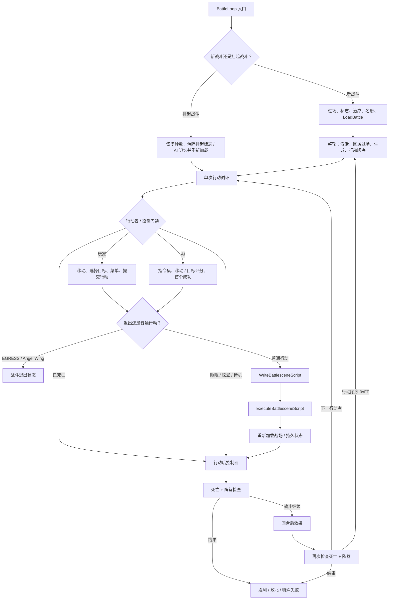

# 战术战斗循环与状态交接

- 状态：**基于已接受证据的设计综合**；本文档不新增原版游戏事实，也不定义新的战斗模拟器。
- 记录日期：2026-08-01
- 读者：需要理解玩家/AI 控制、动作构建、解决、状态回放与战斗内结果交接的研究者、设计文档作者与保真实现者。
- 范围：只消费当前 `main` 上已接受的 battle-loop、battle-functions、battle-actions、battle-AI、战场/寻路、battle-scene、战斗、法术、随机性与存档证据。

> 本文件是 [`tactical-battle-loop.md`](../../synthesis/tactical-battle-loop.md) 的中文镜像。英文原文始终是审阅基线；本镜像为派生文档，遵循 [`glossary.md`](../../glossary.md) 的术语规则（R1–R7）。证据标签按 R1 使用固定中文译法；源码标识符、fixture ID 与路径按 R2 原样保留。

这是[文档路线图](../../documentation-roadmap.md) 所述的第二篇 Layer B 综合，扩展了[游戏总览](../../synthesis/gameplay-overview.md)中的战斗边界。它不替换研究所有者、测试夹具或证据绑定子系统合同。**已确认** 指边界有链接的 Layer A 支持。**推断** 指多个已确认边界被连接成中性的面向玩家循环。**未知** 指当前证据不允许进一步解读。

## 支持与不支持的判断

本文档支持以下方面的判断：

- 从新战斗或恢复战斗经回合、单次行动、动作、回合后处理到结果的受限顺序；
- 玩家控制、AI 控制、移动/目标构建、动作构建器、解决/回放与战斗控制器各自拥有的状态类别；
- 保真实现应从中消费分支/顺序/结果事实的现有测试夹具。

本文档不支持以下方面的判断：

- “最优战术”、单位角色、遭遇设计目的、AI 公平性、预期胜率、难度或节奏；
- 把 AI 潜在伤害分数当作真实伤害，或把单个 Battle 01 测试夹具泛化到每场战斗；
- 每个动作、法术、物品、特殊攻击者或寻路边界的完整运行时语义；
- 精确输入延迟、光标/菜单手感、动画/消息/音频时序或渲染战斗演出一致性；
- 一般战斗模拟架构、预测精度或重制重平衡决定。

## 玩家动作与即时目标

| 玩家动作 | 已确认的直接结果 | 证据边界 |
| --- | --- | --- |
| 移动光标并确认格子 | A、B 或 C 可以确认格子；所选坐标被存储且光标隐藏 | **已确认静态 玩家控制**。合法移动的网格/路径所有者已确认，但完整可见光标时序与所有取消/重入组合保持 **未知**。 |
| 浏览或确认目标 | 空列表返回 `-1`；B 取消；A/C 确认；四个方向在候选中循环 | **已确认静态**。目标列表的构成与顺序分别属于动作、范围或 AI 所有者，不建立目标选择意图。 |
| 选择攻击、魔法、物品或待机/搜索 | 菱形菜单记录动作；取消恢复原位置并把动作留为 `-1` | **已确认静态**。菜单呈现、输入节奏与调用方可视时序在运行时未完全闭合。 |
| 管理战斗物品 | 物品菜单支持使用/给予/装备/丢弃，并保留诅咒、容量、Deals 与消耗回合分支 | **已确认静态**。本文档不把物品分支解读为推荐战术或经济价值。 |
| 打开战场菜单或挂起 | 成员、小地图、选项与挂起构成已确认的选择面；Battle 0 拒绝挂起 | **已确认静态**。正常挂起存档/标志/转移顺序已确认；跨进程恢复与可见 UX 保持 **未知**。 |
| 使用 EGRESS 或 Angel Wing | 在战斗演出构建前退出，支付相应 MP 或移除物品，并获得退出状态 | **已确认静态**。特殊调用方、地图结果与完整呈现仍受 battle-loop/map 所有者约束。 |

**推断 的动作-目标对齐：** 这些动作让玩家在当前合法状态内定位行动者、选择可提交的动作，并把其结果传入持久战斗状态。把它解读为“利用地形”“保护关键成员”或“优化资源”需要遭遇上下文、玩家观察与平衡证据，因此保持 **未知**。

## 顶层战术循环

以下图综合了多个已确认所有者的有序交接；它不是现代引擎架构。实线表示存在由 source/H2/H3 证据确认的控制交接。“战术循环”整体仍是一个 **推断** 的玩家体验。

### 入口与回合锚点

1. **已确认静态：** 新战斗清除经过秒数、运行开战/开战前过场、清除区域标志 90-105、恢复存活/不朽队伍、初始化两个名册，然后调用 `LoadBattle`。
2. **已确认静态：** 挂起战斗恢复已保存秒数、清除标志 88 与 AI 记忆、重新加载并恢复单回合循环。跨进程挂起持久性保持 **未知**。
3. **已确认静态：** 每回合按该顺序运行敌人激活、区域过场、生成准入/动画与行动顺序生成。Battle 01 区域激活与行动顺序各有受限 H3 覆盖；这不闭合每场战斗的运行时状态。
4. **已确认静态：** `0xFF` 行动顺序条目开始下一回合。

### 单回合控制门

- `ExecuteIndividualTurn` 跳过死亡行动者。MUDDLE、AI 控制位、己方自动战斗与普通敌人进入 AI 控制；对手控制开关可把敌人路由进玩家控制。
- SLEEP、STUN 与 STAY 消耗一次动作而不构建战斗演出。
- 普通动作写入并执行战斗演出脚本、结束演出并重新加载战场。
- EGRESS 与 Angel Wing 在演出构建前退出；它们不是普通解决中的伤害分支。

这些是 **已确认静态控制流** 事实。行动者为何拥有某状态、玩家可见的跳过消息以及每个特殊动作的自然可达性，仍属于其所有者。

## 移动、目标与控制归属

### 战场网格与合法空间接缝

**已确认：** 战场数组使用 48x48 行主网格。移动传播维护总成本与可移动网格；地形/占用决定拒绝；攻击/法术范围使用 Manhattan 环。一个 H3 矩阵观察加权传播、预算-128 桶回绕、受控平排跨越与边界辅助入口。

这不意味着已发布的战斗暴露受控的排跨越边界，也不意味着 AI 与玩家控制使用相同的选择策略。网格、范围、占用、目标列表与移动字符串在适配器中应保持可区分的状态所有者；单个“可走”布尔值无法无损地表示它们。

### 玩家控制

**已确认静态：** 玩家路径拥有光标/格子确认、目标列表导航、菱形菜单、物品菜单与战场菜单的分支/顺序事实。取消可以恢复动作前位置并把动作留为未提交；只有已提交的动作进入后续构建器。

**未知：** 完整移动预览、范围高亮、光标动画、按键重复、消息/窗口时序与每个嵌套取消路径的玩家可见行为。

### AI 控制

**已确认静态：** AI 控制的己方角色使用指令集 6。敌人在 16 个指令集之间选择、执行有序命令并在首个成功处停止。AI 移动、治疗、支援、攻击类别与目标优先级各有独立静态所有者。临时地形标志在每次退出时清除。特殊攻击者与 swarm 行为有显式路由。

**已确认运行时，受限：** 一个 14 用例 H3 矩阵观察最终攻击动作的七种非空可行形状、相关 RNG 族、AQUA 绕过、普通目标优先级、移动平局打破与等移动结果。

**推断/未知：** 其余调用方可视 AI 行为、带符号/溢出边界、完整指令集语义、自然地图上的路径选择与 AI“意图”。AI 潜在伤害模型是目标打分输入，不是[物理战斗](../../contracts/combat-resolution.md)或[法术解决](../../contracts/spell-resolution.md)中的真实结果公式。

## 动作提交、构建与回放

### 动作意图到演出脚本

`WriteBattlesceneScript` 在构建开始时清除 EXP、金币、攻击类型与瞬态动作标志。然后它为目标构建并总是对攻击、施放法术、使用物品、Burst Rock、混乱或棱镜激光动作排序。每个目标按顺序经过 switch-target、apply-effect 与 enemy-drop 处理。列表之后，构建器处理行动者空闲、已用物品损坏、double/counter 验证、可选 Burst Rock 重入与脚本终止。

这是 **已确认静态顺序**。实现必须区分：

- 玩家/AI 提交的动作意图；
- 构建器产生的有序目标与瞬态累加器；
- 演出/反应命令；
- 回放后的持久战斗员、EXP、金币、物品与战斗状态。

### 物理、法术与物品解决

- **已确认：** 物理路径按顺序处理闪避、基础伤害、会心一击、伤害应用、异常、诅咒伤害与 double/counter 判定。闪避与致命分支跳过已显式记录的后续阶段。
- **已确认于所属 fixture 接缝：** 物理合同保留整数中间值、HP 钳位、反应顺序、后续验证、快照恢复、持久回放与 EXP/奖励边界。
- **已确认于所属 fixture 接缝：** 法术合同覆盖其列出的伤害、治疗、状态、支援、MP、EXP 与回合后状态子集。本文档无法补全未列出的法术或自然多目标顺序。
- **已确认静态：** 战斗物品通过普通施法法术路由使用其法术索引/等级。消耗与损坏路由保留装备、己方使用与 RNG 门。

### 演出执行与持久回放

`ExecuteBattlesceneScript` 从 `$FF0000` 读取字命令，在 `$FFFF` 终止，并分发覆盖行动者/动作/反应、EXP、消息/输入及相关操作的 21 个命令族。演出初始化、资源、动画设置/更新配对与加载器顺序有完整静态合同。

**已确认于回放接缝：** 解决可以针对临时状态构建命令、恢复快照，然后按命令顺序持久化 HP、MP、状态、EXP、金币及相关结果。每个受支持变更都必须追溯到其特定战斗/法术/奖励测试夹具；本文档不声称一个通用回放模型覆盖每条命令。

**未知：** 精确帧时长、调色板/VDP 效果、武器放置、消息/输入等待外观、每对动画的渲染结果，以及演出时序对玩家决策节奏的影响。

## 动作后、回合后与结果

**已确认静态控制器顺序：**

1. 动作后，处理被击杀战斗员并检查双方剩余计数；
2. 如果战斗继续，处理行动者的回合后效果；
3. 处理被击杀战斗员并再次检查双方；
4. 如果战斗仍继续，推进回合索引；行动顺序终止符开始下一回合。

回合后状态测试夹具确认所列 MUDDLE、SILENCE、SLOW、ATTACK、BOOST 及相关计数器的单步过渡/消息/状态归一化矩阵。它不替换未列出的异常或完整的多回合遭遇。

**已确认静态结果：**

- 胜利恢复队伍、运行战后过场、清除解锁标志、设置完成标志并返回 `D4=1`；
- 普通败北恢复队长 HP、用无符号向下整除把金币减半、获得退出位置并返回 `D4=-1`；
- 战斗 4 败北使用硬编码的完整/升级路径并返回 `D4=0`；
- 单回合 EGRESS/Angel Wing 也用 `D4=0` 退出，但其原因与状态路由必须与战斗 4 失败分开。

升级/退出特例、生成重置失败、挂起战斗持久性、死亡/生成视觉以及这些结果的完整战役含义保持 **未知**。

## 状态归属与交接矩阵

| 所有者边界 | 输入 / 可读状态 | 输出 / 变更 | 不得决定 |
| --- | --- | --- | --- |
| 战斗控制器 | 战斗 ID、标志、秒数、名册、区域/生成/回合状态 | 回合顺序、行动者调度、死亡检查、结果码 | 玩家/AI 目标策略、伤害公式、渲染 |
| 单回合控制 | 行动者生命/状态/控制标志、当前动作状态 | 跳过、玩家/AI 路由、演出/退出交接 | 完整 AI 意图、战斗数学 |
| 战场/寻路 | 地形、占用、MOV、范围、战斗员位置 | 可达/成本网格、目标、攻击位置、移动字符串 | 真实伤害、玩家战术、仅测试边界的发布可达性 |
| 玩家控制 | 输入派生的菜单/光标状态、合法目标列表 | 位置/目标/动作提交或取消 | 输入硬件时序、AI 决定、解决数学 |
| AI 控制 | 指令集、战斗员/资源、移动/目标打分状态、思考 RNG | 移动字符串、目标/动作或待机 | 真实伤害结果、玩家可见公平性、未观察分支 |
| 动作构建器 | 已提交动作、有序目标输入、物品/法术/属性 | 演出命令、瞬态 EXP/金币/标志、后续候选 | 最终渲染时序、战役奖励平衡 |
| 解决/回放 | fixture 拥有的属性、RNG 结果、临时快照、命令 | 持久 HP/MP/状态/EXP/金币/物品变更 | 不受支持的法术/动作、一般模拟完整性 |
| 战斗演出呈现 | 演出命令、图形/动画选择器、VInt/窗口服务 | 受限命令分发与加载器/更新状态 | 玩法公式、尚未观察的精确视觉 |

## 证据矩阵

| 综合边界 | 标签与受限主张 | 证据所有者 / 可执行追踪 | 剩余问题 |
| --- | --- | --- | --- |
| 战斗入口、回合、动作后与结果 | **已确认静态** 新/恢复、回合、双重死亡/阵营检查与返回顺序 | [battle-loop 研究](../../../research/battle-loop.md)；`sf2-battle-control-static-v1`（[`battle-control-static-v1.json`](../../../../tests/fixtures/h2/battle-control-static-v1.json)）与 `sf2-battle-loop-static-v1`（[`battle-loop-static-v1.json`](../../../../tests/fixtures/h2/battle-loop-static-v1.json)） | 挂起持久性、特例、视觉时序 |
| 行动顺序与区域激活 | 特定 Battle 01/边界 H3 调度与激活事实 | `sf2-battle01-turn-order-v1`（[`battle01-turn-order-v1.json`](../../../../tests/fixtures/h3/battle01-turn-order-v1.json)）、`sf2-turn-order-boundaries-v1`（[`turn-order-boundaries-v1.json`](../../../../tests/fixtures/h3/turn-order-boundaries-v1.json)）与 `sf2-battle01-region-activation-v1`（[`battle01-region-activation-v1.json`](../../../../tests/fixtures/h3/battle01-region-activation-v1.json)） | 其他战斗/调用方状态；不得外推全局遭遇节奏 |
| 单回合与玩家控制 | **已确认静态** 控制路由、光标/目标/菜单、挂起/物品/宝箱分支 | [battle-functions 研究](../../../research/battle-functions.md)；`sf2-battle-functions-static-v1`（[`battle-functions-static-v1.json`](../../../../tests/fixtures/h2/battle-functions-static-v1.json)） | 运行时输入、呈现、完整取消嵌套 |
| 移动、范围与目标网格 | **已确认** 48x48 数组、加权传播、范围/占用/目标接缝与五个运行时用例 | [战场/寻路研究](../../../research/battlefield-pathfinding.md)；`sf2-battlefield-static-v1`（[`battlefield-static-v1.json`](../../../../tests/fixtures/h2/battlefield-static-v1.json)）与 `sf2-battlefield-movement-runtime-v1`（[`battlefield-movement-matrix-v1.json`](../../../../tests/fixtures/h3/battlefield-movement-matrix-v1.json)） | 发布排跨越可达性、晚期调用方、带符号/溢出边界 |
| AI 动作/移动/目标选择 | 完整源码清单与主要命令静态所有者；14 用例最终动作 H3 | [battle-AI 研究](../../../research/battle-ai.md)；`sf2-battle-ai-static-v1`（[`battle-ai-static-v1.json`](../../../../tests/fixtures/h2/battle-ai-static-v1.json)）、`sf2-battle-ai-action-choice-static-v1`（[`battle-ai-action-choice-static-v1.json`](../../../../tests/fixtures/h2/battle-ai-action-choice-static-v1.json)）与 `sf2-battle-ai-action-choice-runtime-v1`（[`battle-ai-action-choice-v1.json`](../../../../tests/fixtures/h3/battle-ai-action-choice-v1.json)） | 分组 H3 队列、调用方可视缺陷、AI 意图/公平性 |
| 动作构建 | **已确认静态** 累加器重置、目标族/排序、逐目标顺序、物品/损坏与后续序列 | [battle-actions 研究](../../../research/battle-actions.md)；`sf2-battle-actions-static-v1`（[`battle-actions-static-v1.json`](../../../../tests/fixtures/h2/battle-actions-static-v1.json)） | 未建模的异常/特殊辅助、消息/动画时序 |
| 物理解决 | fixture 拥有的算术、分支、反应、后续、奖励与回放子集 | [战斗合同](../../contracts/combat-resolution.md)；`sf2-physical-damage-land-archer-v1`（[`physical-damage-v1.json`](../../../../tests/fixtures/h3/physical-damage-v1.json)）、`sf2-attack-chain-double-counter-v1`（[`attack-chain-v1.json`](../../../../tests/fixtures/h3/attack-chain-v1.json)）与 `sf2-battle-scene-replay-v1`（[`battle-scene-replay-v1.json`](../../../../tests/fixtures/h3/battle-scene-replay-v1.json)） | 合同中分项的 **未知** 边界；不得泛化到完整动作集 |
| 法术/状态解决 | 合同中列出的伤害/治疗/状态/支援/消耗/回放子集 | [法术合同](../../contracts/spell-resolution.md)；`sf2-spell-damage-resistance-v1`（[`spell-damage-resistance-v1.json`](../../../../tests/fixtures/h3/spell-damage-resistance-v1.json)）与 `sf2-after-turn-status-lifecycle-v1`（[`after-turn-status-lifecycle-v1.json`](../../../../tests/fixtures/h3/after-turn-status-lifecycle-v1.json)） | 不受支持的法术、自然目标顺序、完整多回合状态 |
| 演出命令/呈现边界 | **已确认静态** 21 命令分发、初始化/加载器与设置/更新配对 | [battle-scene 研究](../../../research/battle-scene-engine.md)；`sf2-battle-scene-engine-static-v1`（[`battle-scene-engine-static-v1.json`](../../../../tests/fixtures/h2/battle-scene-engine-static-v1.json)） | 精确帧/VDP/调色板/音频/渲染输出 |
| 挂起交接 | **已确认静态** 菜单/存档/标志/转移接缝与受限存档格式/动作 | [battle-functions 研究](../../../research/battle-functions.md) 与 `sf2-battle-functions-static-v1`（[`battle-functions-static-v1.json`](../../../../tests/fixtures/h2/battle-functions-static-v1.json)）拥有战场菜单 → 秒数/存档/标志/转移接缝；[存档合同](../../contracts/save-system.md) 提供受限格式/动作上下文 | 跨进程战斗持久性、断电、可见 UX |

该表只提供精确所有者导航。本文档不得复制更弱的聚合预期，也不得用某个测试夹具的自然/受控设置替代另一个子系统的输入前置条件。

## 原版保真与现代化

### 保真规则

声称对本文档覆盖的战术边界保真的实现至少应：

1. 保留战斗控制器、回合控制、移动/目标、动作构建器、解决/回放与呈现之间的可观察状态边界；
2. 保留已确认的顺序、哨兵、分支极性、目标排序、整数中间值、快照/回放行为与持久变更；
3. 把 AI 打分与真实战斗/法术结果分开，把演出命令与最终渲染帧分开；
4. 为每个受支持动作消费所属 H2/H3 测试夹具，而不是因为“类似动作应行为类似”就填充未知分支；
5. 把刻意偏差与兼容原版的预期分开报告。

### 尚未作出的现代化决定

撤销、移动预览、威胁范围、AI 可解释性、动画加速/跳过、动作日志、重平衡、种子策略、存档点、失败惩罚与战斗模拟架构都可能是未来选择，但这里都没有决定。偏离原版需要显式决定或未来规格，以及独立的 expected-deviation/H4 测试夹具。

## H4 集成与停止条件

本文档不注册新的聚合黄金值。H4 适配器应按功能消费证据矩阵中的现有测试夹具，并分别报告输入/控制结果、移动/目标结果、构建的动作轨迹、临时解决、持久回放、动作后/回合后状态与最终结果。只有当跨子系统 parity 用例的所有输入单位、分支、RNG 接缝、顺序与持久性所有者都被接受时，才可添加它。

在以下情况停止扩展本文档：

- 静态清单、源码标签或单个受控用例需要变成玩家战术、AI 意图或平衡；
- 需要补全未接受的动作/法术/物品/特殊攻击者/寻路分支；
- 需要精确呈现、输入时序、正常战役可达性或挂起持久性；
- 必须选择模拟架构、预测模型、现代 UI 或有意的重平衡。

完整战斗模拟仍保留在路线图的[长期方向](../../documentation-roadmap.md#long-term-directions)中。在该切片开始前，它需要互相兼容的 battle-loop、动作、AI、寻路与状态合同，加上受限的 H4 适配器验收面。本文档只提供导航，不声称每个入场标准都已满足。
